# AunCast Udon スクリプト クラス図

```mermaid
classDiagram
    direction TB

    %% ========================================
    %%  Core レイヤー
    %% ========================================

    class LocalDualPlayerController {
        <<Manual Sync>>
        -VideoPlayerManager playerManagerA
        -VideoPlayerManager playerManagerB
        -PlaybackMonitor playbackMonitor
        -PlaybackSwitcher switcher
        -ActivePlayerMonitor activeMonitor
        -ResyncCoordinatorClient resyncClient
        -UdonSharpBehaviour staffNotifyTarget
        -AunCastEventBus eventBus
        ~[UdonSynced] VRCUrl _syncedURL
        ~[UdonSynced] int _syncedVideoIdx
        ~[UdonSynced] bool _ownerPlaying
        -int _localState
        -bool _activeIsA
        +PlayVideoAsStaff(VRCUrl)
        +StopVideoAsStaff()
        +Reboot()
        +RequestManualResync() bool
        +Reload()
        +SetVolume(float)
        +SetVolumeLocal(float)
        +GetLocalState() int
        +GetCurrentURL() VRCUrl
        +OnManagerVideoReady()
        +OnManagerVideoStart()
        +OnManagerVideoError()
        +OnDeserialization()
    }

    class PlaybackSwitcher {
        <<NoVariableSync>>
        -VideoPlayerManager playerManagerA
        -VideoPlayerManager playerManagerB
        -AudioSilenceDetector silenceDetectorA
        -AudioSilenceDetector silenceDetectorB
        -AunCastEventBus eventBus
        -bool _activeIsA
        -float _crossfadeStartedAt
        +InitializeToA()
        +ResetBothPlayersToA()
        +GetActiveManager() VideoPlayerManager
        +GetStandbyManager() VideoPlayerManager
        +GetActiveSilenceDetector() AudioSilenceDetector
        +StartStandbyConnect(float, VRCUrl)
        +StartCrossfade(float)
        +TickCrossfade(float, float)
        +IsCrossfadeComplete(float, float) bool
        +CompleteSwitchRoles()
        +StopStandbyOnFailure()
        +StartActiveDirectReboot(VRCUrl)
        +UpdateRenderTexture(int, bool)
        +SwitchAudioLinkSource()
    }

    class ActivePlayerMonitor {
        <<NoVariableSync>>
        -VideoPlayerManager playerManagerA
        -VideoPlayerManager playerManagerB
        -float _driftAccumulator
        -int _consecutiveStallCount
        -int _consecutiveAdvanceCount
        +BindRoles(bool)
        +InitializeForActive(float)
        +InitializeForStandby(float)
        +PollActive(float)
        +PollStandby(float)
        +DetectActiveFailure(float) bool
        +IsVerifySatisfied(float) bool
        +IsAnyPlayerPlaying() bool
        +HasSeenPlayerTimeAdvance() bool
        +GetDriftAccumulator() float
        +GetActiveStallDuration() float
    }

    class ResyncCoordinator {
        <<Manual Sync>>
        -PlaybackMonitor playbackMonitor
        -UdonSharpBehaviour staffNotifyTarget
        ~[UdonSynced] short[] userPlayerId
        ~[UdonSynced] byte[] resyncState
        ~[UdonSynced] short globalForceRebootSeq
        ~[UdonSynced] byte maxConcurrentResyncUsers
        ~[UdonSynced] byte maxConnectionLimit
        -int maxPlayers
        +[NetworkCallable] OnResyncRequest(int)
        +[NetworkCallable] OnReportRunning(int)
        +[NetworkCallable] OnReportSuccess(int)
        +[NetworkCallable] OnReportFail(int)
        +[NetworkCallable] OnCancelSlot(int)
        +[NetworkCallable] OnRequestSlot(int)
        +TriggerGlobalResync()
        +TriggerGlobalForceReboot()
        +GetResyncState(int) int
        +GetUserPlayerId(int) int
        +FindSlotByPlayerId(int) int
        +EstimateWaitTime(int) float
    }

    class ResyncCoordinatorClient {
        <<NoVariableSync>>
        -ResyncCoordinator coordinator
        -int _mySlotIndex
        -bool _resyncRequested
        -int _consecutiveFailCount
        +TryEnsureSlotAssigned() bool
        +PollGlobalForceReboot() bool
        +TryRequestResync(float, int) bool
        +PollResyncCoordinator(float, int) int
        +CancelResync()
        +ReportResult(bool)
        +ReportRunning()
        +GetMySlotIndex() int
        +IsSilenceAutoResyncEligible(float) bool
    }

    class PlaybackMonitor {
        <<Manual Sync>>
        -UdonSharpBehaviour staffNotifyTarget
        -ResyncCoordinator coordinator
        ~[UdonSynced] byte[] playbackActive
        ~[UdonSynced] byte[] connectingActive
        ~[UdonSynced] byte[] errorActive
        -int maxPlayers
        +[NetworkCallable] OnReportPlayback(int, int)
        +[NetworkCallable] OnReportError(int, int)
        +[NetworkCallable] OnReportConnecting(int, int)
        +ReportForSlot(int, bool)
        +ReportErrorForSlot(int, bool)
        +ReportConnectingForSlot(int, bool)
        +GetPlayingEstimateCount() int
        +GetConnectingEstimateCount() int
        +GetPlaybackActive(int) int
        +ClearSlot(int)
    }

    class AunCastEventBus {
        <<NoVariableSync>>
        +Texture videoTexture
        -UdonBehaviour[] videoTextureSubscribers
        -UdonBehaviour[] localStateSubscribers
        -UdonBehaviour[] portablePanelShownSubscribers
        +PublishVideoTexture(Texture)
        +PublishLocalStateChanged()
        +PublishPortablePanelShown()
    }

    %% ========================================
    %%  Player レイヤー
    %% ========================================

    class VideoPlayerManager {
        <<NoVariableSync>>
        +LocalDualPlayerController receiver
        +int playerIndex
        +VRCAVProVideoPlayer avProPlayer
        +Renderer avProTextureRenderer
        +AudioSource[] audioSources
        -float _currentVolume
        -float _fadeGain
        +Play()
        +Pause()
        +Stop()
        +LoadURL(VRCUrl)
        +GetTime() float
        +IsPlaying() bool
        +GetVideoTexture() Texture
        +SetVolume(float)
        +SetFadeGain(float)
        +GetFadeGain() float
        +GetAppliedOutputGain(AudioSource) float
        +OnVideoReady()
        +OnVideoStart()
        +OnVideoError(VideoError)
    }

    class AudioSilenceDetector {
        <<NoVariableSync>>
        -float silenceRmsThresholdDbfs
        -float silenceConsecutiveSec
        -AudioSource _audioSource
        +GetRms() float
        +GetLastRmsDbfs() float
        +GetSilenceRmsThreshold() float
        +GetSilenceConsecutiveSec() float
    }

    %% ========================================
    %%  UI レイヤー
    %% ========================================

    class StaffControlPanel {
        <<NoVariableSync>>
        -LocalDualPlayerController controller
        -ResyncCoordinator coordinator
        -UserStatusPanel viewerStatusPanel
        -string[] allowedUserNames
        -bool _isStaff
        +OnCoordinatorChanged()
        +OnUrlChanged()
        +SetLocalPasscodeUnlocked()
        +IsLocallyUnlocked() bool
        +OnStopButtonPress()
        +OnGlobalResyncButtonPress()
        +OnForceRebootButtonPress()
        +OnPromoteNextUrl()
        +UpdateActionButtonsInteractable()
    }

    class WallControlPanel {
        <<NoVariableSync>>
        -LocalDualPlayerController controller
        -StaffControlPanel staffPanel
        -UserStatusPanel portablePanel
        -AunCastEventBus eventBus
        -string unlockPasscode
        -bool _isStaff
        +OnUserResyncButtonPress()
        +OnUserRebootButtonPress()
        +OnSpawnPanelButtonPress()
        +OnSwitchViewButtonPress()
        +OnResyncOnlyButtonPress()
        +OnPortablePanelShown()
        +OnLocalStateChanged()
    }

    class UserStatusPanel {
        <<NoVariableSync>>
        -LocalDualPlayerController controller
        -ResyncCoordinator coordinator
        -AunCastEventBus eventBus
        -UdonSharpBehaviour staffControlPanel
        -HudProgressOverlay hudProgress
        -bool _staffUnlocked
        -int summonGesture
        -int desktopSummonGesture
        -bool menuVisible
        +OnResyncButtonPress()
        +OnRebootButtonPress()
        +OnSwitchViewButtonPress()
        +SetMenuVisible(bool)
        +SummonInFrontOfLocalPlayer()
        +IsMenuVisible() bool
        +IsStaffInteractable() bool
        +SetStaffUnlocked(bool)
        +SetSummonGestureFlag(int, bool)
        +SetDesktopSummonGestureFlag(int, bool)
    }

    class HudProgressOverlay {
        <<NoVariableSync>>
        -Transform quadTransform
        -MeshRenderer quadRenderer
        -bool _showing
        -float _currentProgress
        +SetHoldProgress(float, float)
        +Hide()
    }

    %% ========================================
    %%  Utility レイヤー
    %% ========================================

    class VideoMeshScreen {
        <<NoVariableSync>>
        -AunCastEventBus eventBus
        +string texParam
        +int rendererIndex
        +OnVideoTextureChanged()
    }

    class VideoUiScreen {
        <<NoVariableSync>>
        -AunCastEventBus eventBus
        +OnVideoTextureChanged()
    }

    class SyncDebugDisplay {
        <<None>>
        -LocalDualPlayerController controller
        -AudioSilenceDetector silenceDetectorA
        -AudioSilenceDetector silenceDetectorB
        +PostLateUpdate()
    }

    %% ========================================
    %%  コンポジション / 依存関係
    %% ========================================

    %% Core 内部の依存
    LocalDualPlayerController --> PlaybackSwitcher : switcher
    LocalDualPlayerController --> ActivePlayerMonitor : activeMonitor
    LocalDualPlayerController --> ResyncCoordinatorClient : resyncClient
    LocalDualPlayerController --> PlaybackMonitor : playbackMonitor
    LocalDualPlayerController --> VideoPlayerManager : playerManagerA/B
    LocalDualPlayerController ..> StaffControlPanel : SendCustomEvent(OnUrlChanged)
    LocalDualPlayerController --> AunCastEventBus : eventBus

    PlaybackSwitcher --> VideoPlayerManager : playerManagerA/B
    PlaybackSwitcher --> AudioSilenceDetector : silenceDetectorA/B
    PlaybackSwitcher --> AunCastEventBus : eventBus

    ActivePlayerMonitor --> VideoPlayerManager : playerManagerA/B

    ResyncCoordinatorClient --> ResyncCoordinator : coordinator

    ResyncCoordinator --> PlaybackMonitor : playbackMonitor
    ResyncCoordinator ..> StaffControlPanel : SendCustomEvent(OnCoordinatorChanged)

    PlaybackMonitor ..> StaffControlPanel : SendCustomEvent(OnCoordinatorChanged)
    PlaybackMonitor --> ResyncCoordinator : coordinator

    %% Player → Core コールバック
    VideoPlayerManager --> LocalDualPlayerController : receiver (コールバック転送)

    %% UI → Core 操作
    StaffControlPanel --> LocalDualPlayerController : controller
    StaffControlPanel --> ResyncCoordinator : coordinator
    StaffControlPanel --> UserStatusPanel : viewerStatusPanel

    WallControlPanel --> LocalDualPlayerController : controller
    WallControlPanel --> StaffControlPanel : staffPanel
    WallControlPanel --> UserStatusPanel : portablePanel
    WallControlPanel --> AunCastEventBus : eventBus

    UserStatusPanel --> LocalDualPlayerController : controller
    UserStatusPanel --> ResyncCoordinator : coordinator
    UserStatusPanel --> AunCastEventBus : eventBus
    UserStatusPanel ..> StaffControlPanel : SendCustomEvent + SetStaffUnlocked(push)
    UserStatusPanel --> HudProgressOverlay : hudProgress

    %% Utility → EventBus 購読
    VideoMeshScreen --> AunCastEventBus : eventBus (購読)
    VideoUiScreen --> AunCastEventBus : eventBus (購読)

    %% Debug
    SyncDebugDisplay --> LocalDualPlayerController : controller
    SyncDebugDisplay --> AudioSilenceDetector : silenceDetectorA/B
```

> **凡例**: 破線矢印 (`..>`) は `SendCustomEvent` による通知依存を表す。Core レイヤは StaffControlPanel の具象型に依存せず、`UdonSharpBehaviour` 基底参照経由で `OnUrlChanged` / `OnCoordinatorChanged` を発火する（疎結合化）。同様に **UI↔UI の `UserStatusPanel`→`StaffControlPanel` も基底型化済み**で、通知/命令は `SendCustomEvent`、解錠 bool は逆辺（`StaffControlPanel`→`UserStatusPanel`、具象）から `SetStaffUnlocked` で push してキャッシュする。これにより具象型の相互参照（循環）は解消されている。実線矢印 (`-->`) は具象型フィールドによる参照（コマンド・クエリ）。

## レイヤー構成

| レイヤー | クラス | 役割 |
|---------|--------|------|
| **Core** | `LocalDualPlayerController` | 各ユーザーのローカル再生 FSM。A/B 二重化再生の統括 |
| | `PlaybackSwitcher` | Active/Standby のクロスフェード切替と AudioLink 連携 |
| | `ActivePlayerMonitor` | Active の生存監視・ドリフト計測、Standby の検証 |
| | `ResyncCoordinator` | ワールド全体の Resync スロット管理 (Owner 一元管理) |
| | `ResyncCoordinatorClient` | Coordinator との RPC 通信を担うクライアント側ラッパー |
| | `PlaybackMonitor` | 全ユーザーの再生状態をビットパックで同期 |
| | `AunCastEventBus` | 疎結合イベント配信ハブ (テクスチャ・状態変化・パネル表示) |
| **Player** | `VideoPlayerManager` | AVPro ラッパー。VRChat コールバックを FSM へ転送 |
| | `AudioSilenceDetector` | AudioSource の PCM から RMS 無音検知 |
| **UI** | `StaffControlPanel` | スタッフ向け操作・モニタリング UI |
| | `WallControlPanel` | 壁掛け制御パネル (パスコード解錠・Resync・ジェスチャー設定) |
| | `UserStatusPanel` | 観客向け拡張メニュー (VR ジェスチャー呼び出し対応) |
| | `HudProgressOverlay` | VR ジェスチャー長押し中の HUD プログレス表示 |
| **Utility** | `VideoMeshScreen` | MeshRenderer にビデオテクスチャを適用 |
| | `VideoUiScreen` | RawImage にビデオテクスチャを適用 (アスペクト比フィット) |
| | `SyncDebugDisplay` | A/B ドリフトのリアルタイムスクロールグラフ (開発用) |

## 同期モード一覧

| クラス | BehaviourSyncMode | 同期変数 |
|--------|-------------------|----------|
| `LocalDualPlayerController` | Manual | `_syncedURL`, `_syncedUrlSubmitterName`, `_syncedVideoIdx`, `_ownerPlaying` |
| `ResyncCoordinator` | Manual | `userPlayerId[]`, `resyncState[]`, `userTimestampOffset`, `userTimestampDelta[]`, `globalForceRebootSeq`, `maxConcurrentResyncUsers`, `maxConnectionLimit` |
| `PlaybackMonitor` | Manual | `playbackActive[]`, `connectingActive[]`, `errorActive[]` |
| その他全クラス | NoVariableSync / None | なし |
