# AunCast Udon スクリプト クラス図

```mermaid
classDiagram
    direction TB

    %% ========================================
    %%  Core レイヤー
    %% ========================================

    class AunCastDualPlayerController {
        <<Manual Sync>>
        -AunCastVideoPlayerManager playerManagerA
        -AunCastVideoPlayerManager playerManagerB
        -AunCastPlaybackMonitor playbackMonitor
        -AunCastPlaybackSwitcher switcher
        -AunCastActivePlayerMonitor activeMonitor
        -AunCastResyncCoordinatorClient resyncClient
        -UdonSharpBehaviour staffNotifyTarget
        -AunCastEventBus eventBus
        ~[UdonSynced] VRCUrl _syncedURL
        ~[UdonSynced] string _syncedUrlSubmitterName
        ~[UdonSynced] int _syncedVideoIdx
        ~[UdonSynced] bool _ownerPlaying
        -int _localState
        -bool _activeIsA
        +IsValidStreamUrl(string) bool
        +PlayVideoAsStaff(VRCUrl)
        +StopVideoAsStaff()
        +Reboot()
        +RequestManualResync() bool
        +SetVolume(float)
        +SetVolumeLocal(float)
        +GetLocalState() int
        +GetCurrentURL() VRCUrl
        +OnManagerVideoReady()
        +OnManagerVideoStart()
        +OnManagerVideoError()
        +OnDeserialization()
    }

    class AunCastPlaybackSwitcher {
        <<NoVariableSync>>
        -AunCastVideoPlayerManager playerManagerA
        -AunCastVideoPlayerManager playerManagerB
        -AunCastSpeaker silenceDetectorA
        -AunCastSpeaker silenceDetectorB
        -AunCastEventBus eventBus
        -bool _activeIsA
        -float _crossfadeStartedAt
        +InitializeToA()
        +ResetBothPlayersToA()
        +GetActiveManager() AunCastVideoPlayerManager
        +GetStandbyManager() AunCastVideoPlayerManager
        +GetActiveSilenceDetector() AunCastSpeaker
        +StartStandbyConnect(float, VRCUrl)
        +StartCrossfade(float)
        +TickCrossfade(float, float)
        +IsCrossfadeComplete(float, float) bool
        +CompleteSwitchRoles()
        +StopStandbyOnFailure()
        +StartActiveDirectReboot(VRCUrl)
        +UpdateRenderTexture(int, bool)
        +SwitchAudioLinkSource()
    }

    class AunCastActivePlayerMonitor {
        <<NoVariableSync>>
        -AunCastVideoPlayerManager playerManagerA
        -AunCastVideoPlayerManager playerManagerB
        -float _driftAccumulator
        -int _consecutiveStallCount
        -int _consecutiveAdvanceCount
        +BindRoles(bool)
        +InitializeForActive(float)
        +InitializeForStandby(float)
        +PollActive(float)
        +PollStandby(float)
        +DetectActiveFailure(float) bool
        +IsVerifySatisfied(float) bool
        +IsAnyPlayerPlaying() bool
        +HasSeenPlayerTimeAdvance() bool
        +GetDriftAccumulator() float
        +GetActiveStallDuration() float
    }

    class AunCastResyncCoordinator {
        <<Manual Sync>>
        -AunCastPlaybackMonitor playbackMonitor
        -UdonSharpBehaviour staffNotifyTarget
        ~[UdonSynced] short[] userPlayerId
        ~[UdonSynced] byte[] resyncState
        ~[UdonSynced] short globalForceRebootSeq
        ~[UdonSynced] byte maxConcurrentResyncUsers
        ~[UdonSynced] byte maxConnectionLimit
        -const int MAX_PLAYERS = 82
        +[NetworkCallable] OnResyncRequest(int)
        +[NetworkCallable] OnReportRunning(int)
        +[NetworkCallable] OnReportSuccess(int)
        +[NetworkCallable] OnReportFail(int)
        +[NetworkCallable] OnCancelSlot(int)
        +[NetworkCallable] OnRequestSlot(int)
        +TriggerGlobalResync()
        +TriggerGlobalForceReboot()
        +GetResyncState(int) int
        +GetUserPlayerId(int) int
        +FindSlotByPlayerId(int) int
        +EstimateWaitTime(int) float
    }

    class AunCastResyncCoordinatorClient {
        <<NoVariableSync>>
        -AunCastResyncCoordinator coordinator
        -int _mySlotIndex
        -bool _resyncRequested
        -int _consecutiveFailCount
        +TryEnsureSlotAssigned() bool
        +PollGlobalForceReboot() bool
        +TryRequestResync(float, int) bool
        +PollResyncCoordinator(float, int) int
        +CancelResync()
        +ReportResult(bool)
        +ReportRunning()
        +GetMySlotIndex() int
        +IsSilenceAutoResyncEligible(float) bool
    }

    class AunCastPlaybackMonitor {
        <<Manual Sync>>
        -UdonSharpBehaviour staffNotifyTarget
        -AunCastResyncCoordinator coordinator
        ~[UdonSynced] byte[] playbackActive
        ~[UdonSynced] byte[] connectingActive
        ~[UdonSynced] byte[] errorActive
        -const int MAX_PLAYERS = 82
        +[NetworkCallable] OnReportPlayback(int, int)
        +[NetworkCallable] OnReportError(int, int)
        +[NetworkCallable] OnReportConnecting(int, int)
        +ReportForSlot(int, bool)
        +ReportErrorForSlot(int, bool)
        +ReportConnectingForSlot(int, bool)
        +GetPlayingEstimateCount() int
        +GetConnectingEstimateCount() int
        +GetPlaybackActive(int) int
        +ClearSlot(int)
    }

    class AunCastEventBus {
        <<NoVariableSync>>
        +Texture videoTexture
        +bool videoFlipY
        -UdonBehaviour[] videoTextureSubscribers
        -UdonBehaviour[] localStateSubscribers
        -UdonBehaviour[] portablePanelShownSubscribers
        +PublishVideoTexture(Texture, bool)
        +PublishLocalStateChanged()
        +PublishPortablePanelShown()
    }

    %% ========================================
    %%  Player レイヤー
    %% ========================================

    class AunCastVideoPlayerManager {
        <<NoVariableSync>>
        +AunCastDualPlayerController receiver
        +int playerIndex
        +VRCAVProVideoPlayer avProPlayer
        +Renderer avProTextureRenderer
        +AudioSource[] audioSources
        -float _currentVolume
        -float _fadeGain
        +Play()
        +Pause()
        +Stop()
        +LoadURL(VRCUrl)
        +GetTime() float
        +IsPlaying() bool
        +GetVideoTexture() Texture
        +GetVolume() float
        +SetVolume(float)
        +SetFadeGain(float)
        +GetFadeGain() float
        +OnVideoReady()
        +OnVideoStart()
        +OnVideoError(VideoError)
    }

    class AunCastSpeaker {
        <<NoVariableSync>>
        +int playerIndex
        +int mode
        +float baseVolume
        -float _adjustedUserVolume
        -float _fadeGain
        -float silenceRmsThresholdDbfs
        -float silenceConsecutiveSec
        -AudioSource _audioSource
        +SetBaseVolume(float)
        +SetAdjustedUserVolume(float)
        +SetFadeGain(float)
        +GetPlayerIndex() int
        +GetMode() int
        +GetAudioSource() AudioSource
        +GetRms() float
        +GetLastRmsDbfs() float
        +GetSilenceRmsThreshold() float
        +GetSilenceConsecutiveSec() float
    }

    %% ========================================
    %%  UI レイヤー
    %% ========================================

    class AunCastStaffControlPanel {
        <<NoVariableSync>>
        -AunCastDualPlayerController controller
        -AunCastResyncCoordinator coordinator
        -AunCastPortablePanel viewerStatusPanel
        -string[] allowedUserNames
        -bool _isStaff
        +OnCoordinatorChanged()
        +OnUrlChanged()
        +SetLocalPasscodeUnlocked()
        +IsLocallyUnlocked() bool
        +OnStopButtonPress()
        +OnGlobalResyncButtonPress()
        +OnForceRebootButtonPress()
        +OnPromoteNextUrl()
        +UpdateActionButtonsInteractable()
    }

    class AunCastWallControlPanel {
        <<NoVariableSync>>
        -AunCastDualPlayerController controller
        -AunCastStaffControlPanel staffPanel
        -AunCastPortablePanel portablePanel
        -AunCastEventBus eventBus
        -string unlockPasscode
        -bool _isStaff
        +OnUserResyncButtonPress()
        +OnUserRebootButtonPress()
        +OnSpawnPanelButtonPress()
        +OnSwitchViewButtonPress()
        +OnResyncOnlyButtonPress()
        +OnPortablePanelShown()
        +OnLocalStateChanged()
    }

    class AunCastPortablePanel {
        <<NoVariableSync>>
        -AunCastDualPlayerController controller
        -AunCastResyncCoordinator coordinator
        -AunCastEventBus eventBus
        -UdonSharpBehaviour staffControlPanel
        -AunCastHudProgressOverlay hudProgress
        -bool _staffUnlocked
        -int summonGesture
        -int desktopSummonGesture
        -bool menuVisible
        +OnResyncButtonPress()
        +OnRebootButtonPress()
        +OnSwitchViewButtonPress()
        +SetMenuVisible(bool)
        +SummonInFrontOfLocalPlayer()
        +IsStaffInteractable() bool
        +SetStaffUnlocked(bool)
        +SetSummonGestureFlag(int, bool)
        +SetDesktopSummonGestureFlag(int, bool)
    }

    class AunCastHudProgressOverlay {
        <<NoVariableSync>>
        -Transform quadTransform
        -MeshRenderer quadRenderer
        -bool _showing
        -float _currentProgress
        +SetHoldProgress(float, float)
        +Hide()
    }

    %% ========================================
    %%  Utility レイヤー
    %% ========================================

    class AunCastScreen {
        <<NoVariableSync>>
        -AunCastEventBus eventBus
        +string textureProperty
        +int rendererIndex
        +OnVideoTextureChanged()
    }

    class AunCastUiScreen {
        <<NoVariableSync>>
        -AunCastEventBus eventBus
        +OnVideoTextureChanged()
    }

    class AunCastAudioOutputTunnel {
        <<NoVariableSync>>
        +AudioSource inputA
        +AudioSource inputB
        -UdonSharpBehaviour targetTunnel
    }

    %% ========================================
    %%  コンポジション / 依存関係
    %% ========================================

    %% Core 内部の依存
    AunCastDualPlayerController --> AunCastPlaybackSwitcher : switcher
    AunCastDualPlayerController --> AunCastActivePlayerMonitor : activeMonitor
    AunCastDualPlayerController --> AunCastResyncCoordinatorClient : resyncClient
    AunCastDualPlayerController --> AunCastPlaybackMonitor : playbackMonitor
    AunCastDualPlayerController --> AunCastVideoPlayerManager : playerManagerA/B
    AunCastDualPlayerController ..> AunCastStaffControlPanel : SendCustomEvent(OnUrlChanged)
    AunCastDualPlayerController --> AunCastEventBus : eventBus

    AunCastPlaybackSwitcher --> AunCastVideoPlayerManager : playerManagerA/B
    AunCastPlaybackSwitcher --> AunCastSpeaker : silenceDetectorA/B
    AunCastPlaybackSwitcher --> AunCastEventBus : eventBus

    AunCastActivePlayerMonitor --> AunCastVideoPlayerManager : playerManagerA/B

    AunCastResyncCoordinatorClient --> AunCastResyncCoordinator : coordinator

    AunCastResyncCoordinator --> AunCastPlaybackMonitor : playbackMonitor
    AunCastResyncCoordinator ..> AunCastStaffControlPanel : SendCustomEvent(OnCoordinatorChanged)

    AunCastPlaybackMonitor ..> AunCastStaffControlPanel : SendCustomEvent(OnCoordinatorChanged)
    AunCastPlaybackMonitor --> AunCastResyncCoordinator : coordinator

    %% Player → Core コールバック
    AunCastVideoPlayerManager --> AunCastDualPlayerController : receiver (コールバック転送)

    %% UI → Core 操作
    AunCastStaffControlPanel --> AunCastDualPlayerController : controller
    AunCastStaffControlPanel --> AunCastResyncCoordinator : coordinator
    AunCastStaffControlPanel --> AunCastPortablePanel : viewerStatusPanel

    AunCastWallControlPanel --> AunCastDualPlayerController : controller
    AunCastWallControlPanel --> AunCastStaffControlPanel : staffPanel
    AunCastWallControlPanel --> AunCastPortablePanel : portablePanel
    AunCastWallControlPanel --> AunCastEventBus : eventBus

    AunCastPortablePanel --> AunCastDualPlayerController : controller
    AunCastPortablePanel --> AunCastResyncCoordinator : coordinator
    AunCastPortablePanel --> AunCastEventBus : eventBus
    AunCastPortablePanel ..> AunCastStaffControlPanel : SendCustomEvent + SetStaffUnlocked(push)
    AunCastPortablePanel --> AunCastHudProgressOverlay : hudProgress

    %% Utility → EventBus 購読
    AunCastScreen --> AunCastEventBus : eventBus (購読)
    AunCastUiScreen --> AunCastEventBus : eventBus (購読)
    AunCastAudioOutputTunnel --> AunCastSpeaker : inputA/B AudioSource
    AunCastAudioOutputTunnel ..> AudioOutputTunnel : targetTunnel (SetProgramVariable input)
```

> **凡例**: 破線矢印 (`..>`) は `SendCustomEvent` による通知依存を表す。Core レイヤは AunCastStaffControlPanel の具象型に依存せず、`UdonSharpBehaviour` 基底参照経由で `OnUrlChanged` / `OnCoordinatorChanged` を発火する（疎結合化）。同様に **UI↔UI の `AunCastPortablePanel`→`AunCastStaffControlPanel` も基底型化済み**で、通知/命令は `SendCustomEvent`、解錠 bool は逆辺（`AunCastStaffControlPanel`→`AunCastPortablePanel`、具象）から `SetStaffUnlocked` で push してキャッシュする。これにより具象型の相互参照（循環）は解消されている。実線矢印 (`-->`) は具象型フィールドによる参照（コマンド・クエリ）。

## レイヤー構成

| レイヤー | クラス | 役割 |
|---------|--------|------|
| **Core** | `AunCastDualPlayerController` | 各ユーザーのローカル再生 FSM。A/B 二重化再生の統括 |
| | `AunCastPlaybackSwitcher` | Active/Standby のクロスフェード切替と AudioLink 連携 |
| | `AunCastActivePlayerMonitor` | Active の生存監視・ドリフト計測、Standby の検証 |
| | `AunCastResyncCoordinator` | ワールド全体の Resync スロット管理 (Owner 一元管理) |
| | `AunCastResyncCoordinatorClient` | Coordinator との RPC 通信を担うクライアント側ラッパー |
| | `AunCastPlaybackMonitor` | 全ユーザーの再生状態をビットパックで同期 |
| | `AunCastEventBus` | 疎結合イベント配信ハブ (テクスチャ・状態変化・パネル表示) |
| **Player** | `AunCastVideoPlayerManager` | AVPro ラッパー。VRChat コールバックを FSM へ転送 |
| | `AunCastSpeaker` | AudioSource の出力宣言・基準音量保持・PCM からの RMS 無音検知 |
| **UI** | `AunCastStaffControlPanel` | スタッフ向け操作・モニタリング UI |
| | `AunCastWallControlPanel` | 壁掛け制御パネル (パスコード解錠・Resync・ジェスチャー設定) |
| | `AunCastPortablePanel` | 観客向け拡張メニュー (VR ジェスチャー呼び出し対応) |
| | `AunCastHudProgressOverlay` | VR ジェスチャー長押し中の HUD プログレス表示 |
| **Utility** | `AunCastScreen` | MeshRenderer にビデオテクスチャを適用 |
| | `AunCastUiScreen` | RawImage にビデオテクスチャを適用 (アスペクト比フィット) |
| | `AunCastAudioOutputTunnel` | 既存 AudioOutputTunnel の `input` を A/B の可聴側へ動的に差し替える互換アダプタ |

## 同期モード一覧

| クラス | BehaviourSyncMode | 同期変数 |
|--------|-------------------|----------|
| `AunCastDualPlayerController` | Manual | `_syncedURL`, `_syncedUrlSubmitterName`, `_syncedVideoIdx`, `_ownerPlaying` |
| `AunCastResyncCoordinator` | Manual | `userPlayerId[]`, `resyncState[]`, `userTimestampOffset`, `userTimestampDelta[]`, `globalForceRebootSeq`, `maxConcurrentResyncUsers`, `maxConnectionLimit` |
| `AunCastPlaybackMonitor` | Manual | `playbackActive[]`, `connectingActive[]`, `errorActive[]` |
| その他全クラス | NoVariableSync / None | なし |
