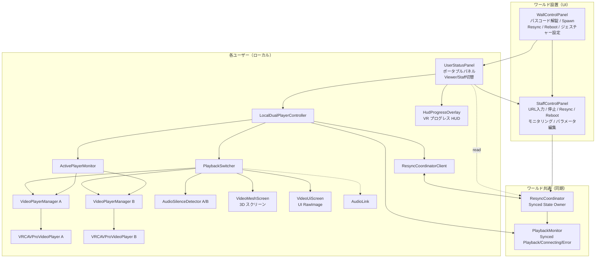
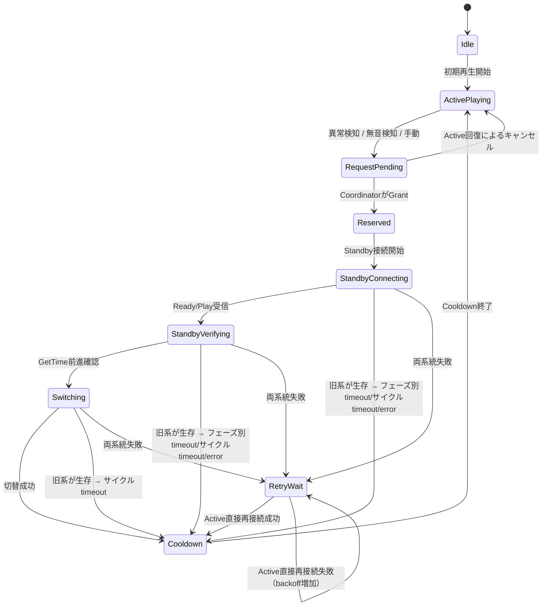
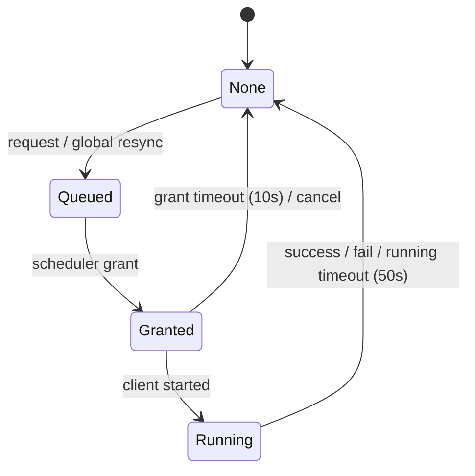
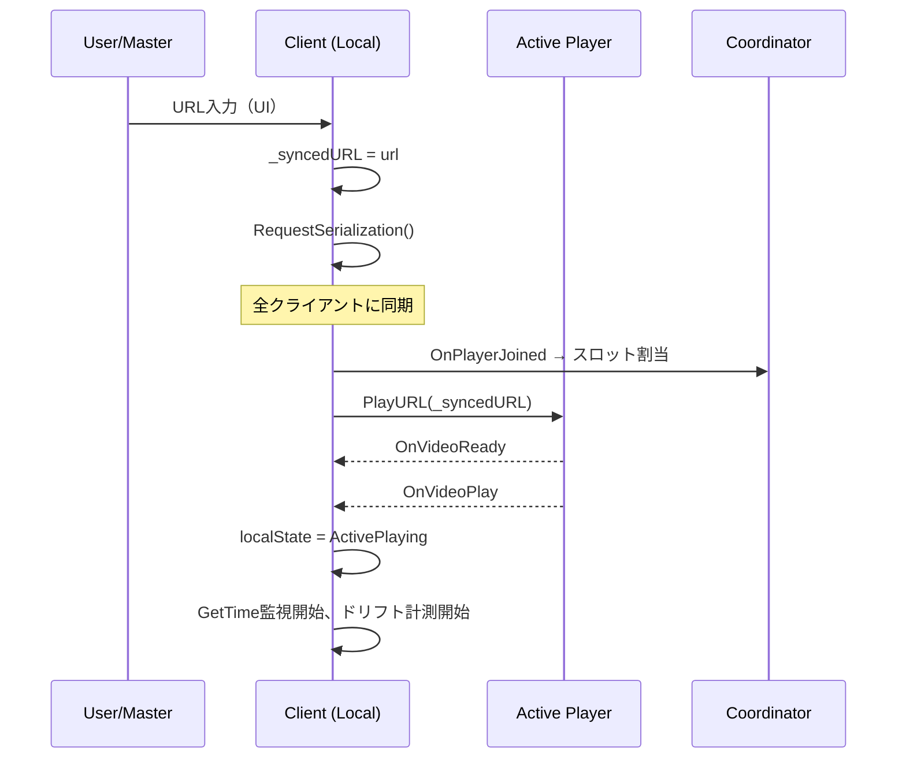
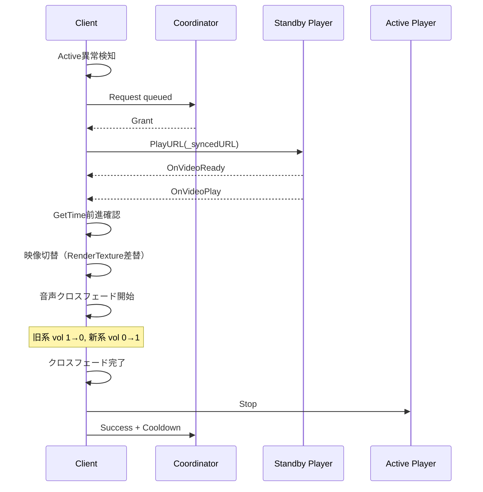
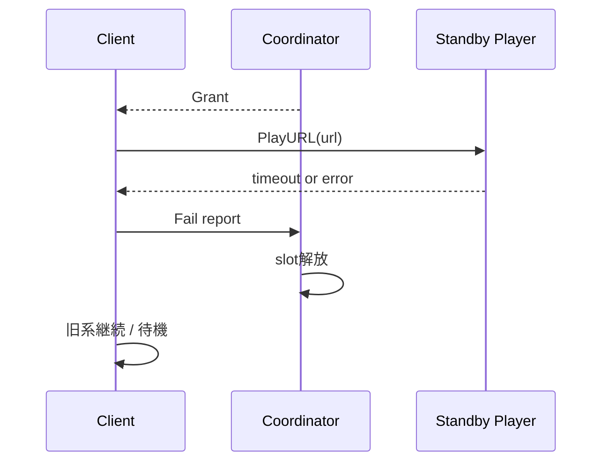

# VRChat 低遅延ライブ配信専用 Resync プレイヤー設計書

## 1. 文書情報

- 文書名: VRChat 低遅延ライブ配信専用 Resync プレイヤー 要件定義・詳細設計書
- 対象環境:
  - VRChat World SDK / UdonSharp
  - `VRCAVProVideoPlayer`
  - 低遅延ライブストリーム（主に `rtspt://` 系を想定）
- 想定用途:
  - VRChat ワールド内でのライブ配信視聴
  - 長時間視聴中の停止・ドリフト・無音化・スタックに対する再同期
- 本文書の目的:
  - 実装前に要件と制約を明文化する
  - UdonSharp 実装可能な粒度まで詳細設計を落とす
  - 今後の実装・テスト・保守の基準を作る

---

## 2. 背景と問題設定

`VRCAVProVideoPlayer` を用いた低遅延ライブ視聴では、以下の課題がある。

1. `SetTime()` による実用的な再同期が期待できない。
2. 再接続型の Resync は、単発プレイヤー構成では音切れ・表示途切れを伴いやすい。
3. VRChat では、新しい video URL の処理にユーザー単位のレート制限（約 5 秒間隔）があるため、無秩序な再接続は行えない。
4. CDN（VRCDN 等）の同時接続数にはプラン上限があり、多人数インスタンスでは接続枠に余裕がない。

このため、本設計では以下を採用する。

- 内部的に 2 台の `VRCAVProVideoPlayer` を保持する
- 待機系を先に接続し、`GetTime()` 前進を確認してから切り替える
- 切替トリガーは「音が出たこと」ではなく「新系ストリームが前進していること」とする
- Resync 実行は即時ではなく予約制とし、世界全体でスケジュールする
- 予約キューと同時実行数の管理は Coordinator が担い、CDN 同時接続上限を超えないよう制御する
- 個別の異常検知による自動 Resync に加え、スタッフ操作や無音区間検知によるグローバル Resync をサポートする

---

## 3. 目的

### 3.1 主目的

- 低遅延ライブ配信の視聴を継続させつつ、停止・スタック・劣化時に再同期する
- 単発再接続よりも切替時の途切れを抑える
- VRChat / Udon / AVPro の制約内で安全に運用できる構成を提供する

### 3.2 副目的

- CDN / サーバへの過剰な Resync 要求を避ける
- ユーザーごとの再同期乱発を抑止する
- ワールド全体の同時接続数上限を超えないよう制御する
- 将来的な計測・ログ・チューニングを容易にする

---

## 4. スコープ

### 4.1 本設計の対象

- ワールド内プレイヤーコンポーネント構成
- Resync 判定ロジック
- 2 系統プレイヤー切替ロジック
- 世界全体の予約制御
- UdonSharp 実装のための状態遷移・データ構造
- テスト観点

### 4.2 本設計の対象外

- 配信サーバ実装そのもの
- OBS / CDN 詳細設定の網羅
- 完全な音切れゼロ保証
- CDN 固有 API や認証制御
- プレイヤー UI デザインの詳細美観

---

## 5. 制約条件

## 5.1 VRChat / Udon 側の制約

- `VRCAVProVideoPlayer` に対する高度な再生レート制御は期待しない
- `SetTime()` によるライブシークは実用的でないため、用いない前提で設計する
- URL 処理のレート制限（約 5 秒間隔）はユーザー単位で適用され、複数プレイヤーインスタンス間で共有される
- ネットワークイベントは状態の永続表現として使わず、同期変数を真実の状態とする
- Coordinator の同期変数は Owner のみが更新する（Owner-Centric モデル）。クライアントは `SendCustomNetworkEvent` + `[NetworkCallable]` (SDK 3.10.2) で Owner に通知する
- `SendCustomNetworkEvent` はデリバリー保証がないため、クライアント側でポーリング確認 + タイムアウト再送を行う

## 5.2 ライブ配信側の制約

- 番組内容が本当に無音である区間があり得る
- 低遅延ライブであるため、完全なバッファ余裕は期待しない
- Resync 中は一時的に 2 ストリーム接続になる
- CDN（VRCDN 等）にはプランごとの同時接続上限がある。本設計では **100 接続上限プラン** を前提とする
  - 80 人インスタンスで全員が通常再生中 → 残り接続枠は 20
  - 安全マージンを考慮し、同時 Resync 実行数の上限は **10〜15** とする
  - この制約が Coordinator による集中管理を必要とする主要因である

## 5.3 品質上の制約

- 完全シームレス切替は保証しない
- 目標は「無音ギャップと停止継続の低減」であり、「サンプル精度の継ぎ目ゼロ」ではない
- 設計の優先順位は「安全性 > 安定性 > 低遅延 > 完全な滑らかさ」とする

---

## 6. 用語定義

- **Active Player**: 現在視聴に使っているプレイヤー
- **Standby Player**: 次回 Resync 用に待機接続するプレイヤー
- **Resync**: 旧系の不調時に新系を接続・検証・切替する処理
- **Coordinator**: ワールド全体の予約・実行スケジュールを管理するオブジェクト
- **Request**: 各ユーザーからの Resync 希望
- **Grant**: Coordinator がそのユーザーに Resync 実行権を与えた状態
- **Cooldown**: Resync 直後に再予約を拒否する期間
- **GetTime Progress**: `GetTime()` の値が単調増加していること
- **Soft Failure**: 音量・時間進行・状態が怪しいが即断不能な状態
- **Hard Failure**: `OnVideoError` や `GetTime()` 停止継続など、明確に再同期が必要な状態

---

## 7. システム概要

本システムは、各ユーザーにローカルで 2 台の `VRCAVProVideoPlayer` を持たせる。また、世界全体で 1 つの `ResyncCoordinator` を配置する。

### 7.1 基本方針

1. 通常は Active Player のみを表に出して再生する
2. 異常検知時に Resync Request を発行する
3. Coordinator が予約・同時実行上限・クールダウンを考慮して Grant する
4. Grant されたクライアントは Standby Player で接続開始
5. `OnVideoReady` / `OnVideoPlay` / `GetTime()` 前進を確認
6. 新系が生きていると確認できたら切り替える
7. 旧系を停止し、ロールを交換する
8. クライアントは Cooldown に入り、再予約を抑止する

---

## 8. 要件定義

## 8.1 機能要件

### FR-01: 2 系統プレイヤー保持
システムは 2 台の `VRCAVProVideoPlayer` を内部に保持し、交互に Active / Standby として利用できなければならない。

### FR-02: 異常検知
システムは Active Player の異常を検知できなければならない。異常検知は少なくとも以下を含む。

- `OnVideoError`
- `GetTime()` 停止継続
- `GetTime()` 前進が著しく不自然
- 任意の補助条件（任意実装）

### FR-03: Resync 要求発行
異常検知時、クライアントは即時 Resync を実行せず、Coordinator に対して Request を発行しなければならない。

### FR-04: 予約の一意性
各ユーザーは同時に 1 件までしか Resync Request を持てない。

### FR-05: Grant 制御
Coordinator は世界全体の同時実行数と各ユーザーのクールダウン状態を考慮し、Grant の可否を決定しなければならない。

### FR-06: 新系接続
Grant 後、クライアントは Standby Player に対して指定 URL で接続を開始しなければならない。

### FR-07: 新系生存確認
クライアントは以下を満たした場合のみ、新系を有効とみなさなければならない。

- `OnVideoReady` を受け取った
- `OnVideoPlay` または `OnVideoStart` を受け取った
- `GetTime()` が一定期間連続で前進した

### FR-08: 切替
新系生存確認後、クライアントは Active/Standby を切り替え、旧系を停止しなければならない。

### FR-09: Cooldown
Resync 完了後、クライアントは一定時間再予約を拒否しなければならない。

### FR-10: 失敗時の復帰
Standby 接続が失敗した場合、クライアントは状態を解放し、Coordinator に失敗を通知しなければならない。

### FR-11: 状態同期
予約・Grant・Running・Cooldown に関する世界共通の状態は同期変数で表現しなければならない。

### FR-12: Late Joiner 耐性
Late Joiner は参加時点での Coordinator 状態を再構築できなければならない。

### FR-13: Resync トリガー
Resync の発動方法は以下の 3 種類を含む。

- **手動トリガー（グローバル）**: スタッフ（Master または許可されたユーザー）が UI 操作で全ユーザーの一斉 Resync を発行する
- **手動トリガー（個別）**: 各ユーザーが ViewerPanel の Resync ボタンで自身の Resync を要求する
- **自動トリガー（個別）**: 各クライアントが Audio RMS 無音検知やストール検知に基づき、自動的に自身の Resync を Coordinator キューに投入する。連続発火を防ぐため `silenceSuppressSec` によるクールダウンを設ける

### FR-14: Resync モニタリング
スタッフは、インスタンス全体の再生・Resync 状況をリアルタイムで確認できなければならない。以下の情報を含む。

- **数値サマリ**: 再生中ユーザー数 / 接続中ユーザー数 / インスタンス内ユーザー数 / インスタンス収容上限
- **スロットインジケーター**: 各ユーザーの状態（正常再生 / 接続中 / Resync 待機 / Resync 実行中 / エラー）を色分けアイコンで一覧表示し、異常度の高い順にソートする
- **推定残り時間（ユーザー向け）**: Resync 待機が発生したとき、待機列が解消して自身の Resync が完了するまでの推定残り時間を ViewerPanel に表示する
- **推定残り時間（スタッフ向け）**: 待機列がある場合、全体の Resync が完了するまでの推定残り時間を StaffControlPanel に表示する

### FR-15: スタッフ操作パネル
スタッフ向けの操作パネルをワールド内に設置できなければならない。操作可能なユーザーを制限するアクセス制御を備えること。以下の機能を含む。

- **URL 入力欄**: ストリーム URL を入力・変更する。入力された URL は全クライアントに同期される
- **強制停止ボタン**: 全ユーザーの再生を即座に停止する
- **グローバル Resync トリガー**: 全ユーザーの Resync を Coordinator のキューに一括投入する。同時実行数上限に基づきスタガリングで順次実行される
- **強制リブート（Force Reboot）**: 全ユーザーの Active・Standby 両方のストリームを一旦切断し、Active で再接続する緊急機能。二重化による切替ではなく単純な全断→再接続のため、映像・音声の途切れが発生する。通常運用では使用しない
- **同時 Resync 実行数上限**: スタッフがワールド内で変更できる（`maxConcurrentResyncUsers`、同期）
- **CDN 総接続数上限**: スタッフがワールド内で変更できる（`maxConnectionLimit`、同期。範囲: maxPlayers+1 ～ maxPlayers*2）
- **モニタリング表示**: グローバル Resync の進捗状況（FR-14 参照）

> **注記**: 「無音自動 Resync 切替」は当初スタッフ操作パネルに配置する想定だったが、各クライアントごとの個別フラグであることから UserStatusPanel（観客向けパネル）側に移行している（FR-17 参照）。

以下のパラメータはワールド制作時にコンポーネント側（Inspector）で設定する。

- 並列 Resync 実行数上限
- Resync 実行間隔（1 ユーザーの Resync をトリガーした後、次のユーザーの Resync をトリガーするまでの待機時間）
- 無音判定閾値
- 無音検知抑制時間 `silenceSuppressSec`（最後の Resync から、無音検知を再び有効にするまでの時間。デフォルト 150 秒）

### FR-16: 観客向け Resync リクエスト
各観客は自身の Resync を手動でリクエストできなければならない。Cooldown 中の重複リクエストは抑止する。

### FR-16b: 観客向け緊急再接続
Resync リクエストが長時間応答なし、または `GetTime()` が長時間停止している場合に限り、観客自身が Coordinator を介さず強制的に再接続できなければならない。動作は Active・Standby 両方を切断し Active で再接続する（Section 18.3 の Active 直接再接続と同等）。通常時はボタンを非表示とし、以下の条件を満たした場合のみ表示する。

- Resync リクエスト後、一定時間（例: 30 秒）経過しても Grant されない
- `GetTime()` が一定時間（例: 10 秒）以上停止している

緊急再接続後のローカル Cooldown は長めに設定する（例: 60 秒）。

### FR-17: 観客向けポータブルパネル
各観客が自身の再生状態を確認できるポータブルパネルを提供しなければならない。VR ジェスチャー（複数方式選択可）またはデスクトップの Tab キーで呼び出す形式とする。少なくとも以下の情報・操作を含む。

- Resync リクエストボタン（Cooldown 中は ETA / カウントダウン表示）
- 緊急リブートボタン（常時操作可能。Coordinator を介さず自身のストリームを全断→再接続する）
- Resync 実行までの推定待ち時間（「ETA ○s」表示）
- 自身のプレイヤー `GetTime()` とサーバー時間のズレ（ドリフト）蓄積ゲージ
- 無音検出連続時間ゲージ（抑制中はグレーアウト）
- 現在のローカル状態テキスト（再生中 / Resync 待機中 / Resync 実行中 / Cooldown 中 + Stall/Fail カウント + エラーメッセージ）
- ローカル音量スライダー（`SetVolumeLocal` でクライアントローカルに適用、同期不要）
- 無音自動 Resync 切替トグル（`SetAutoSilenceResyncEnabled`、クライアントローカル）
- 閉じるボタン
- Staff ビューへの切替（パスコード解錠時のみ）
- VR ジェスチャー長押し中の視界プログレス HUD 表示

---

## 8.2 非機能要件

### NFR-01: 安全性
レート制限違反を極力避けること。各ユーザーへの URL 処理間隔は仕様下限より少し長く取る。

### NFR-02: 負荷制御
世界全体で同時 Resync 実行ユーザー数に上限を設けること。

### NFR-03: 一貫性
状態の真実は同期変数に置き、イベントは補助通知に留めること。

### NFR-04: 可観測性
ログ出力やデバッグ表示により、各ユーザーの状態・遷移・失敗理由を追跡可能にすること。

### NFR-05: 回復性
owner 変更が起きても、Coordinator の状態が破綻しにくいこと。

### NFR-06: 調整可能性
しきい値・タイムアウト・上限数は Inspector から調整可能であること。

---

## 9. アーキテクチャ設計

## 9.1 構成要素

### A. LocalDualPlayerController
各ユーザーのローカル再生制御を行う司令塔。状態機械の本体は本クラスが保持し、検知・切替・音声・Coordinator 連携の各責務はサブコンポーネントへ委譲する。

責務:
- ローカル状態機械 (`_localState`) の管理と TickStateMachine
- URL の同期・適用 (`_syncedURL`, `_syncedVideoIdx`, `_ownerPlaying`)
- ローカル音量 (`_localVolume`) と無音自動 Resync フラグ (`_autoSilenceResyncEnabled`) の保持
- 無音検知ポーリング (`PollSilenceDetection`): 全 audible プレイヤーの RMS を確認し、連続無音で個人 Resync 発行
- サブコンポーネント (`ActivePlayerMonitor`, `PlaybackSwitcher`, `ResyncCoordinatorClient`, `PlaybackMonitor`) への委譲・調停
- `VideoPlayerManager` のコールバックハブ（`OnManagerVideoReady` / `OnManagerVideoStart` / `OnManagerVideoError` 等）
- `AsStaff` API（`PlayVideoAsStaff` / `StopVideoAsStaff`）の提供
- `Reboot()`: 緊急リブート（Resync キャンセル → 全断 → Active 直接再接続）
- `Reload()`: Active プレイヤーの再読み込み（Resync キャンセル → Active 停止 → 再接続）
- `RequestManualResync()`: 観客からの手動 Resync リクエスト
- `PlaybackMonitor` への再生状態レポート（スロットル付き、10 秒ごと + 変化時）
- `OnDeserialization`: 非 Owner の URL 変更検知と再生停止同期
- 非 Owner の同期待ち（`_waitForSync`）: `_ownerPlaying` が false の間は Pause で待機

### B. VideoPlayerManager（既存流用 × 2 台）
各 `VRCAVProVideoPlayer` に対応する AVPro ラッパー。既存の `VideoPlayerManager` を 2 台配置して Active / Standby に対応する。

責務:
- `OnVideoReady` / `OnVideoStart` / `OnVideoEnd` / `OnVideoError` / `OnVideoLoop` のイベント受信と Controller への通知（`receiver._lastCallbackPlayerIndex` + `receiver.OnManagerXxx()` パターン）
- `GetTime()` / `IsPlaying` の取得
- 音量制御（x² と Dr. Lex 指数カーブの lerp 補間による知覚的にリニアなカーブ。`_fadeGain` × 調整済み音量を `AudioSource.volume` に反映）
- クロスフェード用ゲイン（`_fadeGain`）の保持と `ApplyVolume()` への反映
- テクスチャ取得（`_MainTex` / `_EmissionMap` / `_BaseMap` / `_BaseColorMap` を順に探索）

### C. ActivePlayerMonitor
`LocalDualPlayerController` から委譲される、Active / Standby Player の生存監視と Verify を担う独立コンポーネント。

責務:
- `GetTime()` 前進判定（`monitorIntervalSec` ごとにポーリング）
- 異常検知（`DetectActiveFailure`）と停止継続時間 (`stallDuration`) の計算
- Standby Player の Verify (`IsVerifySatisfied` / `IsStandbyTimedOut`)
- ドリフト計測（絶対ドリフト方式 EMA、`_baseWallTime` / `_basePlayerTime` / `_driftAccumulator`）
- ドリフトしきい値 (`driftResyncThresholdSec`) を超えた際の Resync 候補通知
- `BindRoles(activeIsA)` で `PlaybackSwitcher` のロール変更に追従

### D. PlaybackSwitcher
Active / Standby の物理的な切替（映像・音声・AudioLink）を担う。

責務:
- `playerManagerA` / `playerManagerB` のロール（Active/Standby）保持と `_activeIsA` の管理
- スクリーン群（`VideoMeshScreen[]` / `VideoUiScreen[]`）への RenderTexture ソース切替（`UpdateRenderTexture` / `UpdateRenderTextureFromManager`）。配信は内部の `BroadcastVideoTexture` がループで全要素に適用する
- クロスフェード（`crossfadeDurationSec`、等パワーパニング cos/sin カーブで各 `VideoPlayerManager` の `_fadeGain` を制御）
- AudioLink 入力ソースの切替（`audioLinkBehaviour.SetProgramVariable("audioSource", ...)` 経由）
- ロール交換 (`CompleteSwitchRoles`) 後のリセット
- 各 Player に対応する `AudioSilenceDetector` への参照保持（Active 側 RMS の問い合わせ）
- Active 直接リブート (`StartActiveDirectReboot`): 両 Player を A にリセットしてから Active で `LoadURL`
- Standby 接続開始 (`StartStandbyConnect`): `_fadeGain=0` で接続、映像・音声を隠して準備

### E. PlaybackMonitor
各クライアントの再生状態（再生中 / 接続中 / エラー）を世界共通で同期する別オブジェクト。Coordinator から分離することで、頻繁な再生状態更新が Resync 制御の同期と競合しないようにする。

責務:
- ビットパックされた `playbackActive` / `connectingActive` / `errorActive` の `[UdonSynced]` 同期（Owner-Centric）
- 各クライアントから `OnReportPlayback` / `OnReportError` / `OnReportConnecting` を `[NetworkCallable]` で受信（パラメータ: slotIndex, int encoded）
- ポップカウントによる再生中・接続中ユーザー数の高速算出（`_popcount` テーブル参照）
- スロット解放（`ClearSlot`）— 3 配列すべてをクリア
- `FlushSerialization()` による即時送信（`OnPlayerLeft` 時に Coordinator から呼ばれる）
- `StaffControlPanel` への再描画通知（`OnDeserialization` / `Update` で `NotifyObservers`）

### F. ResyncCoordinator
ワールド全体の予約制御を行う同期オブジェクト。

責務:
- スロット管理（Join / Leave 対応、`OnRequestSlot` フォールバック）
- Request キュー管理 (`OnResyncRequest` / `OnReportRunning` / `OnReportSuccess` / `OnReportFail` / `OnCancelSlot`)
- Grant 判定（同時実行数制御、`maxConcurrentResyncUsers` / `maxConnectionLimit`）
- タイムアウト監視（`grantTimeoutSec` / `runningTimeoutSec`）
- グローバル Resync (`TriggerGlobalResync`) と強制リブート (`TriggerGlobalForceReboot`) の発行
- owner 変更後の状態継続

### G. ResyncCoordinatorClient
クライアント側に配置し、Coordinator の同期変数をローカル状態に翻訳する薄いクライアント。

責務:
- 自スロット番号のキャッシュ (`_mySlotIndex`) と再取得（`OnRequestSlot` リトライ、5 秒間隔）
- Coordinator 状態のポーリング (`PollResyncCoordinator`) と FSM 遷移先の決定
- グローバル Resync の採用検出（`CheckAdoption`: QUEUED/GRANTED 状態を検知 → `REQUEST_REASON_MANUAL` で採用）
- キャンセル送信後の Adoption 抑制（`_adoptionSuppressedUntil` で 2 秒間抑制）
- Resync リクエスト送出 (`SendCustomNetworkEvent` + `[NetworkCallable]`) と再送（3 秒間隔）
- リクエスト理由 (`REQUEST_REASON_FAILURE` / `REQUEST_REASON_MANUAL` / `REQUEST_REASON_SILENCE`) の保持
- Cooldown / RetryWait のローカル管理
- 無音自動 Resync の適格判定 (`IsSilenceAutoResyncEligible`: 最後の Resync 完了から `silenceSuppressSec` 経過後に有効)
- グローバル強制リブートの検知 (`PollGlobalForceReboot`: `globalForceRebootSeq` の変化を監視)

### H. StaffControlPanel（ポータブルパネルの Staff ビューとして統合）
スタッフ向けの操作・モニタリング UI。UserStatusPanel 内の Staff ビュー（クロスフェード切替）として動作する。

責務:
- URL 入力欄 (`nextUrlField`)、Promote ボタンによる URL 同期適用 (`OnPromoteNextUrl`)
- 強制停止ボタン (`OnStopButtonPress`)
- グローバル Resync トリガーボタン (`OnGlobalResyncButtonPress`)
- 強制リブート (`OnForceRebootButtonPress`)
- 同時 Resync 実行数上限 (`maxConcurrentResyncUsers`) と CDN 総接続数上限 (`maxConnectionLimit`) のランタイム編集 UI（Display/Edit モード切替、±1/±10 ボタン）
- モニタリング表示: インジケーター（色付き ■/□ でスロット状態を表示）、ユーザー数表示（Playing / In Instance / Capacity）
- アクセス制御: 許可ユーザー名リスト (`allowedUserNames`) + WallControlPanel 経由のローカルパスコード解錠 (`SetLocalPasscodeUnlocked`)。同名ユーザー衝突時は最小 playerId を優先
- 多言語ヘルプテキスト: ホバーに応じてボタン説明を表示 (`OnHoverXxx` → `helpTextField`)。日本語/英語をシステム言語 or 手動トグルで切替 (`OnLanguageChanged` / `ToggleLanguage`)
- `OnCoordinatorChanged()` による通知駆動の再描画（デバウンス 0.2 秒 + 周期 1 秒フォールバック）
- Now Playing 表示（現在再生中の URL）

### I. WallControlPanel（壁掛け設置型）
ワールド内に固定配置する小型の壁掛けパネル。3 つの表示状態を持つ: User ビュー / Staff ビュー / ResyncOnly ビュー。

責務:
- **User ビュー**: 個人 Resync リクエストボタン (`OnUserResyncButtonPress`) / 緊急リブートボタン (`OnUserRebootButtonPress`) / VR 呼び出しジェスチャー選択トグル（右スティック上倒し / 片手ダブルトリガー / 両手トリガー長押し）
- **Staff ビュー**: 4 桁パスコード入力 UI（成功時に `staffPanel.SetLocalPasscodeUnlocked()` を呼ぶ。同期なしのローカル解錠）
- **ResyncOnly ビュー**: パネルから離れているときに全面表示する大型 Resync ボタン。全ユーザーが利用可能
- **共通**: ポータブルパネル（UserStatusPanel）を頭部前面に呼び出す Spawn ボタン (`OnSpawnPanelButtonPress`)
- User/Staff ビュー切替ボタン (`OnSwitchViewButtonPress`)
- User ボタンの interactable 状態を controller の FSM に追従させる（0.3 秒間隔でポーリング）
- **距離ベース表示切替**: シュミットトリガー方式（`wallNearDistance`=2.5m / `wallFarDistance`=3m）で ResyncOnly ↔ User/Staff をちらつきなく切替。AunCastSettings で変更可能
- **CanvasGroup クロスフェード**: 4 つの CanvasGroup（user / staff / shared / resyncOnly）を `crossfadeDuration` で滑らかに遷移。遷移中は切替先のみインタラクティブ
- **解錠後のポータブルパネル連動**: パスコード解錠後にポータブルパネルを開くと自動的に User ビューに切替。切替ボタンは LockOpen アイコンで無効化

### J. UserStatusPanel（ポータブルパネル）
観客向けの自己状態確認・Resync リクエスト UI。VR ジェスチャーまたはデスクトップの Tab キーで呼び出す。Viewer ビューと Staff ビュー（StaffControlPanel）をクロスフェードで切替可能。

責務:
- 個人 Resync リクエストボタン / 緊急リブートボタン
- 状態テキス���表示（ローカル状態 + エラーメッセージ + Stall/Fail カウント）
- ドリフトゲージ（`headroomGauge`）: 蓄積ドリフト量をしきい値に対する割合で表示
- サイレンスゲージ（`silenceGauge`）: 無音検出の連続時間を表示。抑制中はグレーアウト
- ローカル音量スライダー (`volumeSlider` → `SetVolumeLocal`)
- 無音自動 Resync 切替トグル (`autoSilenceResyncToggle` → `SetAutoSilenceResyncEnabled`)
- Resync ボタンのクールダウン / ETA 表示（`_resyncCooldownLabel`）
- **VR ジェスチャー呼び出し**: 複数方式を同時有効可能（ビットフラグ制御）
  - 片手ダブルトリガー (`GESTURE_DOUBLE_TRIGGER`、デフォルト有効)
  - 両手トリガー長押し (`GESTURE_BOTH_TRIGGERS_HOLD`)
  - 右スティック上方向倒し続け (`GESTURE_RIGHT_STICK_UP_HOLD`)
- **Desktop 呼び出し**: Tab キー（Viewer → Staff → 閉じる の 3 ステート切替）
- **HUD プログレス表示**: VR ジェスチャー長押し中に `HudProgressOverlay` で視界にプログレスを表示
- **グラブムーブ (VR)**: グリップボタンで近傍判定 → パネルを手に追従させて移動
- **Dissolve アニメーション**: 開閉時に背景の Dissolve + コンテンツ alpha フェード
- **Viewer/Staff クロスフェード切替**: 解錠時のみ切替ボタン表示。`crossfadeDuration` で滑らかに遷移
- **ハプティクス**: VR でメニューを開いた際に両手へ触覚フィードバック
- `SummonInFrontOfLocalPlayer()` による頭部前面への呼び出し（WallControlPanel から起動）
- **Menu Follow**: VR 時は頭部ローカルオフセット配置、Desktop 時は FOV から距離を算出してフィットさせる
- **デバッグ自動オープン**: 同名ユーザー検出時にテスト用にテレポート + パネルオープン

### K. AudioSilenceDetector
各 AVPro AudioSource にアタッチし、`AudioSource.GetOutputData()` を使ってメインスレッドから RMS を取得する軽量コンポーネント。

責務:
- 出力 PCM の RMS 算出 (`GetRms`)
- 無音判定パラメータの提供 (`silenceRmsThreshold`, `silenceConsecutiveSec`)

> **設計変更履歴**: 当初は `OnAudioFilterRead` を用いたリングバッファ遅延・バッファアンダーラン吸収を計画していたが、Udon VM がオーディオスレッドのフィールド書き込みをメインスレッドに反映できない制約（`VRChat-Udon-Development-Notes.md` 9.6 参照）から、`GetOutputData` を用いた RMS 取得のみの簡易実装に切り替えた。リングバッファ遅延・吸収機構は未実装で、Section 24 の今後の拡張案として残す。

### L. HudProgressOverlay
VR ジェスチャー長押し中に視界へ重ねるプログレス表示。頭部追従の World Space Quad に専用シェーダーを適用する。

責務:
- `SetHoldProgress(elapsed, duration)` による進捗更新。`showThreshold` 未満では非表示
- `Hide()` による長押し成立 / キャンセル時のフェードアウト（`fadeOutDuration`）
- Bar モード / Pie モー��切替（`usePieMode`���
- LateUpdate で頭部追従（`localOffset`）
- 表示はローカル限定（同期なし）

### M. Debug / Telemetry View
開発・テスト用。任意実装。`SyncDebugDisplay` コンポーネントが補助情報を提供する。

---

## 9.2 コンポーネント関係図



---

## 10. 状態遷移設計

## 10.1 ローカルクライアント状態

### 状態一覧

- `Idle` (0)
- `ActivePlaying` (1)
- `RequestPending` (2)
- `Reserved` (3)
- `StandbyConnecting` (4)
- `StandbyVerifying` (5)
- `Switching` (6)
- `Cooldown` (7)
- `RetryWait` (8)

> **実装変更**: 旧設計にあった `Failed` 状態は廃止。失敗時は旧 Active の生存状態に基づき `Cooldown`（旧系生存時）または `RetryWait`（���系統失敗時）に直接遷移する。

### 状態遷移図



※ **緊急リブート**（FR-16b / グローバル強制リブート）: 任意の状態 → `RetryWait`。視聴者が手動で発動、またはスタッフの `TriggerGlobalForceReboot` により全員が Active・Standby を全断して Active で再接続する。通常の遷移フローを中断するため、上図とは別経路として扱う。

※ **REQUEST_PENDING 中の Active 回復**: 障害検知理由 (`REQUEST_REASON_FAILURE`) で待機中に Active の前進が再開した場合、キャンセルして `ActivePlaying` に復帰する（`REQUEST_REASON_MANUAL` / `REQUEST_REASON_SILENCE` では復帰しない）。

## 10.2 Coordinator 側状態

各ユーザーごとに次の状態を持つ。

- `None`
- `Queued`
- `Granted`
- `Running`

Cooldown はクライアントローカルで管理する（Coordinator のスロットは成功・失敗後に即 NONE に戻る）。

### Coordinator ユーザー状態遷移



---

## 11. 判定ロジック設計

## 11.1 異常検知

### 主判定
以下のいずれかで Resync Request 候補とする。

1. `OnVideoError` を受信
2. `GetTime()` が一定期間ほぼ停止
3. `GetTime()` が連続的に不自然な挙動を示す

### 推奨補助判定
主判定に加え、以下を **推奨** の補助情報として併用する。

- **`IsPlaying`**（推奨）: `GetTime()` が前進していても `IsPlaying == false` の場合、バッファリング中や内部エラーの可能性がある。`GetTime()` 前進 + `IsPlaying == false` が一定時間続いた場合は異常候補とする
- **Audio RMS**（推奨）: `AudioSilenceDetector` の `GetRms()` から算出。無音検知はグローバル Resync の自動トリガーに利用する。個別の異常検知には使わない（コンテンツ無音との区別が困難なため）
- フレーム描画状態（任意）
- 任意の外部フラグ（任意）

### 設計方針
**主判定は `GetTime()` ベース + `IsPlaying` 補助とする。**  
理由:
- コンテンツ無音と障害無音を分けにくいため、音量は主判定に使わない
- 新系切替でも無音継続の可能性があるため
- 「ストリームが動いているか」という本質に近いため
- `IsPlaying` はバッファリング中の false positive を防ぐ安価な補助指標

### 注意事項
- AVPro の `GetTime()` はバッファリング中でも値が進む場合がある。`IsPlaying` との併用でこのケースを検出する
- ライブストリームでは `GetTime()` が巻き戻る（リセットされる）ことがある。`delta < 0` の場合は前進カウントをリセットし、即座に異常とはしない

---

## 11.2 `GetTime()` 前進判定

### 入力
- 現在時刻 `now`
- 前回観測プレイヤー時刻 `lastPlayerTime`
- 現在プレイヤー時刻 `currentPlayerTime`
- `IsPlaying` の状態

### 計算
- `delta = currentPlayerTime - lastPlayerTime`

### 判定
- `delta > minAdvanceThreshold` かつ `IsPlaying == true` なら前進
- `delta < 0`（巻き戻り）の場合は前進カウントをリセットし、次回から再カウント
- 一定回数連続で前進したら「生存」とみなす
- 一定時間前進がなければ「停止」とみなす

### 推奨パラメータ

| パラメータ | 推奨値 | 根拠 |
|---|---|---|
| 観測間隔 (`monitorIntervalSec`) | 0.1 秒 | AVPro の GetTime() 更新頻度に対して十分な粒度。Update() 毎フレームでは過剰 |
| 最小前進量 (`minAdvanceThresholdSec`) | 0.01 秒 | float 精度のノイズを排除しつつ、0.1 秒間隔での実際の進行（≈0.1 秒）を確実に検出 |
| 生存確認連続回数 (`minConsecutiveAdvances`) | 5 回 | 0.1 秒 × 5 = 0.5 秒間の安定した前進を確認。3 回では偶発的な前進で誤判定するリスクあり |
| 停止判定継続時間 (`stalledTimeoutSec`) | 2.0 秒 | ライブストリームの一時的なバッファリング（〜1 秒）を許容しつつ、真の停止を検出 |

※ これらは推定値であり、実機テスト（Section 22.3）で調整する前提

---

## 11.3 新系切替判定

以下を全て満たした時のみ切替。

1. `OnVideoReady == true`
2. `OnVideoPlay || OnVideoStart == true`
3. `GetTime()` 前進連続回数 >= `minConsecutiveAdvances`
4. 検証フェーズが `verifyMinDuration` を超過
5. 重大エラーが発生していない

## 11.4 ドリフト検知

### 定義

ドリフトとは、Active Player の `GetTime()` の進行速度とサーバー時間（`Networking.GetServerTimeInSeconds()`）の進行速度のズレの蓄積量を指す。ライブストリームでは、バッファリングの揺らぎや配信側の不安定さにより、徐々にズレが蓄積することがある。

### 計算方法（絶対ドリフト方式）

ウォームアップ終了時点の壁時計とプレイヤー時刻を基準点として記録し、以後は基準点からの経過時間の差を直接測定する。

```
// ウォームアップ終了直後に一度だけ基準点を確定
_baseWallTime = now
_basePlayerTime = currentPlayerTime

// 以後の各サンプルで絶対ドリフトを測定し EMA で平滑化
rawDrift = (now - _baseWallTime) - (currentPlayerTime - _basePlayerTime)
alpha = 1 - exp(-dt / driftSmoothingTimeConstant)
_driftAccumulator = lerp(_driftAccumulator, rawDrift, alpha)
```

- `_driftAccumulator > 0`: プレイヤーがサーバー時間より遅れている（バッファアンダーラン方向）
- `_driftAccumulator < 0`: プレイヤーがサーバー時間より進んでいる
- `GetTime()` の巻き戻りが発生した場合は基準点をリセットする

### 実装場所

ドリフト計測は `ActivePlayerMonitor` が担当する。`_baseWallTime` / `_basePlayerTime` / `_driftAccumulator` は同コンポーネントの内部状態として保持し、`LocalDualPlayerController` からは `GetDriftAccumulator()` 経由で参照する。

### ドリフトに対する処理

| ドリフト量 | 処理 |
|---|---|
| `driftResyncThresholdSec` 未満 | 何もしない（正常範囲） |
| `driftResyncThresholdSec` 以上 | Resync Request を発行する |

> **設計変更履歴**: 当初は `absorptionThresholdSec` / `bufferAbsorptionLimitSec` / `recoveryRateSecPerSec` を用いた **AudioDelayFilter のリングバッファによる吸収段** を計画していたが、Udon VM のオーディオスレッド制約（Section 9.1 K 参照）によりリングバッファ遅延機構そのものが未実装となったため、現実装ではドリフトしきい値超過 → 直接 Resync 発行のシンプルな 2 段階に統合している。バッファ吸収は Section 24 の今後の拡張案として残す。

### 表示

蓄積量と方向（遅れ / 進み）を UserStatusPanel に表示する（FR-17 参照）。ドリフトが `driftResyncThresholdSec` に近づいた段階で視覚的警告を出す。

### 推奨パラメータ

| パラメータ | 推奨値 | 根拠 |
|---|---|---|
| `driftResyncThresholdSec` | 0.1 秒 | 配信側の通常ジッタを上回り、知覚的にも違和感が出始める閾値 |
| `driftSmoothingTimeConstant` | 1.5 秒 | EMA の時定数。瞬間的な揺らぎを吸収し、持続的なドリフトに反応する |
| `driftWarmupSec` | 5.0 秒 | 再生開始直後の不安定区間ではドリフト判定を行わない |

---

## 12. 予約・スケジューリング設計

## 12.1 方針

- Resync は即時実行しない
- 各ユーザーは 1 件だけ予約可能
- 世界全体の `maxConcurrentResyncUsers` を超えない
- Grant 発行間隔を制御し、サーバへの集中を避ける
- クールダウン中の再予約は拒否する

## 12.2 予約の単位

ユーザーごとに 1 スロットを持つ。  
同一ユーザーからの重複 Request は統合する。

## 12.3 スケジューリング優先順位

推奨:

1. `nextEligibleTime <= now`
2. `state == Queued`
3. 最も早く待機を始めたユーザー
4. 必要なら優先度調整

## 12.4 同時実行制御

- Granted + Running の合計が `maxConcurrentResyncUsers` 未満のときだけ Grant 可能
- Grant 後、ユーザーは `Running` になるまで `grantTimeoutSec` (10s) 以内に開始報告すること
- `Running` 状態で `runningTimeoutSec` (50s) を超過した場合は強制解放する
- クライアント側では GRANTED〜切替完了の全体を `resyncCycleTimeoutSec` (45s) で制限し、Coordinator 側より先にタ���ムアウトして失敗報告する

## 12.5 グローバル Resync

### 概要

グローバル Resync は、スタッフの操作またはシステムの自動検知により、インスタンス内の全ユーザー（またはスタッフが指定した対象）の Resync を一括で Coordinator のキューに投入する機能である。

通常の個別 Resync と同じ予約キュー・Grant 制御・Cooldown を共有するため、CDN 同時接続上限を超えるリスクはない。

### トリガー種別

#### 手動トリガー
- スタッフ（アクセス制御で許可されたユーザー）がワールド設置型の StaffControlPanel のボタンを押して発行する
- 発行時、Coordinator は全アクティブスロット（`userPlayerId != 0` かつ `STATE_NONE`）を `STATE_QUEUED` に一括設定する（すでに Queued/Granted/Running のユーザーはスキップ）
- 曲間・MC 中など、音切れが目立たないタイミングでスタッフが判断して押す運用を想定する

#### 自動トリガー（個人無音 Resync として実装）
- 現在の実装では、無音検知はグローバル Resync ではなく、各クライアントの**個人 Resync** (`REQUEST_REASON_SILENCE`) として発行される
- Active 系・Standby 系の両方の `AudioSilenceDetector.GetRms()` を確認し、`_fadeGain > 0` かつ RMS が閾値以上のプレイヤーが 1 つもない場合に「全 audible プレイヤーで無音」と判定する
- 無音判定が `silenceConsecutiveSec`（デフォルト 2 秒）連続した場合に個人 Resync リクエストを発行する
- 最後の Resync 完了（`_lastResyncCompletedAt`）から `silenceSuppressSec`（デフォルト 150 秒）が経過するまで、無音検知を無効化する（`IsSilenceAutoResyncEligible`）。これにより、Resync 直後の不要な再発動を防止する
- 各ユーザーが `_autoSilenceResyncEnabled` フラグ（UserStatusPanel のトグル）で有効/無効を切り替えられる

### スタガリング戦略

グローバル Resync で 80 人が一括 Queued された場合、`maxConcurrentResyncUsers`（10〜15）の枠で順次処理する。

- 全員完了までの推定時間: `ceil(totalQueued / maxConcurrentResyncUsers) × avgResyncDuration`
- 例: 80 人、同時 10 枠、1 回の Resync が平均 8 秒 → `ceil(80/10) × 8 = 64 秒`
- 時間差は TickScheduler の 1 秒ティック間隔と `maxConcurrentResyncUsers` の枠制限で自然に発生する。専用の Grant 間隔制御は行わない

### スタッフ向けモニタリング UI

#### 表示項目
- 割当済みユーザー数 / 再生中ユーザー数
- 現在 Resync 実行中（Granted + Running）のユーザー数 / 同時実行上限
- 予約待機中（Queued）のユーザー数

#### オブジェクト仕様
- トリガーボタンとモニタリングディスプレイは **StaffControlPanel**（ワールド設置型）に統合する
- Coordinator の同期変数から読み取って表示するだけなので、描画処理はすべてローカル
- アクセス制御により、スタッフのみ操作可能とする（グループインスタンスのロール、ユーザー名リスト等）

### Coordinator 側の対応

グローバル Resync は個別 Resync と同じフローを共用する。専用の同期変数やイベントは設けない。

- `TriggerGlobalResync()` は全アクティブスロットを `STATE_QUEUED` に一括設定し、`RequestSerialization()` で同期する
- 以降は通常の TickScheduler（1 秒ティック × `maxConcurrentResyncUsers` 枠制限）で QUEUED → GRANTED に昇格
- 各クライアントは `ResyncCoordinatorClient.CheckAdoption()` で QUEUED / GRANTED 状態を検知し、通常の Resync フローに入る。このとき `requestReason = MANUAL` が設定され、Active Player の recovery チェック（障害回復によるキャンセル）の対象外となる
- 成功・失敗報告も通常の `OnReportSuccess` / `OnReportFail` を使用する

---

## 13. データ設計

## 13.1 スロット管理方式

Coordinator はユーザーごとの状態を固定長配列で管理する。

### インデックス戦略

配列のインデックスには **スロット番号**（0〜`MAX_PLAYERS - 1`）を使用する。`VRCPlayerApi.playerId` は非連続で上限が大きいため、直接インデックスには使わない。

- `MAX_PLAYERS`: Inspector で設定する配列長上限（推奨: 82。VRChat Group+ の上限）
- スロット割当: プレイヤーが Join した際、`userPlayerId[i] == 0` の空きスロットを先頭から探して割り当てる
- スロット解放: `OnPlayerLeft` で該当スロットを初期化し、`userPlayerId[i] = 0` に戻す
- スロット検索: ローカルクライアントは自身の `playerId` に対応するスロットをキャッシュする

### 帯域コストの考慮

- 配列の同期は変更の有無にかかわらず全体送信される
- Coordinator: short[82] + byte[82] + ushort[82] + float + スカラー群 = 約 420 B / 同期（Owner-Centric 移行 + タイムスタンプ圧縮 + 型縮小）
- PlaybackMonitor: byte[11] = 約 11 B / 同期（1 スロット 1 ビットにパック済み）
- 再生状態の頻繁な更新（PlaybackMonitor）と Resync 制御（Coordinator）を別オブジェクトに分離することで、ownership 競合を軽減し帯域効率を向上させる
- `RequestSerialization()` の呼び出し頻度を最小化するため、Coordinator の `TickScheduler` で変更があった場合のみ送信する

## 13.2 Coordinator 同期変数

Owner-Centric モデル: クライアントは同期変数を読み取り専用。書き込みは Owner のみ。
クライアントからの状態変更要求は `SendCustomNetworkEvent(NetworkEventTarget.Owner, ...)` + `[NetworkCallable]` で Owner に通知する。

```csharp
// --- スロット管理 ---
[UdonSynced] private short[] userPlayerId;     // スロット→playerId マッピング（0 = 空き）

// --- ユーザーごとの状態 ---
[UdonSynced] private byte[] resyncState;        // 状態コード（13.3 参照）

// --- タイムスタンプ（圧縮） ---
[UdonSynced] private float userTimestampOffset;    // 全アクティブスロットの最大タイムスタンプ
[UdonSynced] private ushort[] userTimestampDelta;  // (offset - actual) の 0.1 秒単位整数
    // 復元: offset - delta[i] * 0.1f
    // Owner 内部では float[] _ownerTimestamp で正確な値を保持

// --- グローバル制御 ---
[UdonSynced] private short globalForceRebootSeq;    // 全断→リブートの発行回数（変更検知用）
[UdonSynced] private byte maxConcurrentResyncUsers; // 同時 Resync 実行数上限（ランタイム変更可能）
[UdonSynced] private byte maxConnectionLimit;       // CDN 総接続数上限（ランタイム変更可能、範囲: maxPlayers+1 ～ maxPlayers*2）
```

> **命名注記**: 当初設計では `userState` を予定していたが、実装ではより限定的な意味を示す `resyncState` に改名されている（`PlaybackMonitor` 側に再生状態が分離されたため）。同様に getter は `GetResyncState(slotIndex)`。

### 旧設計からの削除変数

以下は Owner-Centric 移行に伴い不要となったため削除:
- `globalResyncSeq` (int) — グローバル Resync を通常の QUEUED フローに統合したため不要
- `globalResyncTotalCount` / `globalResyncDoneCount` / `globalResyncFailCount` (byte) — 同上
- `userRequestSeq` (byte[82]) — Owner 一元管理により重複検知不要
- `userGlobalResyncTicket` (short[82]) — 同上

### タイムスタンプ圧縮の設計意図

同期パケット削減のため、float[82] (328B) を float + ushort[82] (168B) に圧縮する。

- offset に最大値（最新のタイムスタンプ）を使い、delta は offset との差分を表す
- 最新の値ほど delta が 0 に近く、古い値ほど delta が大きい
- ushort 最大 65535 → 0.1 秒単位で 6,553.5 秒（約 1.82 時間）のスパンを表現可能
- クランプ発生時は最古の値のみが影響を受ける（タイムアウト清掃対象なので安全）
- Owner 内部では `float[] _ownerTimestamp` で正確な値を保持し、タイムアウト判定に使用

## 13.2.1 PlaybackMonitor 同期変数

再生状態のモニタリングは別オブジェクト `PlaybackMonitor` で同期する。Coordinator と分離することで、頻繁な再生状態更新が Resync 制御の ownership と競合しない。

```csharp
[UdonSynced] private byte[] playbackActive;    // ビットパック: 1 スロット = 1 ビット。byte[(maxPlayers+7)/8]
[UdonSynced] private byte[] connectingActive;  // 接続試行中（LoadURL 後〜再生開始前）
[UdonSynced] private byte[] errorActive;       // エラー状態
```

- 各クライアントが `SendCustomNetworkEvent(Owner, "OnReportPlayback", slotIndex, encoded)` で Owner に再生状態を報告する（`encoded`: 0/1 int エンコーディング）。Owner が一元的にビットフィールドを更新し同期する
- 同様に `OnReportConnecting` / `OnReportError` で接続中・エラー状態を報告する
- `active` の判定は A/B 双方のプレイヤーについて `IsPlaying() && hasSeenTimeAdvance` の OR を取る（`ActivePlayerMonitor.IsAnyPlayerPlaying()`）。Resync 切替中でも片方が再生中であれば `active=true` を維持する
- `playing=true` になったタイミングで `connecting=false` を自動送信する（`LocalDualPlayerController.ReportPlaybackStateToCoordinator` 内）
- スロットのクリアは Coordinator の `OnPlayerLeft` → `PlaybackMonitor.ClearSlot()` 経由で行う（3 配列すべてをクリア）
- `FlushSerialization()`: `OnPlayerLeft` 時に遅延シリアライズを即時送信する（ワールド破棄直前のロスト対策）

### Grant の発行方式

- スケジューラは 1 秒間隔の tick で動作し、`maxConcurrentResyncUsers` の空き枠分だけ一括で Grant を発行する
- VRChat の URL 5 秒レート制限は各クライアントがローカルで遵守する。Coordinator 側での Grant 間隔制御は行わない
- グローバル Resync 時は `TriggerGlobalResync` が全アクティブスロットを一括 `STATE_QUEUED` に設定する。以降は通常の個別 Resync と同じ TickScheduler で処理される
- 個別 Resync のスロット更新は Owner 側の `[NetworkCallable]` ハンドラが処理する。クライアントは ownership を取得しない

### Leave 時の処理

```
OnPlayerLeft(VRCPlayerApi player):
  if !Networking.IsOwner(gameObject): return

  slotIndex = FindSlotByPlayerId(player.playerId)
  if slotIndex < 0: return

  PlaybackMonitor.ClearSlot(slotIndex)
  resyncState[slotIndex] = None
  userPlayerId[slotIndex] = 0
  // タイムスタンプ等もクリア
  MarkDirty()
```

## 13.3 状態コード

| 値 | 定数名 | 状態 |
|---|---|---|
| 0 | `STATE_NONE` | 未登録 / アイドル |
| 1 | `STATE_QUEUED` | Resync 待機中 |
| 2 | `STATE_GRANTED` | Resync 許可済み（接続開始待ち） |
| 3 | `STATE_RUNNING` | Resync 実行中（Standby 接続〜切替中） |
| 4 | (欠番) | 旧 STATE_COOLDOWN（ローカル側に移行済み） |

Cooldown はクライアントローカルで管理する（Coordinator のスロットは成功後即 NONE に戻る）。

## 13.4 ローカル状態変数

実装上、ローカル状態は責務ごとにコンポーネントへ分割保持する。

### 13.4.1 LocalDualPlayerController が保持する状態

```csharp
// --- 同期変数（Manual sync, Owner 書き込み） ---
[UdonSynced] private VRCUrl _syncedURL;
[UdonSynced] private int _syncedVideoIdx;
[UdonSynced] private bool _ownerPlaying;

// --- 状態機械 ---
private int _localState;                       // ローカル状態（10.1 参照）

// --- ロール ---
private bool _activeIsA = true;                // PlaybackSwitcher と同期させる

// --- ローカル設定（同期しない） ---
private bool _autoSilenceResyncEnabled = true; // 無音自動 Resync 切替
private float _localVolume;                    // ローカル音量
private float _combinedSilenceDuration;        // 全 audible プレイヤーの無音連続時間

// --- Standby Player 検証 ---
private float _standbyConnectStartedAt;
private bool _standbyReady;
private bool _standbyPlayStarted;

// --- リトライ ---
private float _retryWaitUntil;
private bool _awaitingActiveReboot;
private float _activeRebootStartedAt;

// --- 同期管理 ---
private int _currentVideoIdx;                  // OnDeserialization での URL 変更検知用
private bool _waitForSync;                     // 非 Owner が Owner の再生開始を待つ
private bool _pendingConnectingReport;         // スロット未割当時の connecting 報告を遅延

// --- PlaybackActive レポートのスロットル ---
private float _lastPlaybackReportAt;
// 値変化なしでも 10 秒ごとに再送する
```

### 13.4.2 ResyncCoordinatorClient が保持する状態

```csharp
private int _mySlotIndex;                      // Coordinator 上の自スロット番号（キャッシュ）
private bool _resyncRequested;                 // リクエスト送信済みフラグ
private float _requestStartedAt;              // リクエスト送信時刻（ETA / タイムアウト計算用）
private int _requestReason;                    // REQUEST_REASON_FAILURE / MANUAL / SILENCE
private float _localCooldownUntil;             // ローカル Cooldown 終了時刻
private int _consecutiveFailCount;             // 連続失敗回数（backoff 計算用）
private float _cycleStartedAt;                 // Resync サイクル開始時刻（サイクルタイムアウト判定）
private float _lastResyncCompletedAt;          // 最後の Resync 完了時刻（無音検知抑制判定用）
private int _lastGlobalForceRebootSeq;         // 強制リブートシーケンス番号の前回値

// --- スロット割当フォールバック ---
private float _lastSlotRequestAt;              // OnRequestSlot 再送タイマ (5秒間隔)

// --- イベント再送 ---
private float _lastResyncRequestSentAt;        // SendCustomNetworkEvent 再送タイマ (3秒間隔)

// --- Adoption 抑制 ---
private float _adoptionSuppressedUntil;        // キャンセル後 2 秒間 Adoption を抑制
```

### 13.4.3 ActivePlayerMonitor が保持する状態

```csharp
// --- Active Player 監視 ---
private float _lastObservedActiveTime;
private int _consecutiveAdvanceCount;
private int _consecutiveStallCount;
private float _stallStartedAt;

// --- Standby Player 検証 ---
private bool _standbyReady;
private bool _standbyPlayStarted;
private int _standbyAdvanceCount;
private float _verifyStartedAt;

// --- ドリフト監視（絶対ドリフト方式） ---
private float _driftAccumulator;
private float _baseWallTime;
private float _basePlayerTime;
```

### 13.4.4 PlaybackSwitcher が保持する状態

```csharp
private bool _activeIsA;
private bool _crossfading;
private float _crossfadeStartedAt;
```

---

## 14. URL 管理方針

### 14.1 URL の取得と伝播

- ストリーム URL は Master（またはロック解除時は任意のユーザー）が UI から入力する
- 入力された URL は同期変数（`_syncedURL`）で全クライアントに伝播する
- 各クライアントは `OnDeserialization` で URL 変更を検知し、Active Player で再生を開始する

### 14.2 Resync 時の URL

- Resync 時は、現在の `_syncedURL` をそのまま Standby Player に渡す
- 同一 URL への再接続であるため、CDN 側では新規ストリーム接続として扱われる
- 将来拡張として複数 URL フェイルオーバーを検討するが、本設計のスコープ外とする（Section 24 参照）

### 14.3 URL 変更と Resync の競合

- Resync 実行中（StandbyConnecting / StandbyVerifying / Switching）に URL が変更された場合:
  - Standby の接続を中止し、新 URL で Active を再開する
  - Coordinator に Cancel を通知し、スロットを解放する
  - ローカル状態を `ActivePlaying` に戻す

---

## 15. 詳細シーケンス設計

## 15.1 初期再生



Idle → ActivePlaying の遷移条件:
- `_syncedURL` が空でない
- Active Player が `OnVideoPlay` または `OnVideoStart` を受信した
- `GetTime()` が初回の前進を確認した（false start 防止）

## 15.2 Resync 要求から切替まで



## 15.3 失敗時



---

## 16. 切替仕様

## 16.1 基本ルール

- 切替は新系生存確認後に行う
- 映像切替は即座に行い、音声切替はクロスフェードで行う
- 切替前に新系を表に出さない
- 旧系の停止はクロスフェード完了後に行う

## 16.2 映像切替

- `StandbyVerifying → Switching` に遷移した瞬間に、登録済みの全 `VideoMeshScreen` / `VideoUiScreen` のテクスチャソースを新系の `VideoPlayerManager` に切り替える
- 切替は 1 フレームで完了する。瞬間的な黒画面（1 フレーム）が出る可能性があるが、許容事項とする
- 各 `VideoMeshScreen` は `sharedMaterials[rendererIndex]` のテクスチャプロパティを更新するため、同一マテリアルを共有するスクリーンが何枚あっても CPU/GPU 負荷はほぼ一定。`VideoUiScreen` は RawImage に直接テクスチャを設定する。テクスチャ未取得時の表示はマテリアル既定値に委ねる

## 16.3 音声切替・無音検知

クロスフェードは `VideoPlayerManager` が `AudioSource.volume` を制御する方式で実装する。Active/Standby 切替の物理的な制御は `PlaybackSwitcher` が担う。

### AudioSilenceDetector コンポーネント

各 AVPro AudioSource に `AudioSilenceDetector`（UdonSharpBehaviour）をアタッチする。

```
AVPro AudioSource A (+ AudioSilenceDetector スクリプト)
  → メインスレッドの GetRms() で AudioSource.GetOutputData() を呼び出し
  → 出力 PCM の RMS を返す
  → 無音判定はメインスレッドで定期実行（PlaybackSwitcher / Controller 経由）

AVPro AudioSource B (同様の構成)
```

- 出力 PCM はそのまま AudioListener + AudioLink へ流れる
- `OnAudioFilterRead` は使用しない（Udon VM のオーディオスレッドからメインスレッドへフィールド書き込みを反映できないため。`VRChat-Udon-Development-Notes.md` 9.6 参照）

> **設計変更履歴**: 当初は `OnAudioFilterRead` を用いたリングバッファ遅延・バッファアンダーラン吸収を計画していたが、上記制約により未実装となった。`initialDelaySec` / `bufferAbsorptionLimitSec` / `absorptionThresholdSec` / `recoveryRateSecPerSec` / `maxDelaySec` といったパラメータ群はすべて旧設計のものであり、現状の Inspector には存在しない。バッファ吸収機能は Section 24 の今後の拡張案として残す。

### クロスフェード

`PlaybackSwitcher.StartCrossfade` / `TickCrossfade` が制御し、各 `VideoPlayerManager` の `_fadeGain` (0.0〜1.0) を**等パワーパニングカーブ (cos/sin)** でランプする。`VideoPlayerManager.SetFadeGain` は調整済み音量 × `_fadeGain` を `AudioSource.volume` に反映する。

```csharp
float angle = t * Mathf.PI * 0.5f;
float activeGain = Mathf.Cos(angle);   // 旧系: 1 → 0
float standbyGain = Mathf.Sin(angle);  // 新系: 0 → 1
```

- `crossfadeDurationSec`: 推奨 0.3〜0.5 秒（Inspector 調整可能、`PlaybackSwitcher` で管理。デフォルト 0.3 秒）
- Controller が `STATE_SWITCHING` 遷移時に `StartCrossfade` を呼ぶ。開始時にテクスチャを新系に即時切替する
- 両系統が同時に AudioListener に出力されるため、等パワー特性により音量の落ち込みなく自然にミックスされる
- フェード完了後、`CompleteSwitchRoles()` で旧系プレイヤーを停止しロールを交換する

### 無音検知

`AudioSilenceDetector.GetRms()` を Active 系で定期的に呼び出し、メインスレッドで RMS と閾値を比較する。

- `silenceRmsThreshold`: 推奨 0.001（デフォルト値）
- `silenceConsecutiveSec`: 推奨 2.0 秒（デフォルト値）
- 無音検知はグローバル Resync の自動トリガー（Section 12.5）に利用する
- ローカルクライアントは `_autoSilenceResyncEnabled` フラグでこの自動トリガーを抑制できる
- 異常検知（Section 11）の補助判定としても利用可能

### AudioLink 接続

- AudioLink は Active 系の AVPro AudioSource を入力とする
- `AudioSource.volume` によるクロスフェードが AudioLink の取り込み振幅にも反映される
- 切替時、`PlaybackSwitcher` が AudioLink の入力ソースを新系の AudioSource に差し替える（`audioLinkBehaviour` への参照を経由）

## 16.4 ロール交換

切替成功（クロスフェード完了）後:

- `_activeIsA = !_activeIsA`
- 旧 Active は Standby になる
- 旧 Active は停止・初期化待ち状態へ戻す
- 新 Active を通常監視対象に昇格する
- AudioLink の入力ソースを新系の AudioSource に差し替える

---

## 17. タイムアウト設計

### 17.1 サイクルタイムアウト（クライアント側）

GRANTED（RESERVED 遷移）から切替完了までの包括的タイムアウト。配信サーバへの同時接続数を制限する目的で、一定時間内に完了しないリシンクサイクルを打ち切る。

| パラメータ | 値 | 意味 |
|---|---:|---|
| `resyncCycleTimeoutSec` | 45.0秒 | RESERVED〜SWITCHING の全体制限。超過時は CancelResync → HandleFailed |

サイクルタイムアウトは STANDBY_CONNECTING / STANDBY_VERIFYING / SWITCHING の各フェーズで、フェーズ別タイムアウトより優先してチェックされる。

### 17.2 フェーズ別タイムアウト

| フェーズ | タイムアウト | 意味 |
|---|---:|---|
| Ready待ち | 5.0秒 | URL解決・接続失敗 |
| Play待ち | 3.0秒 | Ready後に再生開始しない |
| Verify待ち | 2.0秒 | GetTimeが前進しない |
| Cooldown | 15.0〜60.0秒 | 再予約拒否期間 |

### 17.3 Coordinator 側タイムアウト

| パラメータ | 値 | 意味 |
|---|---:|---|
| `grantTimeoutSec` | 10.0秒 | GRANTED 後に RUNNING 報告がなければ NONE に戻す |
| `runningTimeoutSec` | 50.0秒 | RUNNING 後に成功/失敗報告がなければ NONE に戻す。クライアント側サイクルタイムアウト (45s) より長く設定し、クライアントが先にタイムアウトして失敗報告できるようにする |

### 17.4 順番待ちタイムアウト

REQUEST_PENDING（順番待ち）にはタイムアウトを設けない。Coordinator が全員に Grant する前提で、ユーザーが待ちきれない場合は手動キャンセル（再 Resync ボタン）で対応する。

---

## 18. 失敗処理設計

### 18.1 失敗分類

- `CycleTimeout` — GRANTED〜切替完了がサイクルタイムアウト (45s) 超過
- `ConnectTimeout`
- `ReadyTimeout`
- `PlayTimeout`
- `VerifyTimeout`
- `OnVideoError`
- `GrantExpired`
- `CoordinatorStateMismatch`

### 18.2 失敗時の原則

- 旧 Active が生きていれば継続
- Coordinator に Fail を通知
- `Running` スロットを必ず解放
- 必要に応じて Cooldown へ遷移
- 連続失敗回数に応じて再試行抑止を強化

### 18.3 両系統失敗時のフォールバック

Active が停止し、Standby 接続も失敗した場合（「全滅」状態）の処理。

#### 状態遷移

```
Failed → RetryWait → RequestPending（再試行）
```

- `Failed` に遷移した時点で `_consecutiveFailCount` をインクリメントする
- 再試行までの待機時間: `min(baseCooldownSec × 2^(_consecutiveFailCount - 1), maxRetryCooldownSec)`
  - 例: 基本 15 秒、最大 120 秒 → 15s, 30s, 60s, 120s, 120s, ...
- 再試行時は **Active 側で直接再接続**を試みる（Standby 経由ではなく、切れている Active に URL を再発行）
  - これは Coordinator の Grant を必要としない緊急再接続であり、旧系が完全に死んでいるためリスクは低い
- 直接再接続が成功した場合、`_consecutiveFailCount` をリセットし、通常の `ActivePlaying` に復帰する
- 直接再接続も失敗した場合、再び `Failed` → `RetryWait` に入る

#### ユーザー通知

- 観客向けパネルに状態を表示する
  - `Failed`: 「再接続待機中（あと○秒）」
  - `RetryWait` 中の再接続試行: 「再接続中...」
  - 複数回失敗: 「ストリーム接続に問題が発生しています」
- `_consecutiveFailCount >= maxFailBeforeAlert`（例: 3）の場合、スタッフ向けパネルにもアラートを表示する

---

## 19. owner / Late Joiner 設計

## 19.1 原則

- 真実の状態は同期変数に保持する
- Coordinator の同期変数は Owner のみが書き換える（Owner-Centric モデル）
- クライアントは `SendCustomNetworkEvent(NetworkEventTarget.Owner, ...)` で状態変更を要求する（fire-and-forget + ポーリング確認）
- スタッフ操作（TriggerGlobalResync 等）のみ例外的に ownership を取得して直接書き換える
- owner 変更時も同期変数から再構築する

## 19.2 Late Joiner

Late Joiner は以下を `OnDeserialization` で再構築する。

- 各ユーザーの queue/grant/running 状態
- 実行中（Granted + Running）ユーザー数

## 19.3 owner 変更

新 owner は既存同期変数から Scheduler を再開する。  
ローカル配列だけに依存しない。

---

## 20. Inspector パラメータ案

実装上、Inspector パラメータは責務に応じて各コンポーネントへ分散配置されている。
主要なチューニングパラメータは `AunCastSettings`（Editor 専用 MonoBehaviour）に集約されており、`AunCastSettings` の Inspector で一括編集できる。

### LocalDualPlayerController 側

- `readyTimeoutSec`
- `playTimeoutSec`
- `verifyTimeoutSec`
- `defaultVolume`
- `verboseLogging` / `_timelineLogging`

### ActivePlayerMonitor 側

- `monitorIntervalSec`
- `minAdvanceThresholdSec`
- `minConsecutiveAdvances`
- `stalledTimeoutSec`
- `verifyMinDurationSec`
- `driftResyncThresholdSec`
- `driftSmoothingTimeConstant`
- `driftWarmupSec`

### PlaybackSwitcher 側

- `crossfadeDurationSec`

### ResyncCoordinatorClient 側

- `resyncCycleTimeoutSec` (45s)
- `silenceSuppressSec` (150s)
- `localCooldownSec` (5s)
- `baseCooldownSec` (15s)
- `maxRetryCooldownSec` (120s)

### ResyncCoordinator 側

- `maxConcurrentResyncUsers`（同期、ランタイム変更可能）
- `maxConnectionLimit`（同期、ランタイム変更可能）
- `grantTimeoutSec` (10s)
- `runningTimeoutSec` (50s、クライアント側サイクルタイムアウトより長く設定)
- `maxPlayers` (82)
- `debugLoggingEnabled`

### WallControlPanel 側

- `wallNearDistance` (2.5m) — AunCastSettings 経由
- `wallFarDistance` (3m) — AunCastSettings 経由

### AudioSilenceDetector 側

- `silenceRmsThreshold` — AunCastSettings 経由
- `silenceConsecutiveSec` — AunCastSettings 経由

### HudProgressOverlay 側

- `localOffset` (頭部ローカルオフセット)
- `usePieMode` (Bar / Pie 切替)
- `barSize` (バーのワールドサイズ)
- `pieDiameter` (パイの直径)
- `showThreshold` (表示開始猶予)
- `fadeOutDuration` (フェードアウト時間)

> **削除済みパラメータ**: `initialDelaySec` / `bufferAbsorptionLimitSec` / `absorptionThresholdSec` / `recoveryRateSecPerSec` / `maxDelaySec` は旧 AudioDelayFilter 設計のもので、現実装には存在しない（Section 16.3 参照）。

---

## 21. 疑似コード

## 21.1 クライアント側

```csharp
void Update()
{
    if (!isLocal) return;

    SampleActiveTime();

    switch (localState)
    {
        case STATE_ACTIVE_PLAYING:
            if (DetectActiveFailure() && CanRequestResync())
            {
                RequestResync();
                localState = STATE_REQUEST_PENDING;
            }
            break;

        case STATE_RESERVED:
            StartStandbyConnect();
            localState = STATE_STANDBY_CONNECTING;
            break;

        case STATE_STANDBY_CONNECTING:
            if (CycleTimedOut())
            {
                CancelResync();
                localState = STATE_FAILED;
            }
            else if (StandbyErrorOrTimeout())
            {
                ReportFail();
                localState = STATE_FAILED;
            }
            else if (standbyReady && standbyPlayStarted)
            {
                verifyStartedAt = Time.time;
                consecutiveAdvanceCount = 0;
                localState = STATE_STANDBY_VERIFYING;
            }
            break;

        case STATE_STANDBY_VERIFYING:
            if (CycleTimedOut())
            {
                CancelResync();
                localState = STATE_FAILED;
            }
            else if (StandbyErrorOrTimeout())
            {
                ReportFail();
                localState = STATE_FAILED;
            }
            else if (CheckStandbyTimeAdvance())
            {
                consecutiveAdvanceCount++;
                if (VerifySatisfied())
                {
                    SwitchPlayers();
                    ReportSuccessAndCooldown();
                    localState = STATE_COOLDOWN;
                }
            }
            break;

        case STATE_COOLDOWN:
            if (Time.time >= localCooldownUntil)
            {
                localState = STATE_ACTIVE_PLAYING;
            }
            break;
    }
}
```

## 21.2 Coordinator 側

```csharp
void TickScheduler()
{
    bool changed = CleanupExpiredStates(serverTime);
    int available = maxConcurrentResyncUsers - CountActiveOrPending();

    while (available > 0)
    {
        int bestSlot = SelectNextQueuedUser();
        if (bestSlot < 0) break;

        resyncState[bestSlot] = STATE_GRANTED;
        _ownerTimestamp[bestSlot] = serverTime;
        changed = true;
        available--;
    }

    if (changed) MarkDirty();
}
```

---

## 22. UI 設計

### 22.1 映像スクリーン

3D スクリーン側は `VideoMeshScreen`、UI RawImage 側は `VideoUiScreen` を割り当てる簡易なスクリーン構成とする。利用者（ワールド制作者）が自身のワールドに合わせて改造する前提であり、本システムでは凝った UI デザインは提供しない。スクリーンを増やしたい場合は、同一マテリアルを使うメッシュに `VideoMeshScreen` を追加して `PlaybackSwitcher.meshScreens` 配列にアサインするだけで、配信負荷を増やさずに複数スクリーンへ映像を出力できる。

### 22.2 スタッフ操作パネル（StaffControlPanel、ポータブルパネル Staff ビュー）

UserStatusPanel 内の Staff ビューとして動作する。パスコード解錠後に Viewer/Staff 切替ボタンで遷移できる。

#### 操作項目
- **URL 入力欄 + Promote ボタン**: ストリーム URL を入力し、Promote で全クライアントに同期適用する（`OnPromoteNextUrl`）。プロトコルチェック（`://` 位置 1〜8）と長さチェック（4096 文字以内）を通過した場合のみ発行
- **強制停止ボタン**: 再生を即座に停止する（`OnStopButtonPress`）
- **グローバル Resync トリガーボタン**: 全ユーザーの一斉 Resync を発行する（`OnGlobalResyncButtonPress`、詳細は Section 12.5）
- **強制リブートボタン**: 全ユーザーの Active/Standby を全断→再接続する（`OnForceRebootButtonPress`、`globalForceRebootSeq` 同期）
- **同時 Resync 実行数上限の編集**: `maxConcurrentResyncUsers` をワールド内で変更できる。Display/Edit モード切替式（Change → ±1 / ±10 → Apply/Cancel）
- **CDN 総接続数上限の編集**: `maxConnectionLimit` をワールド内で変更できる（同様の UI、範囲: maxPlayers+1 ～ maxPlayers*2）
- **多言語ヘルプテキスト**: 各 UI 要素へのホバーで日本語/英語のヘルプを `helpTextField` に表示。ヘルプ欄クリックで言語トグル可能 (`ToggleLanguage`)

> **無音自動 Resync 切替について**: 各クライアントごとに有効/無効を切り替える設計に変更されたため、本パネルではなく UserStatusPanel の Viewer ビューに配置している。

#### モニタリング表示
- **インジケーター** (`indicatorText`): 全スロットを色付き ■/□ でリッチテキスト表示。色分け:
  - 白: 正常
  - 青: Resync 待機中 (QUEUED)
  - 黄: Resync 実行中 (GRANTED/RUNNING)
  - 橙: 接続中 (connecting)
  - 赤: エラー
  - ■ = 再生中、□ = 停止
- **ユーザー数表示** (`userCountText`): Playing (+connecting) / In Instance / Capacity
- **Now Playing 表示** (`nowPlayingText`): 現在再生中のストリーム URL

#### アクセス制御
操作可能なユーザーを限定するロジックを備える。実装方式:
- Inspector で設定するユーザー名リスト (`allowedUserNames`)
- WallControlPanel から発行されるローカルパスコード解錠 (`SetLocalPasscodeUnlocked`、同期なし)
- 同名ユーザー衝突時は最小 `playerId` を優先（SDK Build & Test の複数クライアント対策）

#### 再描画制御
- `OnCoordinatorChanged()` 通知によるイベント駆動 + デバウンス 0.2 秒
- 周期フォールバック 1 秒（時刻依存の色遷移対応）
- `UpdateLockUI()` は周期フォールバック時のみ実行

### 22.3 ポータブルパネル（UserStatusPanel）

VR ジェスチャーまたはデスクトップの Tab キーで呼び出すポータブル UI。全観客が利用可能。WallControlPanel の Spawn ボタンから頭部前面に呼び出すこともできる (`SummonInFrontOfLocalPlayer`)。Viewer ビューと Staff ビュー（StaffControlPanel）をクロスフェードで切替可能。

#### 表示項目・操作項目（Viewer ビュー）
- **Resync ボタン**: 押すと自身の Resync を Coordinator に Request する。非再生時は無効化。Cooldown / 待機中は ETA またはカウントダウンを表示
- **緊急リブートボタン**: Coordinator を介さず自身のストリームを全断→再接続する。常時操作可能
- **状態テキスト**: ローカル状態 + エラーメッセージ + Stall/Fail カウント
- **ドリフトゲージ** (`headroomGauge`): 蓄積ドリフトのしきい値に対する割合をスライダーで表示
- **サイレンスゲージ** (`silenceGauge`): 無音検出の連続時間をスライダーで表示。`silenceSuppressSec` 中はグレーアウト
- **ローカル音量スライダー**: `volumeSlider` → `controller.SetVolumeLocal()` を呼ぶ。同期不要のローカル設定
- **無音自動 Resync 切替トグル**: `autoSilenceResyncToggle` → `controller.SetAutoSilenceResyncEnabled()` を呼ぶ。コンテンツに意図的な無音が多い場合に各観客がオフにできる
- **閉じるボタン**: パネルを非表示にする

#### VR ジェスチャー呼び出し
複数方式を同時有効にできる（ビットフラグ `summonGesture`。WallControlPanel のトグルで設定可能）:
- **片手ダブルトリガー** (`GESTURE_DOUBLE_TRIGGER`): デフォルト有効。左右いずれかのトリガーを所定時間内に 2 回連続押し
- **両手トリガー長押し** (`GESTURE_BOTH_TRIGGERS_HOLD`): 左右同時に一定秒数握り続け
- **右スティック上倒し続け** (`GESTURE_RIGHT_STICK_UP_HOLD`): 閾値を超えて一定秒数倒し続けで発動

ジェスチャー長押し中は `HudProgressOverlay` で視界にプログレスバーを表示する。長押し成立 / キャンセルでフェードアウト。表示閾値 (`showThreshold`) 未満では非表示のままとなる。

#### Desktop 呼び出し
Tab キーで Viewer 表示 → Staff 表示（解錠時）→ 非表示 の 3 ステート切替。

#### グラブムーブ (VR)
グリップボタンでパネル近傍に手がある場合、パネルを掴んで手に追従させて移動できる。判定は `grabHalfExtents` で定義したローカルボックス内で行う。

#### Viewer/Staff ビュー切替
パスコード解錠時のみ切替ボタンが表示される。クロスフェード（`crossfadeDuration`）で滑らかに遷移し、遷移中は双方とも非インタラクティブになる。背景色も `userBackgroundColor` ↔ `staffBackgroundColor` で補間する。

#### Menu Follow
- VR: 頭部ローカル座標系の `menuOffset` に配置。`menuScale` でスケーリング。アバターの目の高さ (`GetAvatarEyeHeightAsMeters`) を基準値 (`REFERENCE_EYE_HEIGHT = 1.3m`) で割ったスケール係数を `menuOffset`・`menuScale`・`grabHalfExtents` に乗算し、アバターサイズに比例させる。表示時に一度配置し、以降はグラブ or 再呼び出しまで固定
- Desktop: FOV と `desktopFillRatio` から距離を算出し、画面に対して適切なサイズで正面に配置

#### 実装方針
- Coordinator / PlaybackMonitor の同期変数と自身のローカル変数から描画（ローカル処理のみ、0.5 秒間隔で更新）
- Canvas の enabled を `menuVisible || _dissolveHiding` で制御
- 開閉時は Animator 駆動の Dissolve アニメーション + `contentCanvasGroup.alpha` で演出

### 22.4 ボリューム

各観客が UserStatusPanel の音量スライダーで自身のローカル音量を調整できる。`SetVolumeLocal` で `LocalDualPlayerController._localVolume` に書き込み、各 `VideoPlayerManager.SetVolume` 経由で適用する。同期は不要（クライアントローカル設定）。

#### 音量カーブ

`VideoPlayerManager.ApplyVolume()` で適用される音量カーブは、x² ベースと Dr. Lex 指数カーブ (50dB レンジ) を入力値 x 自体を補間係数として lerp する方式:

```csharp
float expCurve = 3.1623e-3f * Mathf.Exp(x * 5.757f) - 3.1623e-3f;
float adjustedVolume = (1f - x) * x * x + x * expCurve;
float output = adjustedVolume * _fadeGain;
```

- 左半分（低音量域）: x² が支配的で「死にゾーン」を回避
- 右半分（高音量域）: 指数カーブが支配的で知覚的にリニアな音量上昇を維持
- デフォルト音量 0.6 で約 -13dB

> **設計変更履歴**: 当初は「ボリューム UI を提供しない」方針だったが、観客ごとに最適な音量が異なる現実的なユースケースを踏まえ、ローカル設定として提供する形に変更した。

### 22.5 デバッグ表示（開発・テスト用）

最低限、以下を可視化できると良い。

#### ローカル表示
- Active プレイヤー識別子
- ローカル状態
- Active `GetTime`
- Standby `GetTime`
- 前回 Resync 時刻
- 失敗理由

#### Coordinator 表示
- 同時実行数
- Queue 件数
- User ごとの状態
- 次回 Grant 可能時刻
- owner 名

---

## 23. テスト計画

## 23.1 単体テスト観点

- `GetTime()` 前進判定が正しく動く
- 停止判定が過敏すぎない
- Verify 条件が通る / 通らない
- Request 重複が抑止される
- Cooldown 中に再予約されない

## 23.2 結合テスト観点

- Grant → Connect → Verify → Switch の一連動作
- Standby 接続失敗時の解放
- owner 変更時の継続
- Late Joiner の状態復元
- 同時実行数上限が効く
- 連続 Request の波状発生時に破綻しない

## 23.3 実機試験観点

- 30 分 / 60 分 / 120 分の長時間視聴
- 意図的なネットワーク劣化
- ストリーム一時停止 / 復帰
- 実無音コンテンツ区間
- 同時視聴者数増加時の Resync 発生分布

---

## 24. リスクと対策

| リスク | 内容 | 対策 |
|---|---|---|
| 無音誤判定 | 番組側の無音で誤発火 | 主判定を `GetTime()` に置く。Audio RMS はグローバル Resync 自動トリガーのみに使用 |
| レート制限違反 | URL 発行過多 | 予約制、Grant 間隔（5.5 秒）、Cooldown |
| CDN 同時接続過多 | 2 ストリーム化で 100 接続上限超過 | `maxConcurrentResyncUsers`（10〜15）を Coordinator で制御 |
| owner 交代 | キュー消失 | synced state を真実にする |
| Standby 起動失敗 | 接続不能 | timeout + fail release |
| 両系統失敗 | Active 停止 + Standby 接続失敗 | exponential backoff + Active 直接再接続 + ユーザー通知 |
| 切替後すぐ失敗 | 新系不安定 | verify 期間導入 |
| グローバル Resync 殺到 | 80 人一括投入 | スタガリング（10〜15 枠で順次処理）、推定完了時間の表示 |
| スロット枯渇 | Leave 未検知でスロットが埋まる | `OnPlayerLeft` でスロット解放 + 定期的な生存チェック |
| 配列同期の帯域 | 82 スロット × 配列の全体送信 | PlaybackMonitor を分離（約 328 B/回）、Coordinator は約 2.3 KB/回。変更時のみ `RequestSerialization` |
| 実装複雑化 | ロジック過多 | 監視・制御・同期・音声を分離（Controller / ActivePlayerMonitor / PlaybackSwitcher / Coordinator / PlaybackMonitor / AudioSilenceDetector） |

---

## 25. 今後の拡張案

- 複数 URL 候補へのフェイルオーバー
- 視聴者環境ごとのしきい値最適化
- 統計ログの蓄積（Resync 成功率、平均所要時間、失敗原因の集計）
- サーバ側状態と連動した抑制
- スタッフパネルからの個別ユーザー強制 Resync / 強制解放
- **音声リングバッファ遅延・バッファアンダーラン吸収**（旧 AudioDelayFilter 設計）: Udon VM がオーディオスレッドからメインスレッドにフィールド書き込みを反映できるようになった場合、または別アプローチ（例: 専用コンポーネントとの相互運用）が確立された場合に再検討する

---

## 26. 実装順序の推奨

1. `VideoPlayerManager` を 2 台配置し、`PlaybackSwitcher` で Active/Standby の物理切替・クロスフェードを実装
2. `ActivePlayerMonitor` で `GetTime()` + `IsPlaying` ベースの異常検知・Verify・ドリフト計測を実装
3. 失敗処理・タイムアウト・両系統失敗時の backoff を `LocalDualPlayerController` に実装
4. Coordinator なしのローカル疑似キューで単一クライアント検証
5. `ResyncCoordinator` を Owner-Centric な同期変数 + `[NetworkCallable]` で実装（スロット管理・Grant）
6. `ResyncCoordinatorClient` でクライアント側ポーリング・再送・Cooldown を実装
7. 複数ユーザー時の Grant / Running / Cooldown を実装
8. `PlaybackMonitor` を分離し、再生状態の同期を別オブジェクトに切り出し
9. owner 変更と Late Joiner の確認
10. グローバル Resync（手動トリガー） + `StaffControlPanel`（停止・Resync・強制リブート・上限編集）を実装
11. `WallControlPanel`（パスコード解錠 + Summon）を実装
12. 観客向けステータスパネル（Resync ボタン・ドリフト表示・音量・無音自動 Resync 切替）を実装
13. `AudioSilenceDetector`（GetOutputData 方式の RMS）→ グローバル Resync 自動トリガーを実装
14. AudioLink 接続を実装
15. 長時間テスト（30 / 60 / 120 分）としきい値調整

> **未実装**: AudioDelayFilter（OnAudioFilterRead 方式のリングバッファ遅延・吸収）は Udon VM の制約により未実装。Section 24 の今後の拡張案として保留。

---

## 27. まとめ

本設計は、`VRCAVProVideoPlayer` に対して `SetTime()` を前提にしない、**低遅延ライブ専用の二重化 Resync プレイヤー**である。

主な特徴は以下。

- 2 台の AVPro を使い、待機系を先に接続する
- 切替判定は音量ではなく `GetTime()` 前進 + `IsPlaying` で行う
- 切替時は音声クロスフェード（`VideoPlayerManager` の `AudioSource.volume` 制御）で滑らかに移行する
- Resync は即時実行ではなく予約制とし、CDN 同時接続上限（100 接続プラン前提）を超えないよう制御する
- 世界全体の同時実行数とクールダウンを Coordinator が管理する
- スタッフによる手動グローバル Resync と、無音区間検知による自動グローバル Resync をサポートする
- 観客は拡張メニューで自身の再生状態・ドリフト・Resync 待ち時間を確認できる
- 真実の状態は同期変数で保持し、owner 変更や Late Joiner に耐える

この方式は完全シームレスを保証するものではないが、VRChat / Udon / AVPro の制約下で、停止継続・無音ギャップ・再接続乱発を抑えるための、現実的で堅い設計である。
