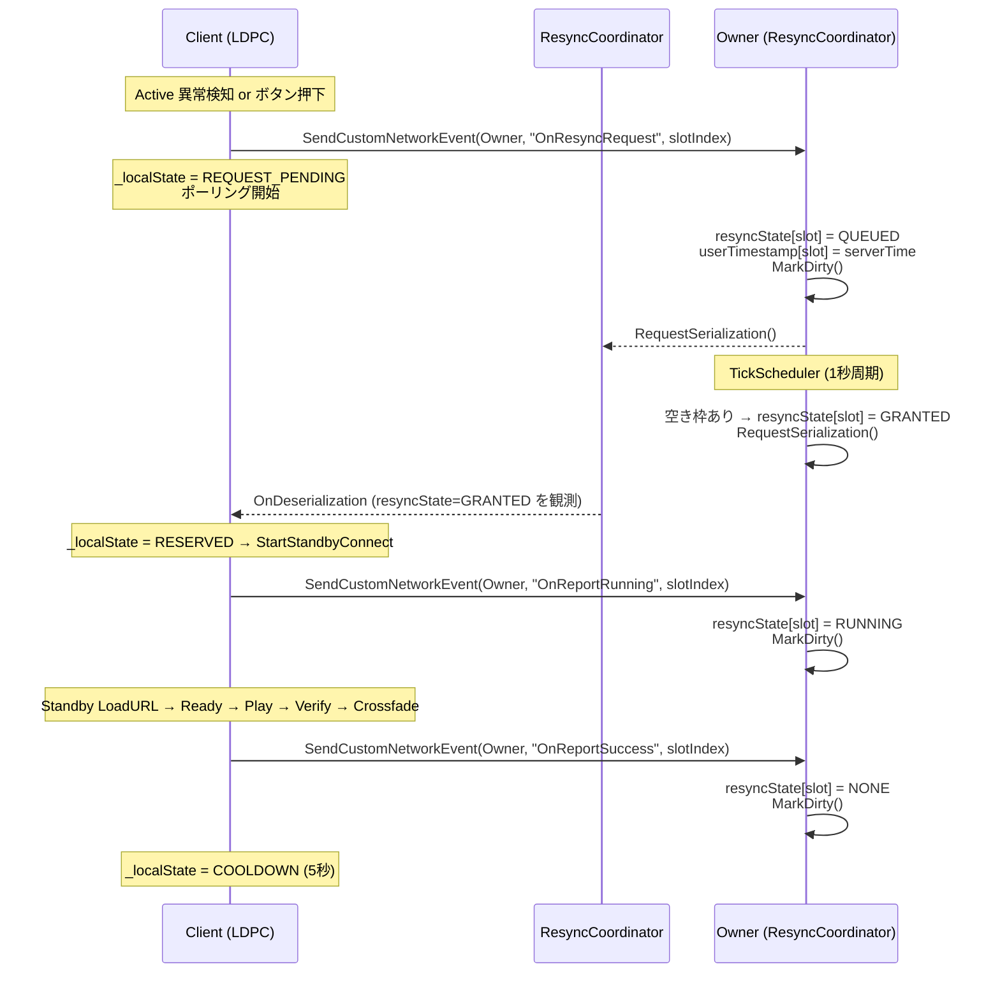
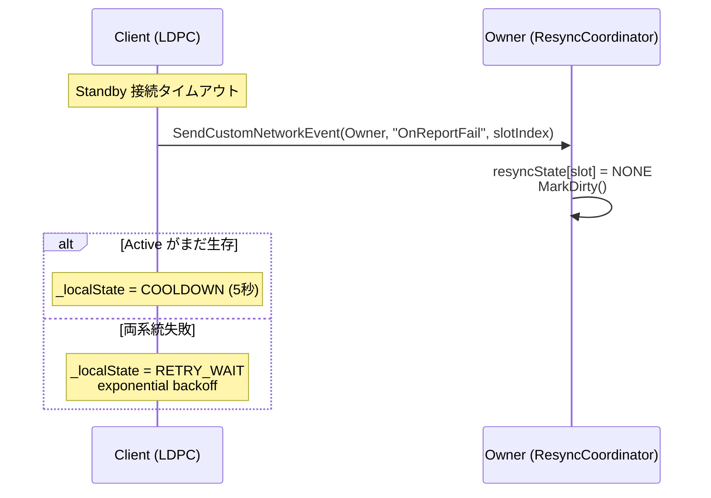
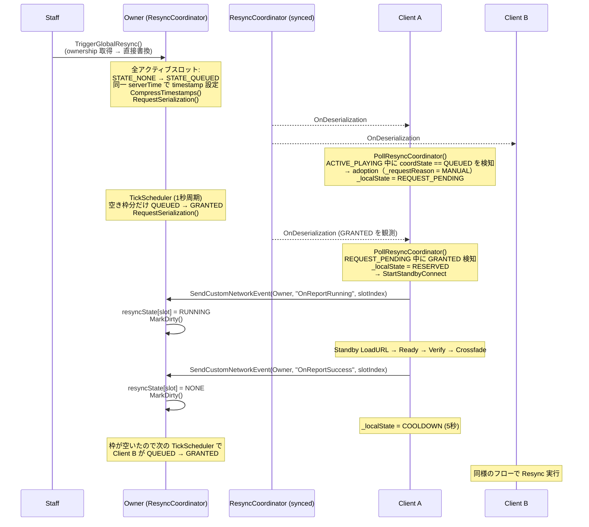
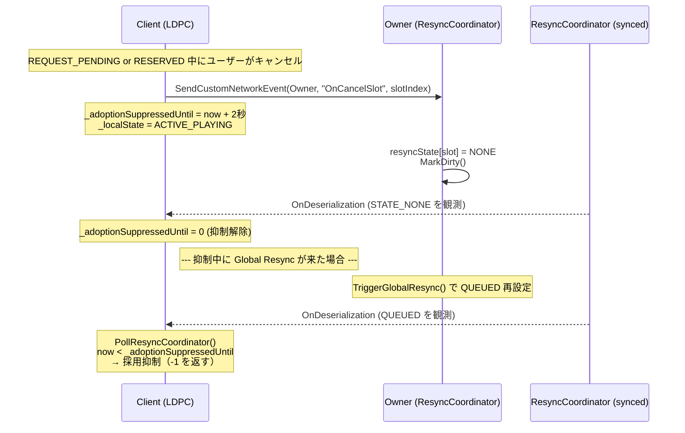
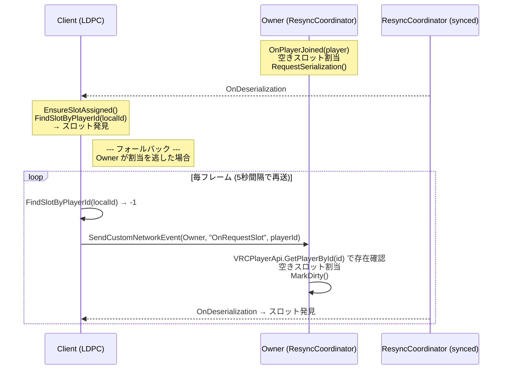
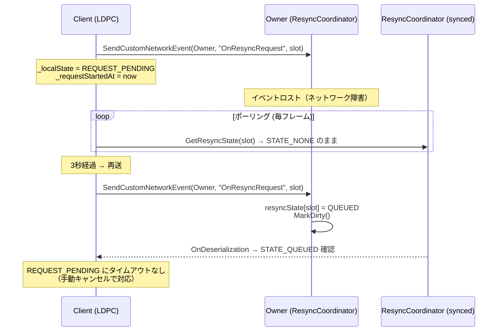

# Resync Owner-Centric Sync Model: Sequence Diagrams

SDK 3.10.2 の `SendCustomNetworkEvent` パラメータ対応 + `[NetworkCallable]` を活用し、
クライアントの ownership 取得を全廃して Owner 一元管理に移行する新設計のシーケンス図。

## 1. 個人 Resync（障害検知 / 手動）

## 2. 個人 Resync: 失敗時

## 3. Global Resync（スタッフ操作）

グローバル Resync は個別 Resync と同じフローを共用する。専用の状態コードやイベントは設けない。

## 4. キャンセルと adoption 抑制

## 5. スロット割当（Join + フォールバック）

## 6. イベント再送（デリバリー保証なし対策）

## 旧設計との主な違い

| 観点 | 旧設計 (ownership ベース) | 新設計 (Owner-Centric) |
|---|---|---|
| クライアント操作 | `TryTakeOwnership()` → 同期変数書換 → `RequestSerialization()` | `SendCustomNetworkEvent(Owner, ...)` 1行 |
| 書き込み権限 | 全クライアントが ownership を奪って書き換え可能 | Owner のみ（スタッフ操作を除く） |
| 競合リスク | 同時 ownership 取得で先行変更が消失（last-writer-wins） | なし（Owner が単一書き込み者） |
| 同期パケット | 1,008 bytes | 420 bytes (-58%) |
| Global Resync 結果報告 | パラメータなし SendCustomNetworkEvent (slotIndex 不明) | 通常の OnReportSuccess / OnReportFail を共用（個別 Resync と同一フロー） |
| デリバリー保証 | ownership + RequestSerialization (確実) | fire-and-forget + ポーリング確認 + タイムアウト清掃 |
| スタッフ操作 | ownership ベース | ownership ベース（変更なし） |
