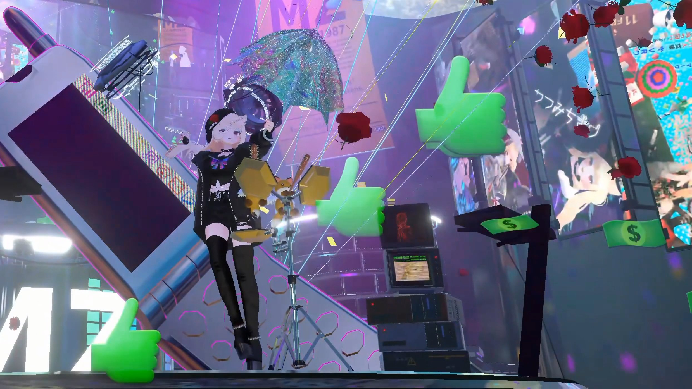
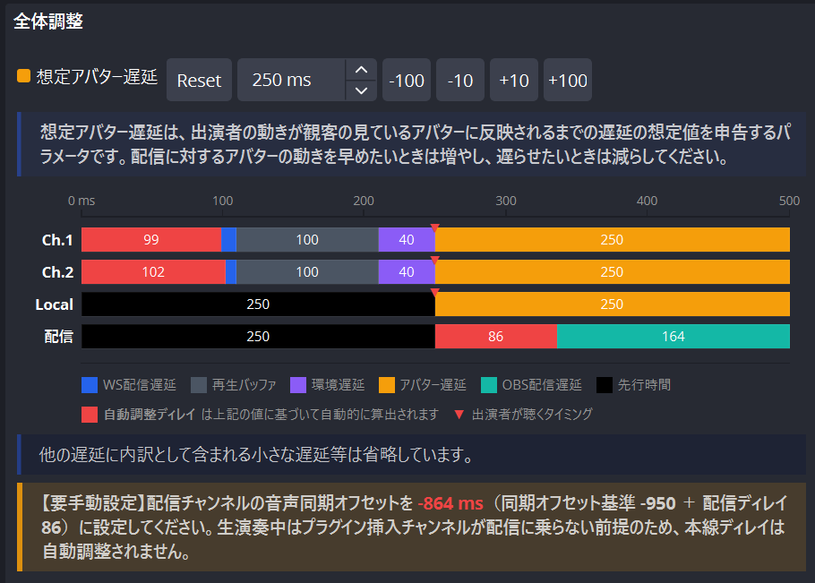

# 開発の背景

このページでは、本ライブプレイヤーがどのような背景と目的で開発されたのかを補足として説明します。これを知ることで、採用可否の判断材料としていただけます（読み飛ばしていただいても構いません）。

---

## 想定シーンと諸問題

AunCast は、VRChat 内の音楽ライブなど、**出演者がアバターでパフォーマンスしながら高品質な音声を配信に載せるイベント** を前提に開発されました。

{ width="640" }

VRChat のアバターボイスは、音楽やライブ演奏を十分な品質で届ける用途には向きません。そのため、この種のイベントでは、出演者の音声をライブ配信に載せ、ワールド内で再生するという運用がたびたび用いられます。

低遅延ライブ配信では、再生を続けるうちに観客ごとの再生位置が少しずつズレる（ドリフトが発生する）ことがあります。音楽ライブでは、このズレが以下の問題につながります。

- 出演者のアバターの動きと、配信で聞こえる音声のタイミングがズレる。
- 出演者と観客が会話する場面で、往復の遅延が大きくなり、会話がしづらい。
- 長時間のイベントほど、ズレが蓄積して体感上の違和感が大きくなる。
- 出演者が最後にした挨拶が観客に聞こえる前に、配信が停止されてしまうことがある。

一部のイベントでは、この対策として **Global Sync**（インスタンス内の全ユーザーを同時に強制再接続させる操作）を定期的に行う運用が定着していました。

しかし、全員を同時に再接続させると、配信サーバーにリクエストが集中します。この際、読み込み始めのタイミング差が出やすく、結果として再同期直後にもズレが残ることがありました。

AunCast では、再接続のタイミングを観客ごとに分散します。これにより、配信サーバーへの負荷を平均化しながら、ドリフトの蓄積を順次解消します。

---

## obs-delay-stream / AunSync との関係

AunCast に先行し、OBSフィルタプラグイン [obs-delay-stream](https://mz1987records.booth.pm/items/8134637) の開発が進められていました。これは、出演者間のネットワーク遅延を計測し、その差を相殺するように遅延を自動調整した音声を出演者ごとに直接配信することで、**国内の観客視点で全出演者の動くタイミングがおおむね合って見える** 状態を目指す仕組みです。

一方、観客側の配信再生でドリフトが蓄積すると、obs-delay-stream で出演者間のタイミングを合わせても、観客の視点では音声とアバターの動きが徐々にズレて見えるようになります。そのため、obs-delay-stream の効果を最大化するには、AunCast で観客ごとのドリフト蓄積を解消する必要がありました。

{ width="455" }

!!! note "AunSync"
    現在、単独出演者が自分一人のタイミングを合わせることに目的を絞ったOBSフィルタプラグイン **[AunSync](https://github.com/pasocommate/AunSync)** も開発中です。

---

## 既存方式との違い

同様の課題を解消する試みとして、配信映像にアバターの動きをエンコードする方式の同期システムも存在します（例：[ShaderMotion](https://booth.pm/ja/items/2306316)）。この方式では、音声と出演者の動きを一つの配信に載せられるため、音声と動きのズレは原理上ゼロとなり、完璧な同期が実現します。

ただし、この手法では一般的に出演者のアバターをNPCとしてワールドに配置する必要があります（または非常に高度なアバター改変技術が必要となります）。多数の有志の出演者が関係し、個人個人の裁量に委ねられることの多いイベントでは、準備の手間・難易度やアバター利用権限の問題が大きく、この手法の採用は現実的ではありませんでした。

AunCast は、出演者がふだん使用しているアバターをそのまま着用してパフォーマンスし、音声は配信で高品質に届ける運用を前提にしています。そのうえで、観客ごとの配信ドリフトを抑え、アバターの動きと音声のズレを目立ちにくくすることを目的としています。

仕組みのより詳しい説明は、[再同期の仕組み](concepts/resync.md)と[同時接続上限の管理](concepts/connection-limit.md)を参照してください。
