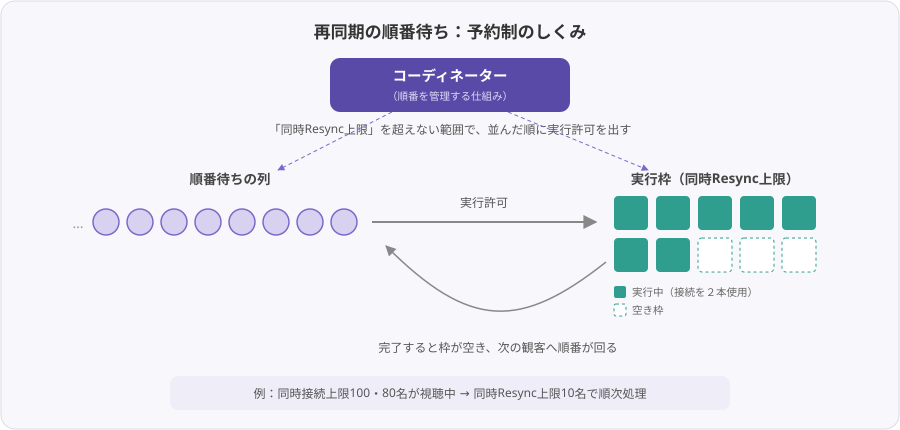

# 同時接続上限の管理

このページでは、AunCast の運用で避けて通れない **「配信サーバーが同時に受け付けられる人数には上限がある」** という制約と、AunCast がそれをどう守っているかを説明します。**スタッフにとって特に重要** な概念です。

---

## 配信サーバーには「同時接続上限」がある

ライブ配信の音声・映像は、配信者から **配信サーバー**（[VRCDN](https://vrcdn.live/) や [TopazChat](https://github.com/TopazChat/TopazChat) など）を通じて各観客へ届きますが、**「同時に受け付けられる接続数」の上限** があります。本マニュアルでは例として **「100接続」** のプランを前提に説明します。

重要なのは、**接続数は「観客の人数」ではなく「確立している接続の本数」で数える** という点です。

!!! info "再同期中の観客は接続を『２本』使う"
    AunCast は[再同期の仕組み](resync.md)のとおり、再生を途切れさせないため観客ごとに再生系統を２系統保持します。通常は１本ですが、**再同期中のみ、予備系統でもう１本** 接続を確立します。つまり「再同期中の観客」は、一時的に接続を２本消費することがあります。

---

## 管理が必要な理由

具体的な数値で考えると、必要性が明確になります。

!!! example "80名が視聴中・上限100接続の例"
    - 80名が視聴中 → **80接続** を消費。
    - 空きは **100 − 80 = 20接続** のみ。
    - 再同期中の観客は一時的に２本目を使うため、**余裕は大きくない**。

ここで、**80名全員が一斉に再同期を開始した** 場合を考えます。

- 80名 × ２本 = **最大160接続** を同時に要求。
- 上限100接続を大幅に超過。
- あふれた接続は受け付けられず、**かえって配信全体が不安定になる**。

つまり再同期は有用ですが、**各自が無秩序に一斉実行すると、上限を超過** します。このため、「同時に再同期してよい人数」を制限する必要があります。

これが、AunCast が再同期を中央で管理している理由です。

---

## AunCast の解決策：予約制と「同時Resync上限」

AunCast は **順番を管理する仕組み**（コーディネーター）を備えており、再同期を **予約制（順番待ち）** にしています。処理の流れは次のとおりです。

1. 再同期を要求するときは、まず **順番待ちの列に並ぶ**。
2. コーディネーターは、**「同時にResyncしてよい人数」の上限を超えない範囲で**、並んでいる観客へ順に **実行許可** を出す。
3. 許可を得た観客だけが、予備系統で接続し直す。
4. 完了すると枠が空き、次の観客へ順番が回る。

これを繰り返すことで、**「同時に２本目を使う人数」が常に上限以下** に保たれ、配信サーバーの接続数があふれません。

{ width="640" }

---

## ２つの上限（スタッフが調整できます） {#limit-params}

接続管理に関わる数値は２つあり、いずれも **スタッフがワールド内から、その場で変更** できます（変更は全員に反映されます）。スタッフ画面では次のラベルで表示されます。

| 項目 | **Connection≤** | **Concurrent≤** |
|---|---|---|
| スタッフ画面の表示 | Connection≤（同時接続上限） | Concurrent≤（同時Resync上限） |
| 意味 | 配信サーバーの接続数上限 | 同時に再同期してよい人数 |
| 設定の目安 | **契約配信プランの上限** | 下記の式の値から余裕を見た数値 |

**Concurrent≤** に設定できる上限の目安は、次の式で見積もれます。

`Concurrent≤` の目安 ＝ `Connection≤` − 想定される最大インスタンス人数

例：上限100接続・最大80名収容 → 100 − 80 ＝ **20 が上限の目安**。

実際には、この目安より小さめの値（初期値の **10** 程度）から始めてください。大きすぎると再同期の失敗が増え、小さすぎると順番待ちが滞留します。本番中の調整方法と判断の目安は[モニタリングと上限調整](../operation/monitoring.md#limits)を参照してください。

---

## 「全員一斉」でも上限を超えない {#staggering}

スタッフが **全員一斉の再同期**（[Resync All](../operation/panel-staff.md#global-resync)）を実行しても、上限を超える心配はありません。一斉といっても全員が同時に接続し直すわけではなく、**通常の再同期と同じ順番待ちの列に、全員がまとめて並ぶ** だけだからです。あとは「同時にResyncしてよい人数」の枠ごとに、順次処理されていきます。

!!! example "全員完了までの目安"
    おおよその目安は次の式で見積もれます。

    ```
    全員完了の目安 ＝ （対象人数 ÷ 同時Resync上限）を切り上げ × １回あたり約８秒
    ```

    例：80名・同時10名・１回８秒 → （80 ÷ 10）× ８＝ **約64秒**

    「１回あたり約８秒」は、画面上の待ち時間推定にも使っている経験値です。実際の所要時間は配信やネットワークの状況で変動します。

なお、通常は自動Resyncにより常時緩やかに再同期が行われているため、Resync All 操作をする必要はありません。

---

## まとめ

- 配信サーバーには **同時接続上限** があり、接続は「人数」ではなく「確立している接続の本数」で数える。
- 再同期中は一時的に２本目を使うため、**全員一斉の再同期は上限を超過** しうる。
- AunCast は **予約制（順番待ち）＋ 同時Resync上限** でこれを防ぐ。
- 上限は **Connection≤（同時接続上限）** と **Concurrent≤（同時Resync上限）** の２つがあり、**スタッフがワールド内で調整** できる。
- 全員一斉の再同期も同じ列を使うため、順次処理され上限を超えない。

!!! tip "配信側の注意もあわせて"
    CDNの選定、ビットレート、URLの取り扱い、自動再生など、**配信側の運用上の注意**は [配信・運用上の注意](../operation/streaming.md) にまとめています。接続の安定にはこちらも重要です。
