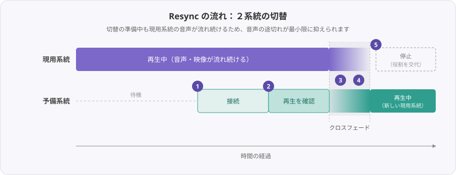

# 再同期 (Resync) の仕組み

このページでは、Resync の内部動作（どの順序で再接続し、何を確認して切り替えるか）を説明します。

---

## １回のResyncで起きること

AunCast は、観客ごとに **現用系統** と **予備系統** の２つの再生系統を持ちます。Resync の実行が始まると、いま聞こえている現用系統をすぐ止めず、予備系統を先に準備します。

1. 現用系統の音声・映像を流したまま、予備系統で同じ配信URLへ接続します。
2. 予備系統の再生が始まったか（再生位置が継続して進んでいるか）を確認します。
3. 正常に再生中と判断できたら、表示と音声を予備系統へ切り替えます。
4. 音声は急に切り替えず、短時間のクロスフェードで移行します。
5. 旧現用系統を停止し、現用系統と予備系統の役割を入れ替えます。

このため、接続の準備中も観客には現用系統の音声が流れ続けます。単純な再読み込みより音声の途切れが目立ちにくいのは、この順序で処理するためです。

{ width="640" }

---

## 自動Resyncの判定

自動Resyncは、各観客のローカル環境で判断されます。主な判定は以下の３つです。

| 判定 | 内容 |
|---|---|
| 停止検知 | 再生位置が進まない状況が一定時間続く |
| ドリフト検知 | 接続確立時からの再生位置のズレが、スタッフの設定した Drift Threshold を超える |
| 無音検知 | 音声が出ていない状況が一定時間続く |

無音検知は、曲間や静かな演出で不必要に働く場合があります。これを防ぐため、観客は手元パネルの **Silence Resync** で、無音を契機とする自動Resyncだけをオフにできます。
なお、無音検知によるResync発生後は、一定時間（デフォルト：150秒）の間、無音が再検知されません。

観客は **Manual Mode** をオンにすると、停止・ドリフト・無音・再生エラー等を契機とするすべての自動Resync / Rebootを停止できます。Resync / Reboot ボタン押下時の動作と、スタッフによる操作は Manual Mode 中も有効です。

スタッフは **Drift Threshold** でドリフト検知のしきい値を変更でき、`OFF` を選ぶとインスタンス全体でドリフト検知を停止できます。`OFF` にしても停止検知・無音検知等は引き続き有効です。

!!! note "順番待ち中に自力で復旧した場合"
    停止検知でResyncを要求した後でも、順番待ち中に現用系統の再生が正常に戻った場合は、Resync要求を取り消してそのまま再生を継続します。

---

## 予備系統で接続できなかった場合

予備系統で接続できない場合、AunCast は状況に応じた処理を行います。

- **現用系統がまだ再生できている場合**：現用系統を維持し、時間を置いて再試行します。
- **現用系統も予備系統も再生できない場合**：間隔を徐々に広げながら、自動的に再接続を繰り返します。

このとき、手元パネルの再生ステータス表示は **Retry Wait** になります。エラー発生時は **Error: ...** と停止・失敗回数が表示される場合があります。失敗が続く場合は、スタッフビューのインジケーターや人数表示にも反映されます。

---

順番待ちや同時接続数の考え方は、次のページで説明します。

[→ 同時接続上限の管理](connection-limit.md)
