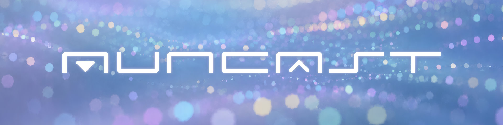

# AunCast ユーザーマニュアル

{ width="836" }

**AunCast** は、VRChatワールド向けの **低遅延ライブ専用ビデオプレイヤー** です。インスタンス内で出演者が行うアバターパフォーマンスに合わせて、**ライブ演奏・DJプレイなど** の音声をワールド内に配信するイベントで、長時間にわたってズレを蓄積させず、途切れずに配信し続けることを目的としています。

---

## 動作環境

- **Unity 2022.3**（VRChat ワールド開発の推奨バージョン）
- **VRChat SDK - Worlds**（VCC でワールドプロジェクトを作成すると導入されます）
- その他の依存パッケージは、VCC がインストール時に自動的に解決します。
- **対応プラットフォーム**：PC（Windows）のみ。**Quest などの Android 単体機には対応していません。** Quest 環境では配信の音声・映像が正常に再生されないため、PC/Quest 混在イベントで使用する際は注意してください。

---

## このマニュアルの読み方

まず、**[動作原理](how-it-works.md)** と **[クイックスタート](quickstart.md)** に目を通せば、基本的な利用に必要な事項を把握できます。詳細な仕様は、その後の各章を必要に応じて参照してください。
