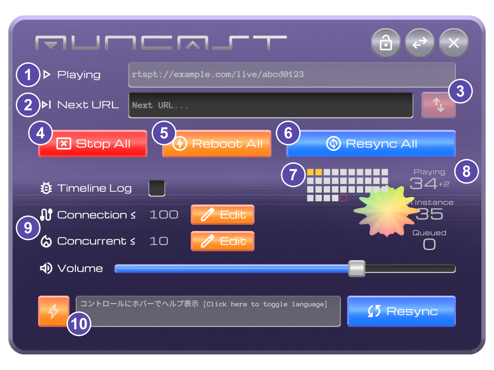

# 手元パネル：スタッフビュー

このページでは、配信を管理するスタッフが行う操作を説明します。スタッフビューの解錠、配信URLの変更、全員一斉の再同期・停止・再起動、接続上限の調整などが含まれます。

壁パネルと手元パネルの呼び出し方法は[壁パネルと手元パネル](panels.md)、手元パネルの基本操作は[手元パネル：観客ビュー](panel-viewer.md)を参照してください。スタッフも、自分の端末の再同期や音量調整では観客ビューの操作を使用します。事前に[再同期の仕組み](../concepts/resync.md)と[同時接続上限の管理](../concepts/connection-limit.md)を読んでおくと、各操作の意味を理解しやすくなります。

---

## スタッフビューを解錠する {#unlock}

スタッフビューの利用には **解錠**（アンロック）が必要です。解錠の方法は２通りです。

1. **VRChat ディスプレイネームで許可されている**：あらかじめスタッフの VRChat ディスプレイネームを登録しておくと、その人は解錠操作なしでスタッフビューを使用できます。
2. **暗証番号で解錠する**：壁パネルの鍵アイコン（lock）から、**４桁の暗証番号** を入力して解錠します。

{ width="260" }

解錠後は、手元パネル右上の **ビュー切替ボタン**（swap_horiz）でスタッフビューへ移動できます。手元パネルを呼び出すジェスチャーをもう一度行っても切り替わります。

---

## スタッフビュー

スタッフビューは、配信を管理するスタッフが使用する操作画面です。

{ width="420" }

主な機能は以下のとおりです（番号は上図に対応）。

| 要素 | 機能 |
|---|---|
| ① **Playing**（play_arrow） | 現在配信中のURL。ポイントすると入力者が表示される |
| ② **Next URL**（skip_next） | 次に再生する配信URLの入力欄 |
| ③ **送信ボタン**（swap_vert） | Next URL を全員に反映する |
| ④ **Stop All**（cancel_presentation） | 全員の再生を停止する |
| ⑤ **Reboot All**（charger） | 全員を強制リブートする（緊急用） |
| ⑥ **Resync All**（change_circle） | 全員を一斉に再同期する |
| ⑦ **状態インジケーター** | 全員の状態を色で表示する（→ [モニタリング](monitoring.md)） |
| ⑧ **人数表示** | Playing / Instance / Queued の人数（→ [モニタリング](monitoring.md)） |
| ⑨ **Connection≤**（cable） 　 **Concurrent≤**（mode_heat） | 同時接続 / Resync上限の現在値と **Edit** ボタン（edit） |
| ⑩ **ヘルプ表示** | ポイントしたUI部品の説明欄 インタラクトで日本語 / 英語を切替 |
| ⑪ **Resync ボタン**（sync） | 自分の端末を再同期する。[観客ビューの Resync](panel-viewer.md#resync-button)と同じ |
| ⑫ **Reboot ボタン**（bolt） | 自分の端末を切断→再接続する。[観客ビューの Reboot](panel-viewer.md#reboot-button)と同じ |
| ⑬ **操作ロックボタン**（lock） | スタッフ操作を一時的に施錠し、誤操作を防ぐ（→ [操作ロック](#staff-lock)） |
| ⑭ **Timeline Log**（bug_report） | 診断用タイムラインログのオン / オフ（→ [タイムラインログ](#timeline-logging)） |

⑪⑫ の Resync / Reboot と Volume は、スタッフビューでも **自分の端末に対する操作** です。挙動は観客ビューと同じなので、[手元パネル：観客ビュー](panel-viewer.md)を参照してください。

---

## 配信URLを変更する {#change-url}

配信の接続先URLを設定・変更する操作です。

1. **Next URL** の入力欄に、新しい配信URLを入力します。VRでは、入力欄を選択するとVRChatのキーボードが表示されます。
2. 右の **送信ボタン**（swap_vert）を押します。

これでURLが **全員に反映** され、各観客が新しい配信を再生し始めます。現在配信中のURLは **Playing** の欄で確認できます。この欄をポイントすると、誰がそのURLを入力したのかが表示されます。

!!! note "Playing URL と Next URL は入れ替わります"
    既に配信中のURLがある状態で送信すると、新しいURLが Playing になり、それまでの Playing URL は Next URL 欄に戻ります。元の配信へ戻したい場合の控えとして使えます。

!!! info "不正なフォーマットのURLは反映されません"
    URLとして不正なフォーマット（`://` を含まない等）の場合は反映されません。

---

## Resync All（全員一斉の再同期） {#global-resync}

**Resync All** ボタンを押すと、インスタンス内の全員を一斉に再同期します。

ただし、全員が同時に接続し直すわけではなく、通常の再同期と同じ順番待ちの列で順次処理されるため、[配信サーバーの上限は超えません](../concepts/connection-limit.md#staggering)。

!!! tip "実行のタイミング"
    Resync All は、適切に自動Resyncが働いている限り、配信中は特に実行する必要はありません。**Stop All せずに配信を停止し、同じURLを使いまわして配信を再開した直後** などに有用です（復旧を急ぐ時は Reboot All も使用できます）。全員完了までの目安時間は[モニタリング画面](monitoring.md)で確認できます。

---

## Stop All（全員の再生を停止） {#stop-all}

**Stop All** で、全員の再生を即座に停止します。配信終了時に使用します。停止中、各画面は待機用の画像に戻ります。

---

## Reboot All（全員の強制リブート） {#force-reboot}

**Reboot All** は、全員の再生をいったんすべて停止し、接続し直させる緊急操作です。押した後はインジケーターを注視し、全観客の接続状況の把握に努めてください。

!!! danger "通常は使用しません"
    Reboot Allは滑らかな切り替えではありません。**全員の音声・映像が一度途切れます。** また、配信サーバーへの再接続処理が一斉に起こるため、却って不安定になる場合があります。まず Resync All を試し、それでも復旧しないときのみ使用してください。

| 操作 | 途切れ | 用途 |
|---|---|---|
| **Resync All** | ほぼなし（背後で切り替え） | 通常の全員一斉の再同期。まずはこちら |
| **Reboot All** | あり（すべて停止して接続し直す） | 深刻な不調時・復旧を急ぐときに |

---

## 上限を変更する（Connection≤ / Concurrent≤）

スタッフビューの **Connection≤ / Concurrent≤** は、それぞれ右の **Edit** ボタンで編集できます。数値の意味と調整の目安は次のページを参照してください。

[→ モニタリングと上限調整へ](monitoring.md)

---

## 操作ロック（誤操作防止） {#staff-lock}

スタッフビュー右上の **操作ロックボタン**（lock）は、スタッフ操作を一時的に **施錠** して誤操作を防ぐスイッチです。

- 施錠中は、送信・Stop All・Reboot All・Resync All などスタッフ操作のボタンが押せなくなります。
- もう一度押すと解錠され、再び操作できます。アイコンは施錠中／解錠中で切り替わります。
- これは **自分の端末だけ** のローカルな切り替えです。他のスタッフによる操作を禁止する効果はありません。

---

## タイムラインログ（診断用） {#timeline-logging}

スタッフビューには、再生・Resync の状態遷移を構造化ログとして出力する **タイムラインログ** のトグルがあります。不具合の原因を調べる際、ログ出力を手掛かりにできます。

!!! warning "負荷が高いため通常はオフ"
    タイムラインログは再生・Resync の状態遷移を逐次出力するため、**有効にすると負荷がかかります**。トラブルの診断時のみ一時的にオンにし、通常運用ではオフのままにしてください。

---

## ヘルプと言語

各ボタンにカーソル（VRはポインタ）を合わせると、画面に説明が表示されます。説明欄を押すと **日本語 / 英語** を切り替えられます。
