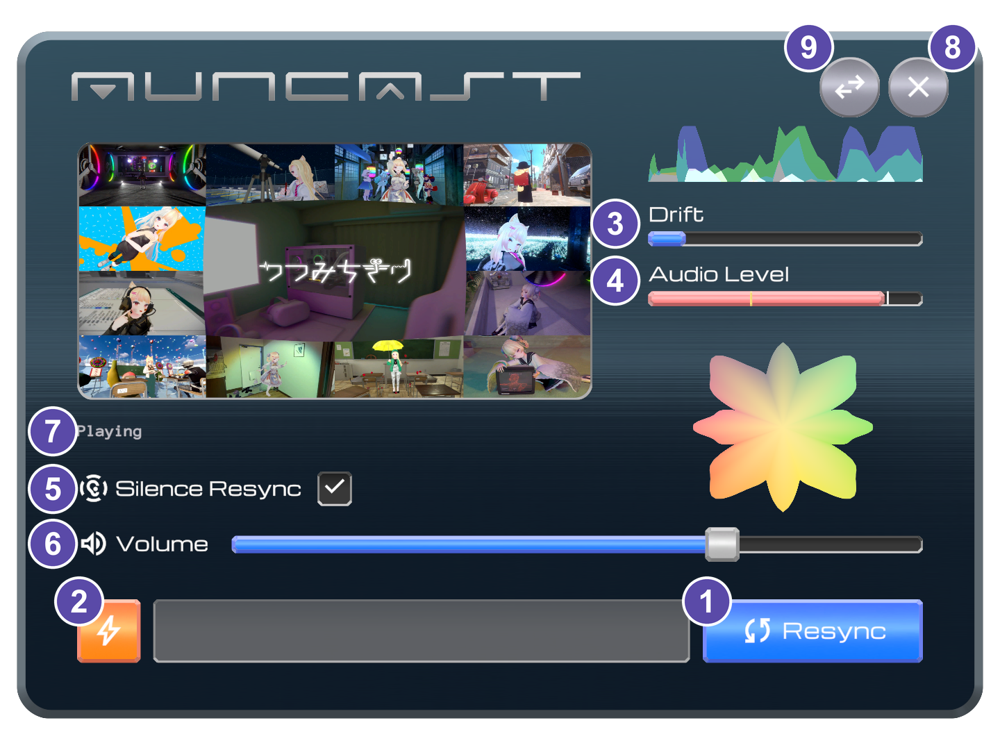

# 手元パネル：観客ビュー

このページでは、手元パネル（観客ビュー）の使い方と、各表示の見方を説明します。スタッフも、自分の端末の再同期や音量調整では、この観客ビューの操作を使用します。手元パネルの呼び出し方は[壁パネルと手元パネル](panels.md)を、配信URLの変更や全員一斉操作などスタッフ専用の操作は[手元パネル：スタッフビュー](panel-staff.md)を参照してください。

---

## 手元パネルの各部 {#controls}

呼び出すと、以下のパネルが表示されます。

{ width="420" }

主な機能は以下のとおりです（番号は上図に対応）。各表示の詳しい読み方は、以降の各項目を参照してください。

| 要素 | 機能 |
|---|---|
| ① **Resync ボタン**（&#xE627;） | 配信への接続を再同期する |
| ② **Reboot ボタン**（&#xEA0B;） | いったん切断してから接続し直す |
| ③ **Drift** | 接続確立時からの「音声・映像のズレ量」のメーター |
| ④ **Audio Level** | 現在 音声が出ているかを示すメーター |
| ⑤ **Silence Resync**（&#xEBF3;） | 無音時に自動的に再同期するかの切り替え |
| ⑥ **Volume**（&#xE050;） | 音量 |
| ⑦ **再生ステータス表示**（スクリーン下部） | 現在のプレイヤーの状態（例: Idle＝待機中） |
| ⑧ **閉じるボタン**（&#xE5CD;） | パネルを閉じる |
| ⑨ **ビュー切替ボタン**（&#xE8D4;） | [スタッフビュー](panel-staff.md)へ切り替える 解錠時のみ表示されます（→ [スタッフビューを解錠する](panel-staff.md#unlock)） |

ここでは特に重要な２つのボタンを説明します。

### Resync ボタン {#resync-button}

押下すると **再同期の順番待ちの列に並びます**。順番が来るとバックグラウンドで新しい接続が用意され、準備が整うと滑らかに切り替わります。

- 何も再生していないとき（配信が停止中）は押せません。
- 押下直後やしばらくの間は、**「順番が来るまでの目安時間」** が表示されます。
- 順番待ちが長くても、通常は待てば順番が回ってきます。待てない場合は Reboot を検討します。
- 順番待ちの間に再度押すと、**取り消し** できます。

### Reboot ボタン {#reboot-button}

順番待ちをせずに、**現在の接続をいったん切断し、直ちに接続し直す** 手段です。

!!! danger "この操作は再生が途切れます"
    Reboot は滑らかな切り替えではありません。**音声・映像が一度途切れます。** ドリフト解消が目的の場合は、まず **Resync ボタン** を試し、順番が長時間回ってこない場合に使用してください。音声や映像が既に流れなくなっている程度の不調時も有用です。

!!! note "Resync と Reboot の呼び分け"
    一般的なライブ配信再生システムで「Resync」と呼ばれている操作は、この Reboot に相当します。本システムでは、全断→再接続を **Reboot** と呼び、独自２系統方式の途切れない再同期の方を **Resync** と呼んでいます。

### 状況別の対処

| 状況 | 推奨操作 |
|---|---|
| 音声がズレている | **Resync ボタン**（Drift が増えたときに有効） |
| 音声・映像が停止した／カクつく | **Resync ボタン** または **Reboot ボタン** |
| Resync しても復旧しない／順番がこない | **Reboot ボタン**（途切れるのを承知で） |
| 静かな場面で勝手に再同期される | [Silence Resync をオフ](#auto-silence) |

---

## 再生ステータス表示（スクリーン下部） {#playback-status}

左上のスクリーンの下部に、現在の状態が一言で表示されます。エラー発生時は、メッセージや停止・失敗の回数も併せて表示されます。おおむね以下の意味です。

| 表示 | 状態 |
|---|---|
| **Idle** | まだ再生していない（配信が開始されていない、など） |
| **Playing** | 正常に視聴できている |
| **Resync Pending** | 再同期を要求して順番待ち中。目安時間が表示される場合もあります |
| **Reserved** | 再同期の実行枠が確保され、開始を待っている |
| **Connecting...** | 予備系統で配信へ接続している |
| **Verifying...** | 予備系統が正常に再生できるか確認している |
| **Switching** | 現用系統から予備系統へ切り替えている |
| **Cooldown** | 切り替え完了直後の短い待機中 |
| **Retry Wait** | 復旧できず、少し待ってから再試行しようとしている |
| **Error: ...** | 最後に発生したエラー。短時間だけ表示される場合があります |

!!! note "停止・失敗の回数について"
    パネルには `Stall=` や `Fail=` として、停止・失敗の回数の目安も表示されます。時折増える程度は異常ではありません。**短時間に増え続ける** 場合は、配信側やネットワークの不調が継続しているサインです。Reboot、Rejoin 等をお試しください。

---

## Drift（ズレ）メーター

**Drift（ドリフト）** は、配信への接続確立時からの **ズレの蓄積量** を示します。ライブ配信を長時間視聴すると、ズレが少しずつ蓄積することがあります。

- メーターが **短い**：ズレはほとんどなく、正常です。
- メーターが **伸びてきた**：ズレが蓄積しつつあります。
- メーターが **上限に達する** と、**自動的に再同期** してズレをリセットします。

!!! tip "ズレが気になったら Resync"
    視聴していてズレが気になるときは、自動検知を待たずに **Resync ボタン** を押しても構いません。再同期に成功すると、メーターは再び初期状態から測り直しになります。ただし、ネットワーク環境等によっては実際のズレが解消しない場合もあります。

!!! note "Resync で解消できない遅延もあります"
    観客が（配信元から見て）国外などのネットワーク的遠方にいる場合や、配信環境が適切でない場合は、遅延が目立つことがあります。これは Drift メーターがゼロのときでも元から常に発生している遅延で、Resync では解消できません。AunCast のシステムは、**遅延の「蓄積」と「観客ごとのバラつき」によるズレを解消するためのもの**であり、AunCast 単独で遅延そのものをなくすことはできません。

---

## Audio Level（音声レベル）メーター

**Audio Level** は、現在 **音声が出ているか** を示すメーターです。音声が鳴っていれば動き、無音ではほとんど動きません。メーターが動いているのに音が聞こえないときは、配信への接続状態ではなく、VRChatのワールド音量設定やオーディオインタフェースの設定を疑ってください。

AunCast は、音声が一定時間（約２秒）出ない状態が続くと自動的に再同期をリクエストします。

!!! note "灰色になっているとき"
    再同期の直後など、**無音の自動チェックを一時停止している間** は、この表示が灰色になります（復旧直後に何度も再同期しないための仕組みです）。以下の項目をオフにしている場合も灰色になります。

---

## Silence Resync（無音時の自動再同期） {#auto-silence}

**音声が一定時間出ないとき、自動的に再同期するか** を切り替えるスイッチです。

| 設定 | 用途 |
|---|---|
| **オン**（初期設定） | 通常はこのまま。曲間などを契機にドリフトを解消する |
| **オフ** | 曲間・MC・静かな演出など、**意図的な無音が多い配信**で、自動再同期を避ける |

!!! warning "オフにしても、ドリフト検知時の自動再同期は停止しません"
    オフにするのは「**無音を契機とする自動再同期のみ**」です。ドリフト検知時の自動再同期や、手動の Resync ボタンは、オフにしても従来どおり有効です。

---

## Volume（音量） {#volume}

配信を視聴する音量です。

- スライダーを **一番左（０）にすると完全に消音** です。
- 消音している間、Silence Resync は働きません。

---

## 順番待ちの目安時間

再同期を要求して順番待ちの間、Resync ボタン上に **順番が来るまでの目安時間** が表示されます。

これは、先に並んでいる人数と、スタッフが設定した[同時Resync上限](../concepts/connection-limit.md#limit-params)から算出した見込みです。全員一斉の再同期などで列が長いほど、待機時間も長くなります。

---

困ったときの対処は[逆引きインデックス](../appendix/reverse-index.md)も参照してください。
