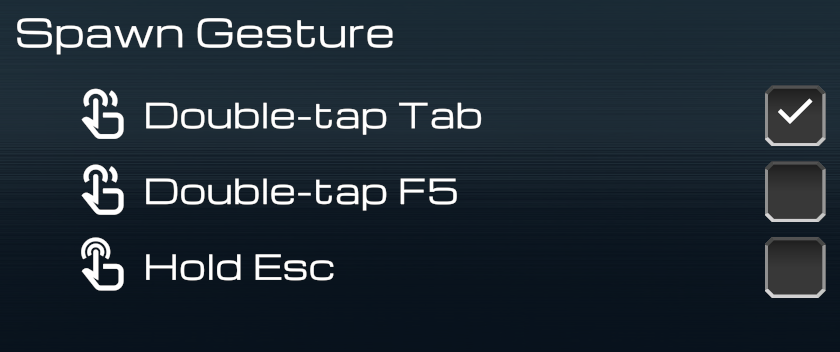
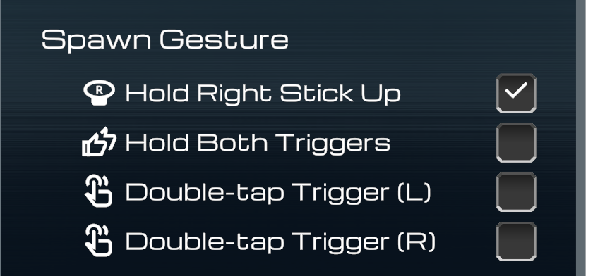
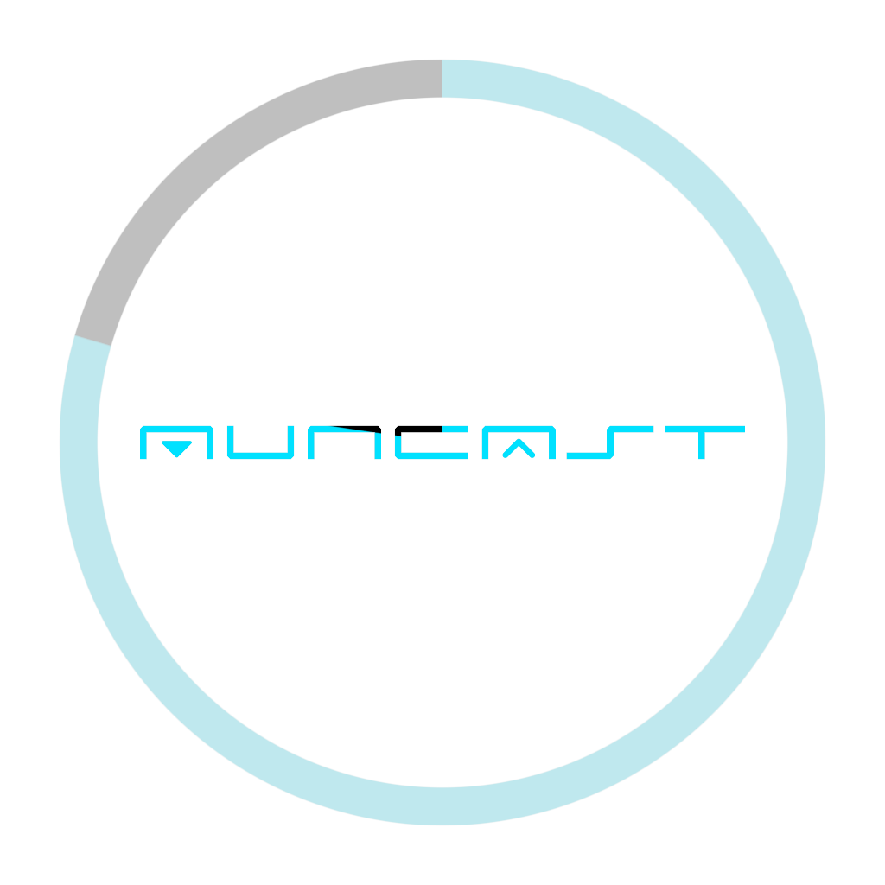

# 壁パネルと手元パネル

このページでは、ワールドに固定設置された壁パネルの使い方と、手元パネルの呼び出し方法を説明します。呼び出した後の手元パネル（観客ビュー）の操作は[手元パネル：観客ビュー](panel-viewer.md)を、スタッフ専用の操作は[手元パネル：スタッフビュー](panel-staff.md)を参照してください。

---

## 壁パネルの表示

壁パネルは、ワールドに固定設置された操作パネルです。**近づくと表示が自動的に切り替わります。**

### 離れているとき

**大きな Resync ボタン** になります。遠くからでも押せ、再同期をリクエストできます。

{ width="260" }

### 近づいたとき

詳細な操作が可能な表示になります。

- **Resync ボタン** … 再同期をリクエストする
- **Reboot ボタン**（bolt）… 切断後に再接続する（音声・映像に途切れが発生します）
- **Spawn Gesture** … 手元パネルの呼び出し方法を選択する
- menu **Spawn Panel ボタン** … 手元パネルを目の前に呼び出す

{ width="300" }

!!! info "スタッフ暗証番号もここで入力します"
    右下の鍵アイコン（lock）から、スタッフ用の暗証番号を入力する画面に切り替えられます。詳細は[スタッフビューを解錠する](panel-staff.md#unlock)を参照してください。このボタンは壁パネルごとに非表示にすることもできます（[壁パネルごとに鍵アイコンを隠せます](../setup/parts-placement.md#wall-panels)）。

---

## 手元パネルの呼び出しジェスチャー

手元パネルは、いつでも手元に表示できるメニューです。呼び出し方法は、壁パネルの **Spawn Gesture** で選択します。初期状態では **Double-tap Tab**（デスクトップ）と **Hold Right Stick Up**（VR）が有効です。選択したジェスチャー・キーバインドは、ローカル設定としてワールドごとに保存されます。

### デスクトップ

キーボードで呼び出します。以下の方法を利用できます（複数選択可）。

- **Double-tap Tab** … Tabキーを続けて２回押す
- **Double-tap F5** … F5キーを続けて２回押す
- **Hold Esc** … Escキーを押し続ける

{ width="340" }

### VR

コントローラー操作で呼び出します。以下の方法を利用できます（複数選択可）。

- **Hold Right Stick Up** … 右スティックを上に倒し続ける
- **Hold Both Triggers** … 両手のトリガーを同時に握り続ける
- **Double-tap Trigger (L) / (R)** … 左／右のトリガーを続けて２回引く

{ width="340" }

!!! tip "押し続ける方式ではHUDゲージが表示されます"
    「倒し続ける」「握り続ける」方式では、成立までの進捗が **HUDゲージ**（視界内の表示）として現れます。

    { width="200" }

!!! note "VRではパネルを掴んで移動できます"
    表示されたパネルに手を近づけて **グリップ** すると、手に持って任意の位置へ移動できます。離すとその位置に固定されます。また、パネルから一定距離遠ざかると自動的に消えます。
