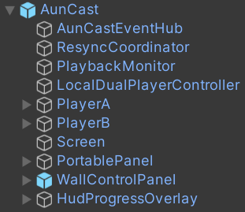
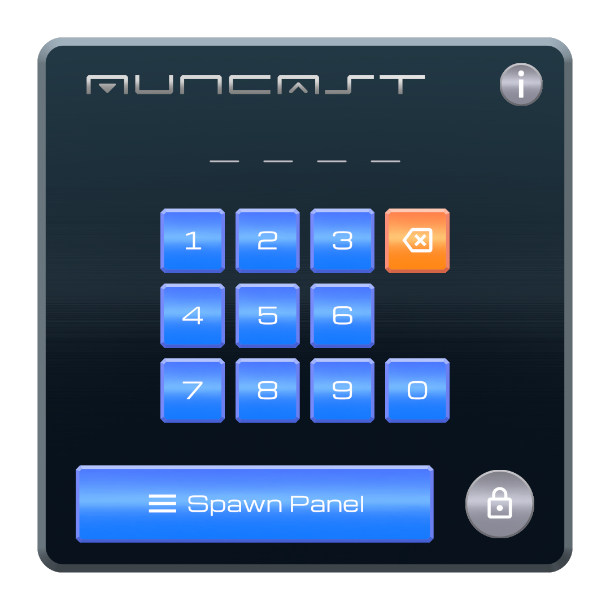
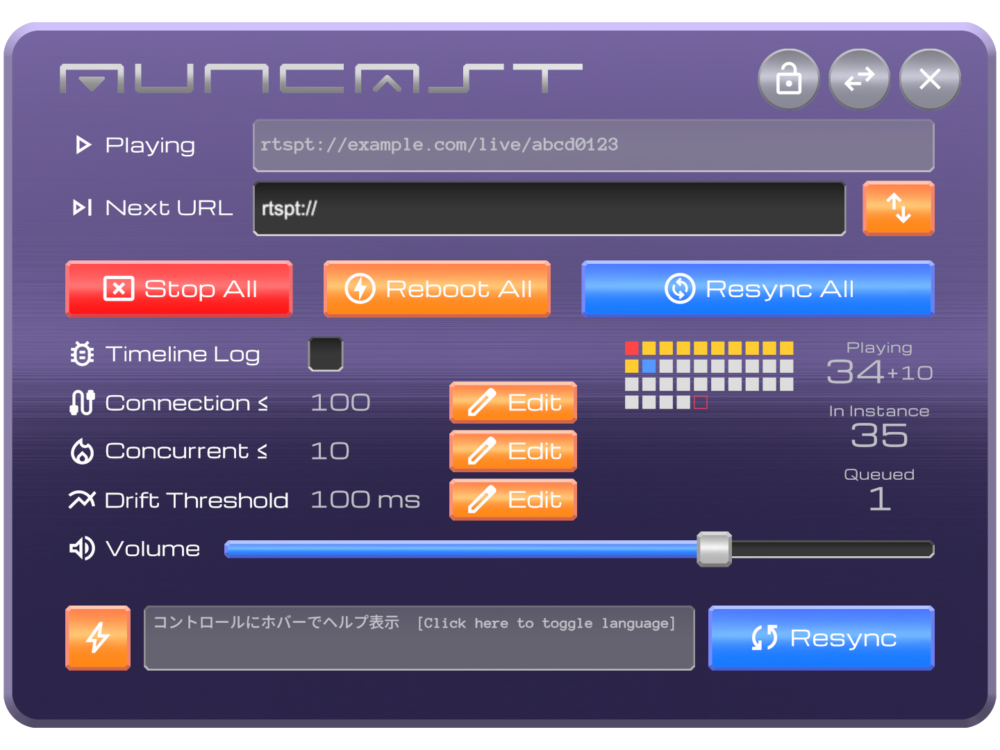
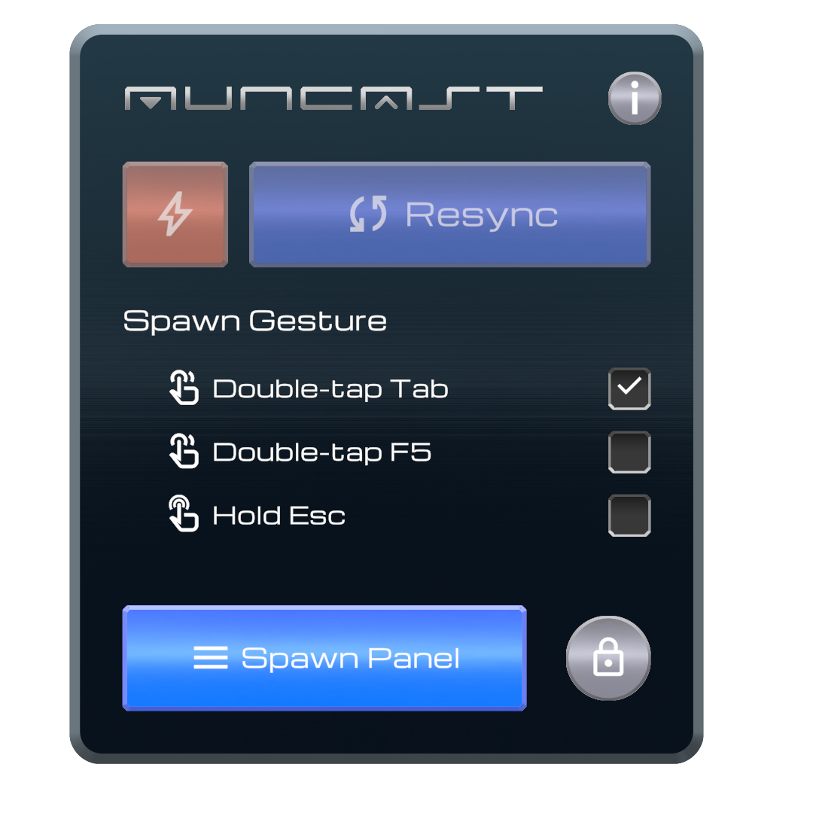
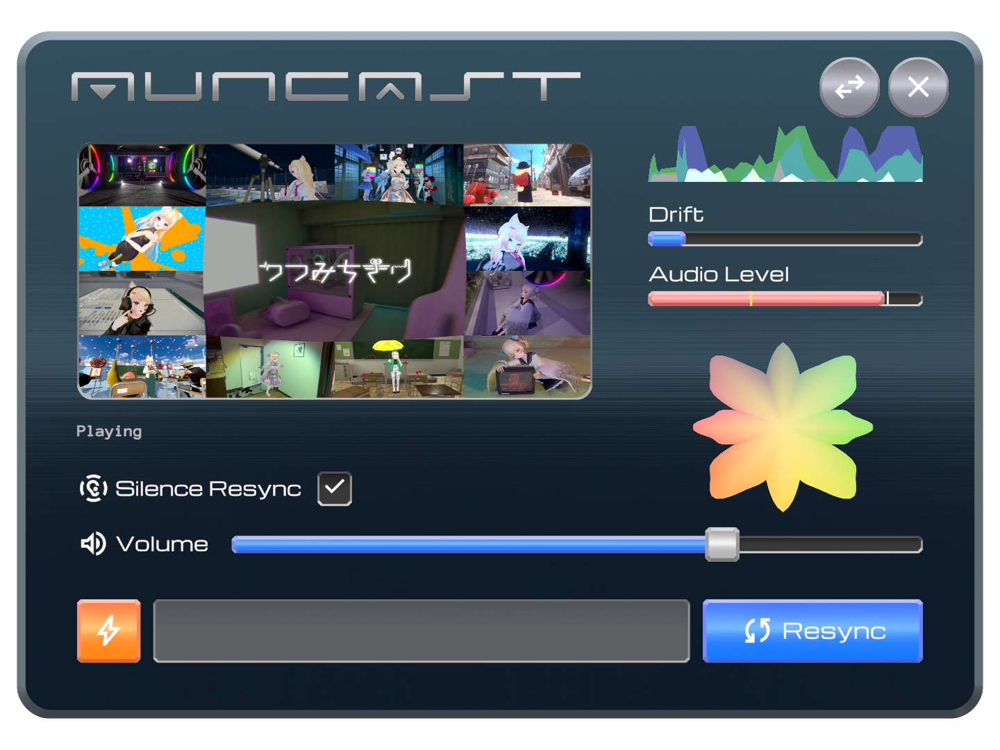

# クイックスタート

本システム利用時の作業別の最短手順です。詳細な仕様は各リンク先を参照してください。

---

## スタッフ：導入・初期設定 {#setup}

1. **[VCCにリスティングを追加](vcc://vpm/addRepo?url=https://pasocommate.chigiri.tokyo/index.json)** をクリックしてリンクを開き、VCCに PasocomMate リスティングを登録します。うまく開けない場合は、VCCの **Settings → Packages → Add Repository** より次のリスティングURLを登録します。

    ```
    https://pasocommate.chigiri.tokyo/index.json
    ```

2. 対象プロジェクトの **Manage Project** で、**AunCast** をプロジェクトに追加します。
3. シーンに **`AunCast.prefab`** を配置します。`AunCast` オブジェクトの直下には、いくつかのカスタマイズ可能な部品が含まれています。

    { width="280" }

4. スクリーン（`Screen`）、スピーカー（`PlayerA/AudioSource`, `PlayerB/AudioSource`）、壁パネル（`WallControlPanel`）などの位置を調整します。壁パネルを複数箇所から操作したい場合は、`WallControlPanel` を複製して配置します。手元パネル（`PortablePanel`）はどこに置いても構いません。
5. `AunCast` ルートオブジェクトを選択し、**`AunCastSettings`** コンポーネントのインスペクタで**利用規約に同意**します。日本語フォントの警告が表示されたら `Tools → TextMesh Pro VRC Fallback Font JPを設定` を実行します。
6. **`AunCastSettings`** コンポーネントのインスペクタで、スタッフ用の **壁パネル解錠パスコード** と、必要に応じて **スタッフ許可ユーザー名**（VRChat ディスプレイネーム）を設定します。
7. オプション：**`AunCastSettings`** で、**同時接続上限**（Connections）を配信プランの同時接続上限以下に設定します。**同時Resync上限**（Concurrent）は、配信プランの上限からインスタンス収容上限を引いた値以下にします。余裕を見て、やや小さめの値に設定してください。ただし、小さすぎるとResyncの順番待ちが溜まって滞る場合があります（[接続上限の設定](guide/settings.md#connection-limits)）。
8. オプション：既存の **VRC AVPro Video Speaker＋AudioSource** がある場合は、位置・音量を調整してから **AVPro Speaker 配線 →「AVPro Speaker 出力先セットアップを実行」** を押します。

[→ 設定と調整（詳細）](guide/settings.md)

---

## スタッフ：配信管理 {#staff}

1. 壁パネルの鍵アイコンを押し、**暗証番号** でスタッフ画面を解錠します。**スタッフ許可ユーザー名** に登録されている場合、この手順は不要です。

    { width="260" }

2. 手元パネルを表示します。壁パネルの **Spawn Panel** ボタン、または **Spawn Gesture** で選択したジェスチャー・キーバインドで呼び出せます。初期状態では、VRは右スティック上方向長押し、デスクトップはTabキー２回押しです。

    <div class="figure-row">
      
      
    </div>

3. 手元パネルをスタッフ画面へ切り替えます。ジェスチャーをもう一度行うか、パネル右上の **⇔ボタン** を押します。

    { width="360" }

4. **Next URL** に配信URLを入力し、右側の **↑↓ボタン** で配信を開始します。
5. 配信を終えたら **Stop All** で停止します。

[→ 操作パネル](guide/operations.md) / [モニタリングと上限調整](guide/monitoring.md) / [配信・運用上の注意](guide/streaming.md)

---

## 観客：視聴とトラブル時の操作 {#viewer}

1. **手元パネルを表示するには**：VRモードもデスクトップモードも、壁パネルの **Spawn Gesture** で選択したジェスチャー・キーバインドで呼び出されます。壁パネルの **Spawn Panel** をインタラクトしても呼び出すことができます。初期状態のジェスチャー・キーバインドは、VRは右スティック上方向長押し、デスクトップはTabキー２回押しです（ただし、スタッフが変更している場合もあります）。選択したジェスチャー・キーバインドはワールドごとに保存されます。

    { width="300" }

2. **音声が途切れた・ズレた**ときは **Resync ボタン**を押します。しばらく待てば順番が回り、音声が途切れることなく復旧します（通常は自動検知でも復旧しますが、気になる場合は手動で実行できます）。

    { width="360" }

3. どうしても復旧しない・順番が回ってこない場合は、**Reboot ボタン**（⚡）を使用します。これは、一般的なライブ配信再生システムで「Resync」と呼ばれている操作で、音声と映像が一時的に途切れます。本システムでは、この全断→再接続を **Reboot** と呼び、独自２系統方式の途切れない再同期の方を **Resync** と呼んでいます。

[→ 操作パネルの使い方](guide/operations.md) / [状態表示の見方](guide/status.md)
