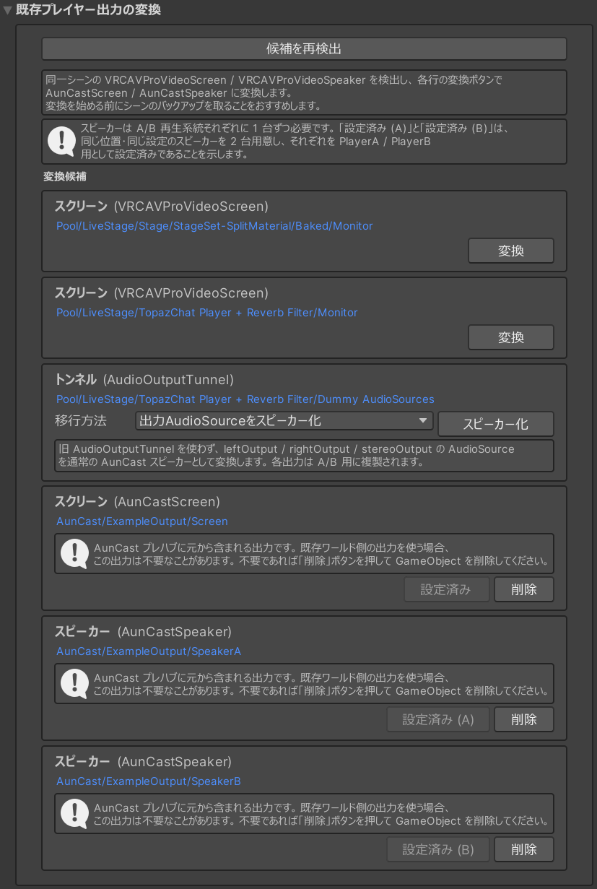
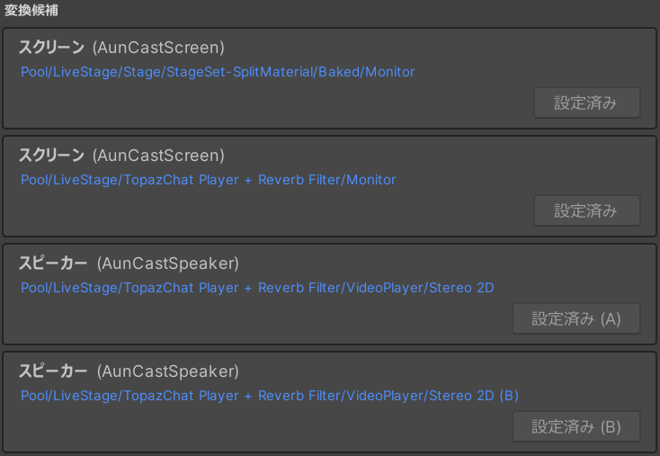
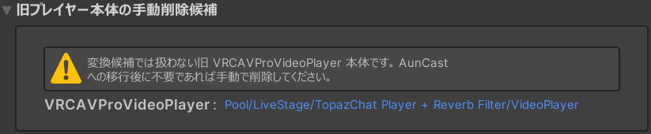

# 部品の配置と移行

壁パネルやスクリーンの追加、音声出力の配線、既存ワールドからの移行など、**シーン上の部品の配置と再配線**に関する作業をまとめています。インスペクタの値だけで設定できる項目は[設定と調整](settings.md)を参照してください。

!!! warning "作業前にシーンをバックアップしてください"
    このページの作業では、シーン上のオブジェクトやコンポーネントを複製・削除・再配線します。作業前にシーンファイルを複製するか、gitなどで現在の状態を保存してください。

!!! note "再配線は自動でも実行されます"
    **「参照関係を再配線」** と同じ処理は、Unity エディタで **Play を開始したとき**と**ワールドをビルドしたとき**にも自動実行されます。再配線は、何度実行しても同じ結果になります（べき等操作）。

---

## 壁パネルを増やす (AunCastWallControlPanel) {#wall-panels}

壁パネル（`WallControlPanel`）は複製して、複数箇所に設置できます。会場の規模が大きい場合や、スタッフ控え室にも操作パネルを置きたい場合に有効です。

1. 既存の **`WallControlPanel` GameObject** を選択し、Ctrl+D で複製します。
2. ワールド内の任意の位置に配置します。
3. `AunCastSettings` の **出力・参照の再配線** にある **「参照関係を再配線」** を押し、コンポーネントを関連付けます。

!!! tip "壁パネルごとに鍵アイコンを隠せます"
    スタッフ暗証番号を入力するための鍵アイコンは、壁パネルごとの設定 (`AunCastWallControlPanel` コンポーネントの **Disable Passcode View Switch Button**) で非表示にできます。たとえば会場内の壁パネルでは鍵アイコンを隠し、控室の壁パネルだけで解錠できるようにする、といった運用が可能です。

    暗証番号を空欄にして無効化している場合は、入力しても解錠されないため、あわせて鍵アイコンも非表示にすることを推奨します。

## スクリーンを増やす (AunCastScreen) {#screens}

映像の出力先（スクリーン）は複製できます。**同一のマテリアルを共有していれば、スクリーンを増やしてもビデオデコードの負荷はほぼ一定**です。

1. 既存の **`ExampleOutput/Screen` GameObject** を選択し、Ctrl+D で複製します。
2. ワールド内の任意の位置に配置し、サイズを調整します。
3. `AunCastSettings` の **出力・参照の再配線** にある **「参照関係を再配線」** を押し、コンポーネントを関連付けます。

別のシェーダー / マテリアルを使用する場合は、複製した `AunCastScreen` の以下の項目を合わせてください。

- **テクスチャプロパティ名**（`textureProperty`、既定 `_EmissionMap`）… そのシェーダーが映像に使用するテクスチャプロパティ名
- **レンダラーインデックス**（`rendererIndex`）… マルチマテリアルのどのスロットに適用するか

既存の `MeshRenderer` に `AunCastScreen` コンポーネントを付与し、同様の設定と再配線をすることでもスクリーン化できます。

!!! note "停止中の画像（アイドル画像）"
    再生停止中の表示は、[設定と調整](settings.md)の **映像プレイヤー** セクションの **「停止中のスクリーン画像」** で指定します。再配線の際に各スクリーンへ分配設定されます。

## スピーカーを増やす (AunCastSpeaker) {#speaker}

AunCast は内部に `PlayerA` / `PlayerB`（A/B再生系統）を持つため、音声出力も２系統の `AudioSource` (+ `VRCSpatialAudioSource`) が必要です。実際のスピーカーは `ExampleOutput/SpeakerA`, `ExampleOutput/SpeakerB` として配置されており、`AunCastSpeaker` コンポーネントが付与されています。

スピーカーを増やすには、これらを複製するか、または新しく用意した `AudioSource` (+ `VRCSpatialAudioSource`) に `AunCastSpeaker` を付け、接続先を `PlayerA` または `PlayerB` に指定してから再配線します。

### 手順

1. 音声出力に使う `AudioSource` (+ `VRCSpatialAudioSource`) を用意し、位置・空間音響（3D設定）を調整します。
2. `AudioSource` に `AunCastSpeaker` を追加し、以下を設定します。
    - `playerIndex` … 接続先のA/B再生系統（0 = `PlayerA`、1 = `PlayerB`）
    - `mode` … チャンネル（0 = Stereo、1 = Left、2 = Right）
    - `baseVolume` … 設計上の基準音量
3. `AunCastSettings` の **出力・参照の再配線** にある **「参照関係を再配線」** を押します。同一シーン上の `AunCastScreen` / `AunCastUiScreen` / `AunCastSpeaker` / `AunCastAudioOutputTunnel` が再スキャンされ、音声・映像の配線が再構築されます。

既存ワールドの `VRCAVProVideoSpeaker` 付き `AudioSource` を流用する場合は、手動で追加する代わりに[既存ワールドからの移行（出力の変換）](#migration)の変換ツールが使用できます。

### 音量と既存 AudioSource の扱い

- **`AudioSource.volume` は実行時に AunCast が上書きします**。設計上の基準音量は `AunCastSpeaker.baseVolume` に設定してください。
- 観客がパネルで変更する音量や、A/B再生系統の切り替えクロスフェードのカーブが `baseVolume` に乗算されて最終的なボリュームとなります。複数の音声出力を置く場合は、各 `AunCastSpeaker` の `baseVolume` でバランスを取ってください。
- **複数スピーカーの多点配置**も可能です。必要な数だけ `AunCastSpeaker` 付き `AudioSource` を置き、A/B再生系統ごとに `playerIndex` を設定してください。
- 設定をやり直す場合は、不要な `AunCastSpeaker` を削除するか、`EditorOnly` タグを付与してから、再度 **「参照関係を再配線」** を押します。非アクティブ化だけでは再配線対象から外れません。
- A/Bで同一 `AudioSource` を共有しているなどの配線不整合は、インスペクタ上に赤で警告表示されます。

## 既存ワールドからの移行（出力の変換） {#migration}

既存ワールドで稼働中のビデオプレイヤー（TopazChat Player / iwaSync3 / USharpVideo 等）から AunCast へ移行する場合は、`AunCastSettings` の **既存プレイヤー出力の変換** セクションで、使用中のスクリーン・スピーカーをそのまま AunCast 用の出力へ変換できます。

{ width="560" }

### 変換の手順

1. **「候補を再検出」** を押します。同一シーン上の `VRCAVProVideoScreen` / `VRCAVProVideoSpeaker` が検出され、変換候補として一覧表示されます（負荷を避けるため、検出は自動では実行されません。シーンを変更したら再度押してください）。
2. 各行のパスをクリックすると該当オブジェクトが選択されるため、変換対象かどうかを確認します。スピーカー行では **接続先** を選択します。
    - **PlayerA / PlayerB** … その `AudioSource` を指定したA/B再生系統に割り当てます。
    - **自動複製 (A/B)** … その `AudioSource` を同じ階層の直後に複製し、オリジナルを `PlayerA`・複製を `PlayerB` に割り当てます。同じ位置・同じ設定のスピーカーを両系統に用意したい通常のケースはこちらを選択します。
3. 各行の **「変換」** を押します。
    - スクリーン：`AunCastScreen` が追加され、テクスチャプロパティ名（`textureProperty`）は元コンポーネントから引き継がれます（取得できない場合はマテリアルから推測されます）。旧 `VRCAVProVideoScreen` は削除されます。
    - スピーカー：`AunCastSpeaker` が追加され、チャンネル（`mode`）と元の `AudioSource.volume`（→ `baseVolume`）が転写されます。`AudioSource` の位置・3D設定・ロールオフはそのまま維持されます。
4. すべて変換したら、**出力・参照の再配線** の **「参照関係を再配線」** を押します。

変換済みの行は **「設定済み」** と表示されます。旧コンポーネントが残っている行は **「修正」** ボタンに変わり、押すと旧コンポーネントだけを削除できます。

{ width="480" }

### AunCast 内蔵のスクリーン・スピーカーを使わない場合

既存ワールド側の出力だけを使う構成では、AunCast プレハブに元から含まれるスクリーン（`Screen`）・スピーカー（`PlayerA/AudioSource`, `PlayerB/AudioSource`）は不要です。変換候補一覧でプレハブ同梱の出力に表示される **「削除」** を押してから再配線してください。

### 状態ラベルと外部参照の警告

変換候補のスピーカー行には、判断材料として状態ラベルが表示されます。`AudioOutputTunnel` コンポーネントが検出された場合は、入力用 AudioSource のスピーカー行ではなく、`AudioOutputTunnel` 行として表示されます。

- **[非アクティブ] [AudioSource無効] [volume 0] [音が届かない設定]** … 現状では聞こえない設定の `AudioSource` です。「音が届かない設定」は、AudioSource の距離減衰カーブにより音が直接聞こえない状態を指します。
- **この AudioSource を参照するコンポーネント: ○件** … その `AudioSource` を参照する外部コンポーネント（音量制御スクリプト等）がシーン内に存在します。警告には参照元コンポーネントへのリンク一覧が表示されます。AunCast ではスピーカーがA/Bの２系統に分かれるため、**単一の `AudioSource` 入力しか受けない参照元は、そのままでは移行できません**。参照元の仕様を確認してください（AunCast による自動差し替えは行われません）。

AudioLink の `AudioSource` 参照は AunCast が自動管理するため、手動対応が必要な警告としては扱われません。

### 旧プレイヤー本体の削除

変換候補では扱わない旧 `VRCAVProVideoPlayer` 本体は、**旧プレイヤー本体の手動削除候補** セクションに一覧表示されます。AunCast への移行が完了し、不要であることを確認できたら手動で削除してください（AunCast は自動削除しません）。

{ width="640" }

### AudioOutputTunnel 構成を移行する場合 {#tunnel}

TopazChat Player の「+ Reverb Filter」など、`AudioOutputTunnel` コンポーネントを使っている構成では、`AudioOutputTunnel.input` 側の入力用 AudioSource は通常スピーカー候補として表示されません。変換候補一覧では `AudioOutputTunnel` として表示され、**「移行方法」** を選べます。

すでに `AunCastAudioOutputTunnel` へ移行済みのトンネルは、変換候補一覧に **「移行済み」** と表示されます。併設される **「直結化」** を押すと、`AunCastAudioOutputTunnel` の出力先 AudioSource が通常の `AunCastSpeaker` として設定され、各出力は A/B再生系統用に複製されます。`AunCastAudioOutputTunnel` コンポーネントは削除され、トンネルによる出力合成機能は失われますが、リングバッファ由来の遅延は解消されます。

**互換トンネルへ移行** を選ぶ場合:

1. `AudioOutputTunnel` と表示された候補で **「互換トンネルへ移行」** を選び、**「トンネル移行」** を押します。
2. 旧 `AudioOutputTunnel` の `leftOutput` / `rightOutput` / `stereoOutput` が `AunCastAudioOutputTunnel` へ引き継がれます。トンネルから先（リバーブ・外部音量制御・出力スピーカー）はそのまま流用できます。
3. 旧 `AudioOutputTunnel.input` の入力用 AudioSource は同じ階層の直後に複製され、オリジナルが PlayerA、複製が PlayerB の `AunCastSpeaker` として設定されます。
4. `AunCastAudioOutputTunnel.inputA` / `inputB` には、この２つの入力用 AudioSource が設定されます。旧 `AudioOutputTunnel` コンポーネントは削除されます。

**出力AudioSourceをスピーカー化** を選ぶ場合:

1. `AudioOutputTunnel` と表示された候補で **「出力AudioSourceをスピーカー化」** を選び、**「スピーカー化」** を押します。
2. 旧 `AudioOutputTunnel` の `leftOutput` / `rightOutput` / `stereoOutput` が通常の `AunCastSpeaker` として設定されます。各出力は A/B再生系統用に複製されます。
3. 旧 `AudioOutputTunnel` と、外部参照がない単純な入力用 AudioSource オブジェクトは自動で削除されます。外部参照がある場合は、旧スピーカーコンポーネントだけが削除されます。

トンネルの出力先 AudioSource を参照する外部コンポーネントがある場合は、**「出力AudioSourceをスピーカー化」** を選んだ時点で、参照元コンポーネントへのリンク一覧付きの警告が表示されます。参照元が単一の AudioSource だけを扱う構成では、A/B再生系統への複製後に手動調整が必要になることがあります。

旧 `AudioOutputTunnel` の出力先を読み取れない構成では、自動移行を中止します。その場合は、目的に応じて `AunCastAudioOutputTunnel` または `AunCastSpeaker` を手動で追加し、出力先を設定してから **「参照関係を再配線」** を押してください。

トンネルが存在する構成では、再配線が `AunCastAudioOutputTunnel.inputA` / `inputB` に設定された入力用 `AunCastSpeaker`（`AudioSource`）を自動で不可聴設定（3D化＋ロールオフ全域０）にします。音声はトンネルの出力側からのみ聞こえるようになりますが、これは正常な動作です。

この方式は、直結出力に比べて遅延がリングバッファ分（数十ミリ秒程度）だけ多い構成です。通常の直結構成では使わないでください。

### AudioLink をお使いの場合 {#audiolink}

AudioLink と連携する場合、追加の配線作業は不要です。AunCast が実行時に、現用系統のスピーカーを AudioLink の入力へ自動的に割り当てます。

このため、AudioLink プレハブに付属する入力用スピーカー（`AudioLinkInput` の `AudioSource` + `VRCAVProVideoSpeaker`）は不要になります。再配線を実行すると、`AudioLinkInput` は自動的に **非アクティブ化＋EditorOnly タグ化**（ビルドから除外。削除はされません）され、理由を示す英語名の注記オブジェクトが直後に生成されます。この処理は AunCast の正常な動作で、AudioLink の反応が損なわれることはありません。`AudioLinkInput` は変換候補一覧にも表示されません。
