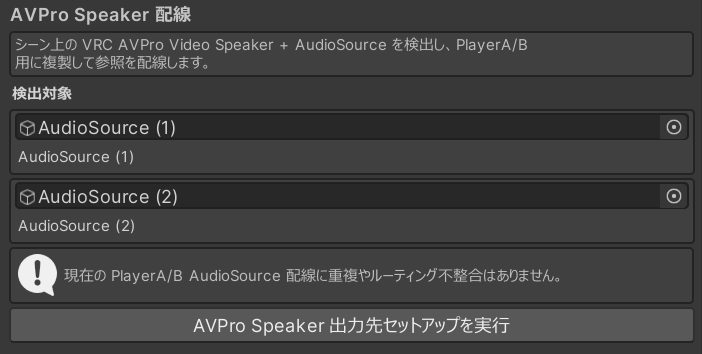

# 複製配置と再配線（スタッフ向け）

スクリーンの追加や音声出力の配線など、**シーン上のオブジェクトを複製・配置してから、`AunCastSettings` のボタンで再配線する**作業をまとめています。インスペクタの値だけで設定できる項目は[設定と調整](settings.md)を参照してください。

---

## スクリーンを増やす {#screens}

映像の出力先（スクリーン）は複製できます。**同一のマテリアルを共有していれば、スクリーンを増やしてもビデオデコードの負荷はほぼ一定**です。

1. 既存の **`Screen` GameObject** を選択し、Ctrl+D で複製します。
2. ワールド内の任意の位置に配置し、サイズを調整します。
3. `AunCastSettings` の **壁パネル配線** にある **「AunCastEventBus参照を再配線」** を押し、コンポーネントを関連付けます。

別のシェーダー / マテリアルを使用する場合は、複製した `VideoMeshScreen` の次の項目を合わせてください。

- **テクスチャパラメータ名**（`texParam`、既定 `_EmissionMap`）… そのシェーダーが映像に使用するテクスチャプロパティ名
- **レンダラーインデックス**（`rendererIndex`）… マルチマテリアルのどのスロットに適用するか

!!! note "停止中の画像（アイドル画像）"
    再生停止中の表示は、[設定と調整](settings.md)の **映像プレイヤー** セクションの **「停止中のスクリーン画像」** で指定します。再配線の際に各スクリーンへ転写されます。

## 壁パネルを増やす {#wall-panels}

壁パネル（`WallControlPanel`）は複製して、複数箇所に設置できます。会場の規模が大きい場合や、スタッフ控え室にも操作パネルを置きたい場合に有効です。

1. 既存の **`WallControlPanel` GameObject** を選択し、Ctrl+D で複製します。
2. ワールド内の任意の位置に配置します。
3. `AunCastSettings` の **壁パネル配線** にある **「AunCastEventBus参照を再配線」** を押し、コンポーネントを関連付けます（`AunCastSettings` のインスペクタを開いた際にも自動で再配線されます）。

## 音声（AVPro Speaker 配線） {#speaker}

AunCast は内部に `PlayerA` / `PlayerB`（A/B再生系統）を持つため、音声出力にもそれぞれ専用の `AudioSource` が必要です。これは **AVPro Speaker 配線** ツールが半自動で用意します。

### 手順

1. 音声出力の基準にする **VRC AVPro Video Speaker＋AudioSource** を用意し、**位置・空間音響（3D設定）・AudioSource の音量**を任意に設定します。既存のものがあれば、そのまま使用できます。
2. `AunCastSettings` の **AVPro Speaker 配線** セクションを確認します。シーン上のスピーカーが **「検出対象」** に一覧表示されます。

    { width="360" }

3. **「AVPro Speaker 出力先セットアップを実行」** を押します。

このボタンは、検出した「スピーカー＋AudioSource」を **Player A / B（A/B再生系統）用に複製**し、各複製の出力先（videoPlayer）をA / Bに配線し、無音検知用の AudioSilenceDetector を付与したうえで、**元のオブジェクトを無効化（EditorOnly タグ）**します。

### 音量と既存 AudioSource の扱い

- 複製は **元の AudioSource をそのまま複製**します。すなわち、**元のスピーカーで設定した音量・3D設定が、そのままA / Bへ引き継がれます**。音量バランスは、セットアップの実行前に元の AudioSource 側で決めておいてください。
- 観客がパネルで変更する音量は、ここで決めた AudioSource の音量に乗算されます。基準となるバランスはこの AudioSource 側で決まります。
- **複数スピーカーの多点配置**も可能です。検出された各スピーカーがA / B両方へ複製されます。
- 設定をやり直す場合は、再度ボタンを押すと、生成済みコンテナ（`AunCastSpeakerRefs_A` / `_B`）をクリアして作り直します。
- A / Bで同一 AudioSource を共有しているなどの配線不整合は、ツールが自動で検査し、赤色で表示します。
