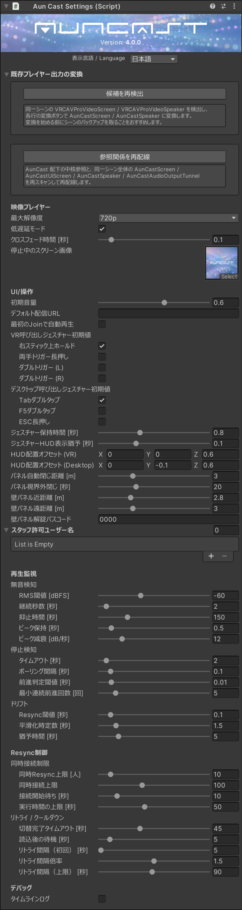

# 設定と調整（スタッフ向け）

このページは、AunCast をシーンに配置した後、`AunCastSettings` インスペクタの値を編集するだけで設定できる項目をまとめています。導入の最短手順は[クイックスタート](../quickstart.md#setup)を参照してください。

設定はすべて、`AunCast` ルートオブジェクトに付与されている **`AunCastSettings` コンポーネントのインスペクタ**で一括編集します。各コンポーネントへの値の反映（配線）も、このインスペクタのボタンで行えます。

スクリーンの追加や音声出力の配線など、**シーン上の部品を配置・変換してから再配線する作業**は[部品の配置と移行](parts-placement.md)にまとめています。

---

## AunCastSettings インスペクタの構成

{ width="360" }

**`AunCastSettings`** コンポーネントのインスペクタは、以下のセクションから構成されます。

- **既存プレイヤー出力の変換** … 既存の `VRCAVProVideoScreen` / `VRCAVProVideoSpeaker` を `AunCastScreen` / `AunCastSpeaker` へ変換（[既存ワールドからの移行](parts-placement.md#migration)）
- **旧プレイヤー本体の手動削除候補** … 競合を防ぐため削除が必要な、既存の旧 `VRCAVProVideoPlayer` 本体（候補の再検出後、該当がある場合のみ表示）
- **出力・参照の再配線** … シーン内のスクリーン / スピーカーなどの参照関係を再配線するボタン
- **映像プレイヤー** … 解像度・低遅延・クロスフェード・停止中の画像
- **UI/操作** … 音量・呼び出しジェスチャー・HUD・壁パネル距離・スタッフ許可・パスコード
- **再生監視** … 無音検知・停止検知・ドリフト
- **Resync制御** … 同時接続制限・リトライ / クールダウン
- **デバッグ** … タイムラインログ

各プロパティにポイントすると、説明がツールチップに表示されます。主要な項目の既定値・意味は、本ページ末尾の[主要パラメータ一覧](#params)にもまとめています。

!!! tip "ラベルの内部名を確認したいとき"
    インスペクタのラベルにカーソルを合わせて **Altキーを押す**と、内部の変数名が表示されます。ラベルを右クリックすると変数名をコピーできます（不具合報告やスクリプト連携の際に便利です）。

## 接続上限の設定（最重要） {#connection-limits}

AunCast の運用において、配信サーバーの同時接続上限に合わせた設定が重要になります。考え方は[同時接続上限の管理](../concepts/connection-limit.md)を必ず確認してください。**Resync制御 → 同時接続制限** の以下の２項目を設定します。

- **同時接続上限** … 利用する **配信サーバーの同時接続上限** を入力します（例: 100）。
- **同時Resync上限 [人]** … 上限を見積もり、余裕を見た値を入力します（例: 10）。見積もりの式は[同時接続上限の管理](../concepts/connection-limit.md#limit-params)を参照してください。

いずれも **スタッフがワールド内でイベント中に変更可能**です。スタッフビューの Connection≤（同時接続上限） / Concurrent≤（同時Resync上限）より変更できます。初期設定時にデフォルト値を入力し、本番ではスタッフが調整します（[モニタリングと上限調整](../operation/monitoring.md#limits)）。

!!! warning "自動再生は原則オフ推奨"
    **「最初のJoinで自動再生」は原則として使用しない**ことを推奨します。この理由と、CDNの選定・ビットレート・URLの取り扱いなどの運用上の注意は、[配信・運用上の注意](../operation/streaming.md)を確認してください。

## アクセス制御（スタッフ権限）

スタッフビューを使用できるユーザーを制限します。**UI/操作** セクションで設定します。

- **スタッフ許可ユーザー名** … パスコードなしでスタッフ権限を付与する **VRChat ディスプレイネーム** のリスト。配信管理を担当するスタッフを登録します。
- **壁パネル解錠パスコード** … 壁パネルから入力してスタッフビューを解錠する４桁数字。空欄で無効。当日のヘルプには口頭でパスコードを伝える、といった運用ができます。

両者は併用できます。

## 主要パラメータ一覧 {#params}

設定変更は `AunCastSettings` インスペクタで行います。

### 映像プレイヤー

| 表示名 | 既定 | 意味 |
|---|---:|---|
| 最大解像度 | 720p | AVPro Video Player の最大解像度（360p〜2160p） |
| 低遅延モード | オン | AVProの低遅延モード |
| クロスフェード時間 [秒] | 0.1 | 切替時の音声クロスフェード長 |
| 停止中のスクリーン画像 | Blank-AunCast.jpg | 停止時に表示する固定画像 |

### UI/操作

| 表示名 | 既定 | 意味 |
|---|---:|---|
| 初期音量 | 0.6 | 起動時の音量（0〜1） |
| デフォルト配信URL | 空欄 | Next URL欄の初期値 |
| 最初のJoinで自動再生 | オフ | 最初のユーザー入室時にデフォルトURLを自動再生 |
| VR呼び出しジェスチャー初期値 | 右スティック 上方向長押し | 手元パネル呼び出し方法の初期有効設定 |
| デスクトップ呼び出し ジェスチャー初期値 | Tabキー ２回押し | 手元パネル呼び出し方法の初期有効設定 |
| ジェスチャー保持時間 [秒] | 0.8 | 長押し系ジェスチャーの必要保持時間 |
| ジェスチャーHUD表示猶予 [秒] | 0.1 | HUDプログレスを出し始めるまでの猶予 |
| HUD配置オフセット (VR) | (0, 0, 0.6) | HUDの表示位置オフセット |
| HUD配置オフセット (Desktop) | (0, -0.1, 0.6) | HUDの表示位置オフセット |
| パネル自動閉じ距離 [m] | ３ | 手元パネルから離れると 自動的に閉じる距離（0 で無効） |
| パネル視界外閉じ [秒] | 20 | 手元パネルが視界外に出てから 閉じるまでの秒数（0 で無効） |
| 壁パネル近距離 [m] | 2.8 | 壁パネルの表示が切り替わる内側のしきい値 |
| 壁パネル遠距離 [m] | ３ | 壁パネルの表示が切り替わる外側のしきい値 |

### 再生監視 → 無音検知

| 表示名 | 既定 | 意味 |
|---|---:|---|
| RMS閾値 [dBFS] | -60 | 無音と判定する音量しきい値（０dBFS = フルスケール） |
| 継続秒数 [秒] | 2.0 | 無音がこの秒数続いたら再同期 |
| 抑止時間 [秒] | 150 | 再同期後に無音検知を再開するまでの時間 |
| ピーク保持 [秒] | 0.5 | Audio Levelメーターのピーク値を保持する時間 |
| ピーク減衰 [dB/秒] | 12 | Audio Levelメーターのピークラインが下がる速度 |

### 再生監視 → 停止検知

| 表示名 | 既定 | 意味 |
|---|---:|---|
| タイムアウト [秒] | 2.0 | この時間 前進しなければ停止と判定 |
| ポーリング間隔 [秒] | 0.1 | 再生位置を監視する間隔 |
| 前進判定閾値 [秒] | 0.01 | 前進とみなす最小の変化量 |
| 最小連続前進回数 [回] | ５ | 生存とみなす連続前進回数 |

### 再生監視 → ドリフト

| 表示名 | 既定 | 意味 |
|---|---:|---|
| Resync閾値 [秒] | 0.1 | 蓄積ドリフトがこれを超えたら自動再同期 |
| 平滑化時定数 [秒] | 1.5 | ドリフト平滑化の時定数 |
| 猶予時間 [秒] | 5.0 | 再生開始直後にドリフト判定をしない猶予 |

### Resync制御 → 同時接続制限

| 表示名 | 既定 | 意味 |
|---|---:|---|
| 同時Resync上限 [人] | 10 | 同時に再同期してよい人数の初期上限 |
| 同時接続上限 | 100 | 配信サーバーへの同時接続上限の初期値 |
| 接続開始待ち [秒] | 10 | 許可後、接続が始まるまでの最大待機 |
| 実行時間の上限 [秒] | 50 | １回の再同期に許される最大時間 |

### Resync制御 → リトライ / クールダウン

| 表示名 | 既定 | 意味 |
|---|---:|---|
| 切替完了タイムアウト [秒] | 45 | 許可〜切替完了までの全体制限 |
| 読込後の待機 [秒] | ５ | 読み込み後、次の再同期を受け付けるまでの待機 |
| リトライ間隔（初回） [秒] | ５ | 両系統失敗時のリトライ基本間隔 |
| リトライ間隔倍率 | 1.5 | 連続失敗ごとにリトライ間隔へ掛ける倍率 |
| リトライ間隔（上限） [秒] | 90 | リトライ間隔の頭打ち値 |

### デバッグ

| 表示名 | 既定 | 意味 |
|---|---:|---|
| タイムラインログ | オフ | 再生・Resync診断用の構造化ログを出力する |

!!! warning "タイムラインログは高負荷"
    タイムラインログは再生・Resync の状態遷移を逐次出力するため、**有効にすると負荷がかかります**。トラブルの診断時のみ一時的にオンにし、通常運用ではオフのままにしてください。スタッフビューのトグルからも切り替えられます。

## テーマの適用

AunCast の UI（手元パネル・壁パネル・HUD）の配色やフォントは **テーマ** で一括変更できます。パッケージには `Default` と `Flat` の２テーマが同梱されています。

1. Hierarchy で `AunCast` ルートオブジェクトを選択し、**`AunCastThemeApplier`** コンポーネントのインスペクタを表示する
2. **Theme** フィールドに使用したいテーマアセットをドラッグ＆ドロップ（または右端の◎ボタンで選択）する
3. **「テーマを適用」** ボタンを押す

以上で、マテリアル・フォント・配色がシーン全体に反映されます。

!!! info "追加テーマを準備中です"
    会場ワールドの雰囲気に合わせて選べる追加テーマを、後日 Booth にて有料で発売予定です。
