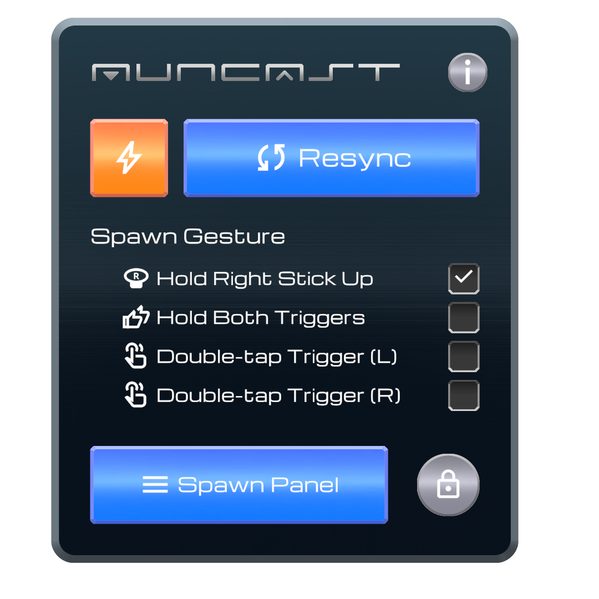
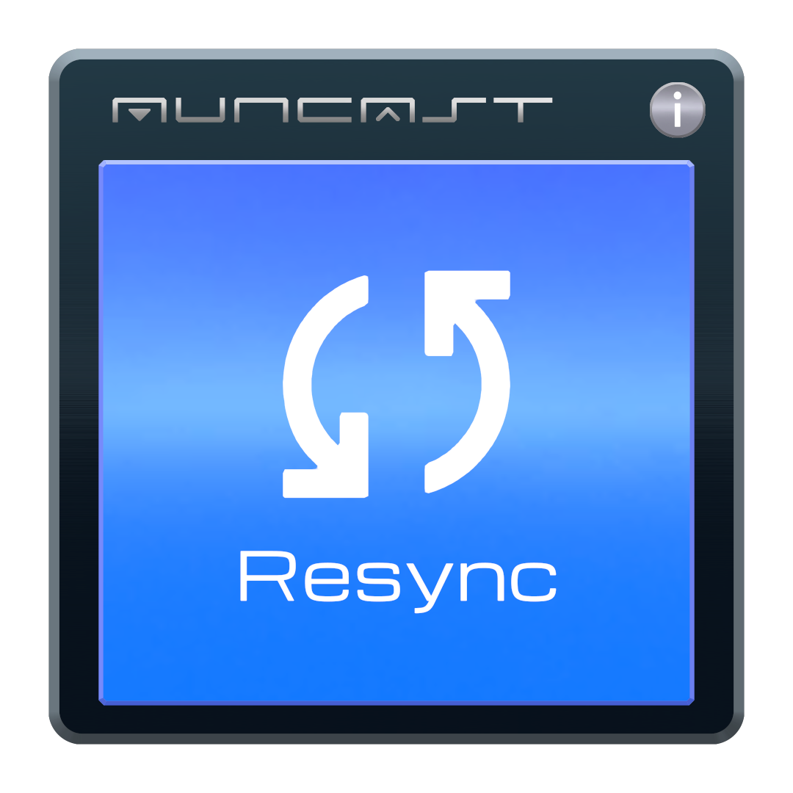

# パネルの呼び出しと操作（観客向け）

このページでは、観客（観客）が使用するパネルとその操作を説明します。先に[再同期の仕組み](../concepts/resync.md)を読んでおくと、各ボタンの意味を理解しやすくなります。

観客が使用するパネルは２種類あります。

- **手元パネル**：自分で呼び出して手元に表示するメニュー。状態確認と操作の中心です。
- **壁のパネル**：ワールドに固定設置された操作パネル。近づいて使用します。

---

## 手元パネルを呼び出す

手元パネルは、いつでも手元に表示できるメニューです。呼び出し方法は、壁のパネルの **「Spawn Gesture」** で選択します。

=== "デスクトップ"

    キーボードで呼び出します。次のいずれか１つを選択します。

    - **Double-tap Tab** … Tabキーを続けて２回押す
    - **Double-tap F5** … F5キーを続けて２回押す
    - **Hold Esc** … Escキーを押し続ける

    { width="300" }

=== "VR"

    コントローラー操作で呼び出します。次のいずれか１つを選択します。

    - **Hold Right Stick Up** … 右スティックを上に倒し続ける
    - **Hold Both Triggers** … 両手のトリガーを同時に握り続ける
    - **Double-tap Trigger (L) / (R)** … 左／右のトリガーを続けて２回引く

    { width="280" }

!!! tip "押し続ける方式ではHUDゲージが表示されます"
    「倒し続ける」「握り続ける」方式では、成立までの進捗が **HUDゲージ**（視界内の表示）に表示されます。途中でやめると取り消されます。

!!! note "VRではパネルを掴んで移動できます"
    表示されたパネルに手を近づけて **グリップ（握る）** すると、手に持って任意の位置へ移動できます。離すとその位置に固定されます。

---

## 手元パネルの各部

呼び出すと、次のパネルが表示されます。

{ width="360" }

主な要素は次のとおりです。表示の詳しい読み方は[状態表示の見方](status.md)を参照してください。

| 要素 | 機能 |
|---|---|
| **Resync ボタン**（右下の青いボタン） | 自分の配信を再同期する（下記） |
| **緊急リブートボタン**（左下のオレンジの稲妻） | いったんすべて停止して接続し直す最終手段（下記） |
| **Drift** | 配信元との「音声・映像のズレ量」のメーター |
| **Audio Level** | 現在 音声が出ているかを示すメーター |
| **Silence Resync** | 無音時に自動で再同期するかの切り替え |
| **Volume** | ローカル音量（他の観客には影響しません） |
| **左上のサムネイル下の文字** | 現在の自分の状態（例: Idle＝ 待機中） |
| **右上の × ボタン** | パネルを閉じる |

ここでは特に重要な２つのボタンを説明します。

### Resync ボタン {#resync-button}

押下すると「再同期したい」と **順番待ちの列に並びます**。順番が来ると背後で新しい接続が用意され、準備が整うと滑らかに切り替わります（仕組みは[再同期の仕組み](../concepts/resync.md)）。

- 何も再生していないとき（停止中など）は押せません。
- 押下直後やしばらくの間は、**「順番が来るまでの目安時間」** が表示されます。
- 順番待ちが長くても、通常は待てば順番が回ってきます。待てない場合は緊急リブートを検討します。
- 順番待ちの間に再度押すと、**取り消し** できます。

### 緊急リブートボタン {#reboot}

順番待ちをせずに、**自分の配信をいったんすべて停止し、直ちに接続し直す** 最終手段です。いつでも押せます。

!!! danger "この操作は再生が途切れます"
    緊急リブートは滑らかな切り替えではありません。**音声・映像が一度途切れます。** まずは通常の **Resync ボタン** を試し、それでも復旧しない・順番が一向に回ってこない場合にのみ使用してください。実行後はしばらく再同期を控える時間に入ります。

---

## 壁のパネル

ワールドに固定設置された操作パネルです。**近づくと表示が自動で切り替わります。**

=== "離れているとき"

    画面いっぱいの **大きな Resync ボタン** になります。誰でも押せ、遠くからでも再同期できます。

    { width="260" }

=== "近づいたとき"

    詳細な操作が可能な表示になります。

    - **Resync ボタン** … 自分を再同期する
    - **緊急リブートボタン**（オレンジの稲妻）… 上記の最終手段
    - **Spawn Panel ボタン** … 手元パネルを目の前に呼び出す
    - **Spawn Gesture** … 手元パネルの呼び出し方法を選択する（上記）

    { width="300" }

!!! info "スタッフ用の入口もここにあります"
    右下のカギのアイコンから、スタッフが暗証番号を入力して操作画面を開く入口（Staff ビュー）に入れます。観客の操作には関係しません。詳細は[スタッフガイド](../staff/operations.md#unlock)を参照してください。

---

## 状況別の対処（早見表）

| 状況 | 推奨操作 |
|---|---|
| 音声が出ない／ズレている | まず **Resync ボタン**（Drift メーターが溜まっている場合は特に有効） |
| 映像が停止した／カクつく | **Resync ボタン**。待てば順番が回ってきます |
| Resync しても復旧しない／順番が回ってこない | **緊急リブート**（途切れるのを承知で） |
| 曲間など静かな場面で自動的に再同期される | パネルの [Silence Resync をオフ](status.md#auto-silence) |
| 音量を変えたい | パネルの **Volume**（ローカル＝自分にのみ反映） |

続いて、パネルに並ぶメーターや状態表示の読み方を確認します。

[→ 状態表示の見方へ](status.md)
